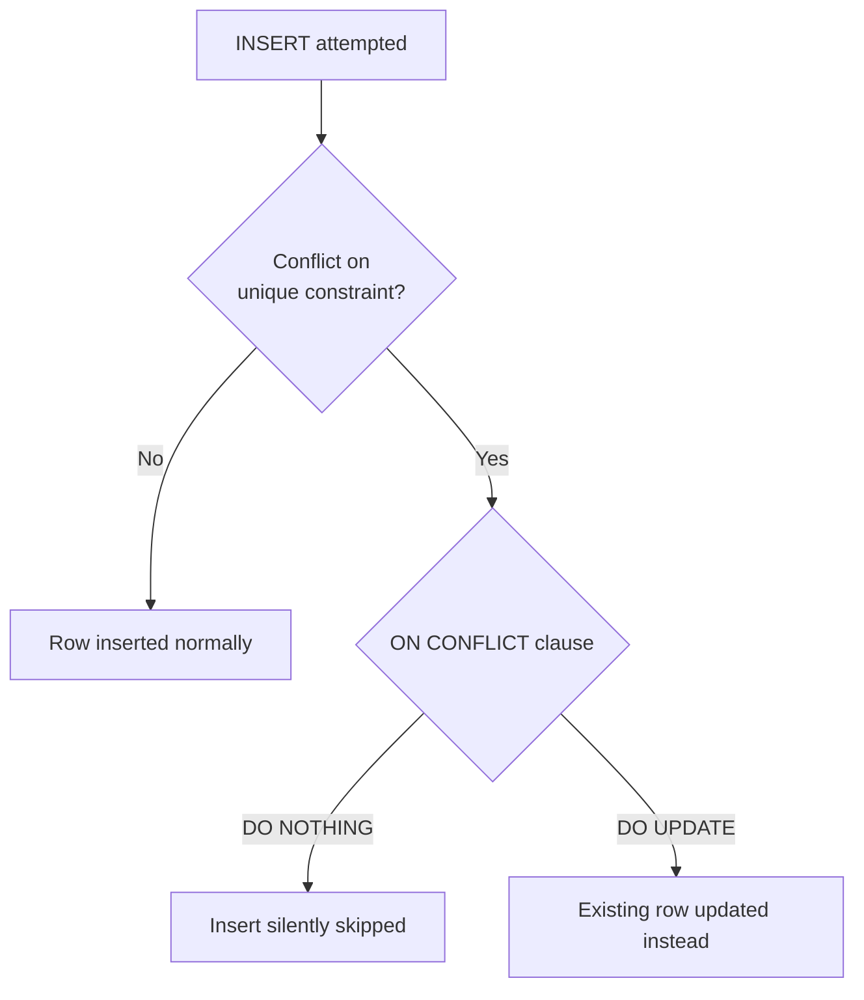

# DML - Insert, Update, Delete

> [!abstract] Definition
> **DML (Data Manipulation Language)** statements change the data stored inside tables, as opposed to DDL, which changes the table structure itself (see [[03-DDL-Tables]]).

---

## `INSERT`

```sql
INSERT INTO users (name, email) VALUES ('Alice', 'alice@example.com');

-- Multiple rows in one statement (far faster than separate INSERTs)
INSERT INTO users (name, email) VALUES
    ('Alice', 'alice@example.com'),
    ('Bob', 'bob@example.com'),
    ('Charlie', 'charlie@example.com');

-- Insert from a query (copy/transform data from another table)
INSERT INTO active_users (name, email)
SELECT name, email FROM users WHERE is_active = true;
```

### `RETURNING` - Get Back What Was Inserted

```sql
INSERT INTO users (name, email) VALUES ('Alice', 'alice@example.com')
RETURNING id, created_at;
```

> [!tip] `RETURNING` avoids a separate `SELECT`
> Extremely useful in application code: insert a row and immediately get its generated `id` back in a single round trip, instead of inserting then querying separately.

---

## `UPDATE`

```sql
UPDATE users SET age = 26 WHERE id = 1;

UPDATE users SET age = 26, status = 'active' WHERE id = 1;    -- multiple columns

UPDATE products SET price = price * 1.10;                       -- no WHERE = updates EVERY row!

UPDATE users SET age = age + 1 WHERE age < 18;                     -- expression referencing current value
```

### `UPDATE ... FROM` (Using Another Table)

```sql
UPDATE orders o
SET status = 'shipped'
FROM shipments s
WHERE o.id = s.order_id AND s.shipped_date = CURRENT_DATE;
```

> [!warning] Always double-check your `WHERE` clause before running `UPDATE`
> An `UPDATE` without a `WHERE` clause modifies every single row in the table. In `psql`, run a `SELECT` with the same `WHERE` clause first to confirm exactly which rows will be affected.

---

## `DELETE`

```sql
DELETE FROM users WHERE id = 1;
DELETE FROM users WHERE created_at < now() - INTERVAL '1 year';
DELETE FROM users;                     -- no WHERE = deletes EVERY row! (see TRUNCATE for a faster equivalent)
```

### `DELETE ... USING` (Using Another Table)

```sql
DELETE FROM orders o
USING users u
WHERE o.user_id = u.id AND u.is_banned = true;
```

### `DELETE ... RETURNING`

```sql
DELETE FROM sessions WHERE expires_at < now() RETURNING id;
```

---

## `UPSERT` - `INSERT ... ON CONFLICT`

```sql
INSERT INTO users (email, name)
VALUES ('alice@example.com', 'Alice')
ON CONFLICT (email)                          -- must reference a UNIQUE or PRIMARY KEY constraint
DO UPDATE SET name = EXCLUDED.name;            -- EXCLUDED refers to the row that FAILED to insert

INSERT INTO users (email, name)
VALUES ('alice@example.com', 'Alice')
ON CONFLICT (email) DO NOTHING;                -- silently skip if it already exists
```



> [!tip] `ON CONFLICT` is Postgres's answer to "insert or update"
> Common pattern: syncing external data where a row might already exist. `EXCLUDED` is a special pseudo-table referring to the values that were proposed for insertion but conflicted.

---

## `MERGE` (Postgres 15+)

```sql
MERGE INTO accounts a
USING transactions t ON a.id = t.account_id
WHEN MATCHED THEN
    UPDATE SET balance = a.balance + t.amount
WHEN NOT MATCHED THEN
    INSERT (id, balance) VALUES (t.account_id, t.amount);
```

> [!info] `MERGE` vs `ON CONFLICT`
> `MERGE` is the SQL-standard statement for combined insert/update/delete logic based on a join condition, more flexible than `ON CONFLICT` (which is keyed specifically to a unique constraint violation) but requires Postgres 15 or later.

---

## `COPY` - Bulk Load/Export (Fastest Method for Large Data)

```sql
COPY users (name, email) FROM '/path/to/users.csv' WITH (FORMAT csv, HEADER true);
COPY users TO '/path/to/export.csv' WITH (FORMAT csv, HEADER true);
```

```bash
# psql's client-side variant, for loading from your local machine over a remote connection
\copy users FROM 'users.csv' WITH (FORMAT csv, HEADER true)
```

> [!tip] `COPY` is dramatically faster than many individual `INSERT` statements
> For loading thousands+ of rows, `COPY` (or `\copy` from `psql`) bypasses per-row statement overhead and is the standard tool for bulk data import/export.

---

## Related
- [[04-Constraints-Keys]]
- [[06-Querying-Select-Where]]
- [[12-Transactions]]
- [[DBMS/PostgreSql/19-Common-Errors-Gotchas]]
