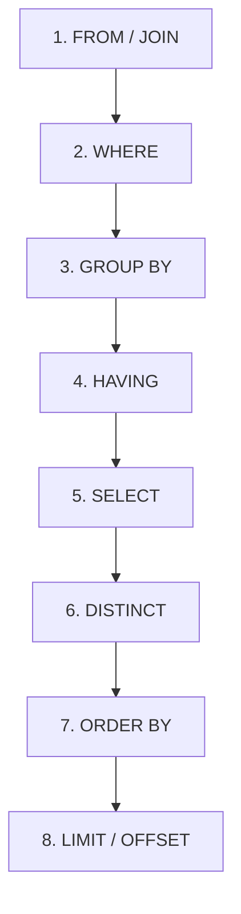

# Querying - `SELECT` & `WHERE`

> [!abstract] Definition
> `SELECT` is the core statement for reading data from tables. Its clauses execute in a specific logical order, different from the order they're written in - understanding that order is key to writing correct, efficient queries.

---

## Logical Execution Order (Not Written Order!)



> [!warning] Why this matters
> You can't reference a `SELECT` column alias inside `WHERE` (WHERE runs before SELECT), but you CAN reference it in `ORDER BY` (which runs after). This trips up beginners constantly - see [[19-Common-Errors-Gotchas]].

---

## Basic `SELECT`

```sql
SELECT * FROM users;                        -- all columns
SELECT name, email FROM users;                 -- specific columns
SELECT name AS full_name FROM users;              -- alias a column
SELECT DISTINCT city FROM users;                     -- unique values only
SELECT DISTINCT ON (city) * FROM users ORDER BY city, age DESC;   -- Postgres-specific: first row per group
```

---

## `WHERE` - Filtering Rows

```sql
SELECT * FROM users WHERE age > 25;
SELECT * FROM users WHERE age >= 18 AND age <= 65;
SELECT * FROM users WHERE city = 'Mumbai' OR city = 'Pune';
SELECT * FROM users WHERE NOT is_banned;

SELECT * FROM users WHERE age BETWEEN 18 AND 65;         -- inclusive on both ends
SELECT * FROM users WHERE city IN ('Mumbai', 'Pune', 'Delhi');
SELECT * FROM users WHERE city NOT IN ('Mumbai', 'Pune');

SELECT * FROM users WHERE name LIKE 'A%';                  -- starts with A
SELECT * FROM users WHERE name ILIKE 'a%';                    -- case-insensitive LIKE (Postgres-specific)
SELECT * FROM users WHERE name LIKE '%son';                     -- ends with "son"
SELECT * FROM users WHERE name ~ '^A.*n$';                         -- regex match (Postgres-specific)

SELECT * FROM users WHERE middle_name IS NULL;
SELECT * FROM users WHERE middle_name IS NOT NULL;
```

| Wildcard (`LIKE`) | Meaning |
|---|---|
| `%` | any sequence of characters (including none) |
| `_` | exactly one character |

> [!warning] `=` never matches `NULL`
> `WHERE middle_name = NULL` always returns zero rows, even if a row's `middle_name` is genuinely null - `NULL` represents "unknown," and nothing is considered equal to "unknown," not even another `NULL`. Always use `IS NULL` / `IS NOT NULL`.

---

## `ORDER BY`

```sql
SELECT * FROM users ORDER BY age;                        -- ascending (default)
SELECT * FROM users ORDER BY age DESC;                      -- descending
SELECT * FROM users ORDER BY city, age DESC;                   -- multi-column: city ascending, then age descending
SELECT * FROM users ORDER BY age NULLS LAST;                      -- control where NULLs sort (default: NULLS LAST for ASC)
```

---

## `LIMIT` & `OFFSET` - Pagination

```sql
SELECT * FROM users ORDER BY id LIMIT 10;                 -- first 10 rows
SELECT * FROM users ORDER BY id LIMIT 10 OFFSET 20;          -- rows 21-30 ("page 3" of 10)
SELECT * FROM users ORDER BY id FETCH FIRST 10 ROWS ONLY;       -- SQL-standard equivalent of LIMIT
```

> [!warning] `OFFSET` gets slower on large tables
> Postgres still has to scan and discard all skipped rows internally. For deep pagination on big tables, prefer **keyset pagination**: `WHERE id > <last_seen_id> ORDER BY id LIMIT 10`, which uses an index seek instead of a scan.

---

## Operators Reference

```sql
= <> != > < >= <=              -- comparison
AND OR NOT                       -- logical
+ - * / %                          -- arithmetic
||                                    -- string concatenation
```

```sql
SELECT first_name || ' ' || last_name AS full_name FROM users;
SELECT 10 % 3;              -- 1, modulo
```

---

## `CASE` - Conditional Logic Inside a Query

```sql
SELECT
    name,
    CASE
        WHEN age < 18 THEN 'minor'
        WHEN age < 65 THEN 'adult'
        ELSE 'senior'
    END AS age_group
FROM users;

-- Shorthand form when comparing one expression against several values
SELECT
    name,
    CASE status
        WHEN 'A' THEN 'Active'
        WHEN 'I' THEN 'Inactive'
        ELSE 'Unknown'
    END AS status_label
FROM users;
```

---

## `COALESCE` & `NULLIF`

```sql
SELECT COALESCE(nickname, name, 'Unknown') FROM users;   -- first non-null value in the list
SELECT NULLIF(discount, 0) FROM products;                    -- returns NULL if discount = 0, else discount
```

> [!tip] `COALESCE` for default values
> The classic use is providing a fallback: `COALESCE(phone, 'N/A')` shows "N/A" instead of a blank/null phone number.

---

## Set Operations - `UNION`, `INTERSECT`, `EXCEPT`

```sql
SELECT city FROM customers
UNION                              -- combines results, removes duplicates
SELECT city FROM suppliers;

SELECT city FROM customers
UNION ALL                          -- combines results, KEEPS duplicates (faster, no dedup step)
SELECT city FROM suppliers;

SELECT city FROM customers
INTERSECT                          -- only rows present in BOTH queries
SELECT city FROM suppliers;

SELECT city FROM customers
EXCEPT                             -- rows in the first query NOT present in the second
SELECT city FROM suppliers;
```

> [!warning] Set operations require matching column counts and compatible types
> Both queries combined by `UNION`/`INTERSECT`/`EXCEPT` must return the same number of columns, with compatible data types in each position.

---

## Related
- [[07-Joins]]
- [[08-Aggregation-GroupBy]]
- [[11-Indexes]] (for `OFFSET`/pagination performance)
- [[19-Common-Errors-Gotchas]]
