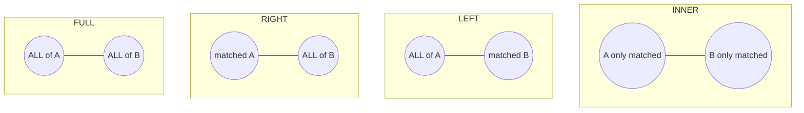

# Joins

> [!abstract] Definition
> A **join** combines rows from two or more tables based on a related column, letting you query normalized (split-apart) data as if it were a single unified table.

---

## Join Types Visualized



| Join | Keeps |
|---|---|
| `INNER JOIN` | only rows with a match in **both** tables |
| `LEFT JOIN` | all rows from the **left** table, matched data from the right (`NULL` if no match) |
| `RIGHT JOIN` | all rows from the **right** table, matched data from the left |
| `FULL JOIN` | all rows from **both** tables, `NULL` where no match exists on either side |
| `CROSS JOIN` | every possible combination of rows from both tables (cartesian product) |

---

## `INNER JOIN`

```sql
SELECT u.name, o.amount
FROM users u
INNER JOIN orders o ON u.id = o.user_id;
```

> `INNER JOIN` (or just `JOIN` - `INNER` is implied by default) only returns rows where the join condition matches on both sides. Users with zero orders won't appear at all.

---

## `LEFT JOIN` (Most Commonly Used)

```sql
SELECT u.name, o.amount
FROM users u
LEFT JOIN orders o ON u.id = o.user_id;
```

> Every user appears at least once, even those with no orders - `o.amount` is `NULL` for them.

```sql
-- Find users who have NEVER placed an order (a very common pattern)
SELECT u.name
FROM users u
LEFT JOIN orders o ON u.id = o.user_id
WHERE o.id IS NULL;
```

---

## `RIGHT JOIN`

```sql
SELECT u.name, o.amount
FROM users u
RIGHT JOIN orders o ON u.id = o.user_id;
```

> [!tip] `RIGHT JOIN` is rarely used in practice
> Any `RIGHT JOIN` can be rewritten as a `LEFT JOIN` by swapping the table order - most style guides prefer sticking to `LEFT JOIN` for consistency and readability.

---

## `FULL JOIN` (a.k.a. `FULL OUTER JOIN`)

```sql
SELECT u.name, o.amount
FROM users u
FULL JOIN orders o ON u.id = o.user_id;
```

> Returns everything from both tables - matched rows combined, unmatched rows padded with `NULL` on whichever side is missing. Useful for reconciliation ("what's in A but not B, and vice versa, all at once").

---

## `CROSS JOIN`

```sql
SELECT s.size, c.color
FROM sizes s
CROSS JOIN colors c;      -- every size paired with every color
```

> [!warning] `CROSS JOIN` output grows multiplicatively
> `N` rows cross-joined with `M` rows produces `N × M` rows. Useful intentionally for generating combinations (e.g. product variants), but a forgotten join condition that turns an intended `INNER JOIN` into an accidental `CROSS JOIN` is a classic bug - always double check your `ON` clause is present.

---

## Self Join

```sql
SELECT e.name AS employee, m.name AS manager
FROM employees e
LEFT JOIN employees m ON e.manager_id = m.id;
```

> A table joined to itself, using aliases to distinguish the two "roles" - the classic use case is an employee/manager hierarchy stored in a single table.

---

## Joining on Multiple Conditions

```sql
SELECT *
FROM orders o
JOIN order_items oi ON o.id = oi.order_id AND oi.quantity > 0;
```

---

## `USING` (Shorthand When Column Names Match)

```sql
SELECT *
FROM orders
JOIN users USING (user_id);   -- equivalent to "ON orders.user_id = users.user_id", requires identical column NAME
```

> [!info] `USING` vs `ON`
> `USING` only works when the join columns have the exact same name in both tables, and it collapses the duplicate column into one in the output. `ON` is more explicit and works for any condition, including differently-named columns.

---

## Joining Three or More Tables

```sql
SELECT u.name, o.id AS order_id, oi.product_id, p.name AS product_name
FROM users u
JOIN orders o ON o.user_id = u.id
JOIN order_items oi ON oi.order_id = o.id
JOIN products p ON p.id = oi.product_id;
```

> [!tip] Chain joins left to right, one relationship at a time
> Each join adds one more table to the "working result set" - reading top to bottom traces the actual relationship path through your schema.

---

## `LATERAL` Joins (Advanced - Correlated Subquery as a Join)

```sql
SELECT u.name, recent.order_id, recent.amount
FROM users u
CROSS JOIN LATERAL (
    SELECT id AS order_id, amount
    FROM orders o
    WHERE o.user_id = u.id
    ORDER BY o.created_at DESC
    LIMIT 3
) AS recent;
```

> [!info] What `LATERAL` enables
> A `LATERAL` subquery can reference columns from tables that appear **earlier** in the `FROM` clause (here, `u.id`) - impossible with a regular join or subquery. Classic use case: "the 3 most recent orders per user," which a plain `GROUP BY` can't express directly.

---

## Related
- [[06-Querying-Select-Where]]
- [[08-Aggregation-GroupBy]]
- [[04-Constraints-Keys]] (foreign keys, the usual basis for join conditions)
- [[11-Indexes]] (indexing join columns for performance)
