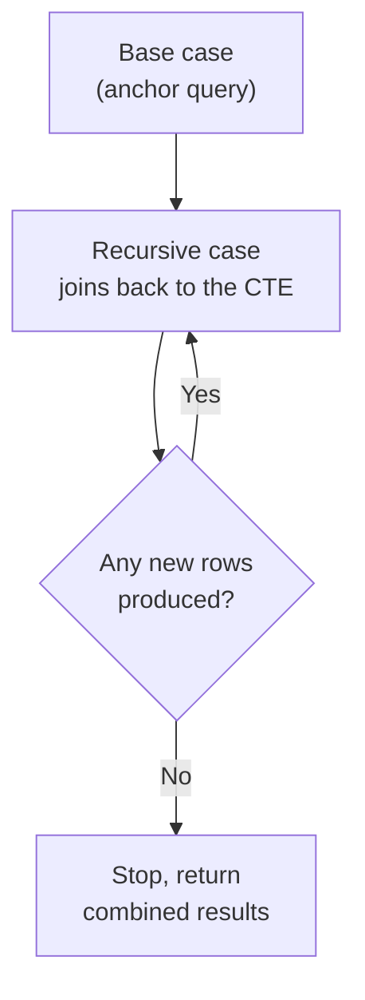

# Subqueries & CTEs

> [!abstract] Definition
> A **subquery** is a query nested inside another query. A **CTE (Common Table Expression)**, written with `WITH`, is a named, reusable subquery that can make complex queries far more readable - and, uniquely, can also be **recursive**.

---

## Subqueries in `WHERE`

```sql
-- Scalar subquery: returns a single value
SELECT * FROM products WHERE price > (SELECT AVG(price) FROM products);

-- IN subquery: returns a list of values
SELECT * FROM users WHERE id IN (SELECT user_id FROM orders WHERE amount > 1000);

-- NOT IN subquery
SELECT * FROM users WHERE id NOT IN (SELECT user_id FROM orders);
```

> [!danger] `NOT IN` with a subquery that can return `NULL` is a classic trap
> If the subquery returns even one `NULL`, `NOT IN` returns **zero rows** for the entire outer query - because `x <> NULL` is unknown, not true, for every comparison. Use `NOT EXISTS` instead (see below), which doesn't have this problem.

---

## `EXISTS` / `NOT EXISTS`

```sql
SELECT * FROM users u
WHERE EXISTS (SELECT 1 FROM orders o WHERE o.user_id = u.id);

SELECT * FROM users u
WHERE NOT EXISTS (SELECT 1 FROM orders o WHERE o.user_id = u.id);   -- users with NO orders
```

> [!tip] `EXISTS` vs `IN`
> `EXISTS` stops scanning as soon as one matching row is found (a boolean check), and correctly handles `NULL`s in the subquery. For correlated existence checks, `EXISTS`/`NOT EXISTS` is generally the safer, more efficient choice over `IN`/`NOT IN`.

---

## Subqueries in `SELECT` (Scalar Subquery as a Column)

```sql
SELECT
    name,
    (SELECT COUNT(*) FROM orders o WHERE o.user_id = u.id) AS order_count
FROM users u;
```

> [!warning] Correlated subqueries in `SELECT` run once per outer row
> This pattern is easy to write but can be slow on large tables since Postgres re-executes the inner query for every outer row. A `LEFT JOIN` + `GROUP BY` (see [[08-Aggregation-GroupBy]]) is often faster for the same result.

---

## Subqueries in `FROM` (Derived Tables)

```sql
SELECT city, avg_age
FROM (
    SELECT city, AVG(age) AS avg_age
    FROM users
    GROUP BY city
) AS city_stats
WHERE avg_age > 30;
```

> A subquery in `FROM` must always be given an alias (`AS city_stats` above) - Postgres requires every derived table to have a name.

---

## Common Table Expressions (`WITH`)

```sql
WITH active_users AS (
    SELECT * FROM users WHERE is_active = true
)
SELECT city, COUNT(*)
FROM active_users
GROUP BY city;
```

> [!tip] CTEs as readability tools
> A CTE is functionally similar to a subquery in `FROM`, but named and placed at the top of the query - this breaks a complex query into clearly-labeled logical steps, each of which can be tested independently by running it alone.

### Multiple CTEs in One Query

```sql
WITH
active_users AS (
    SELECT * FROM users WHERE is_active = true
),
big_spenders AS (
    SELECT user_id, SUM(amount) AS total FROM orders GROUP BY user_id HAVING SUM(amount) > 1000
)
SELECT au.name, bs.total
FROM active_users au
JOIN big_spenders bs ON bs.user_id = au.id;
```

---

## Recursive CTEs

```sql
WITH RECURSIVE org_chart AS (
    -- Base case: the top of the hierarchy
    SELECT id, name, manager_id, 1 AS depth
    FROM employees
    WHERE manager_id IS NULL

    UNION ALL

    -- Recursive case: join back to the CTE itself
    SELECT e.id, e.name, e.manager_id, oc.depth + 1
    FROM employees e
    JOIN org_chart oc ON e.manager_id = oc.id
)
SELECT * FROM org_chart ORDER BY depth;
```



> [!tip] Classic use cases for recursive CTEs
> Organizational hierarchies (employee -> manager chains), category trees (nested subcategories), graph traversal (e.g. "find all paths between two nodes"), and generating sequences (`generate_series` is often simpler for pure number/date sequences though).

> [!warning] Recursive CTEs can infinite-loop
> If the underlying data has a cycle (e.g. A manages B, B manages A) and there's no depth/visited-check, the recursion never terminates. Add a safeguard: `WHERE depth < 20` or track visited IDs in an array.

---

## `WITH ... AS MATERIALIZED` / `NOT MATERIALIZED` (Postgres 12+)

```sql
WITH expensive_calc AS MATERIALIZED (
    SELECT * FROM big_table WHERE complex_condition
)
SELECT * FROM expensive_calc WHERE another_condition;
```

> [!info] Why this matters
> Since Postgres 12, CTEs are "inlined" (optimized like a subquery) by default unless marked `MATERIALIZED`, which forces the CTE to be computed once and cached. Use `MATERIALIZED` when the CTE is expensive and referenced multiple times; use `NOT MATERIALIZED` to hint the planner to inline it for better optimization opportunities.

---

## Related
- [[07-Joins]]
- [[08-Aggregation-GroupBy]]
- [[10-Window-Functions]]
