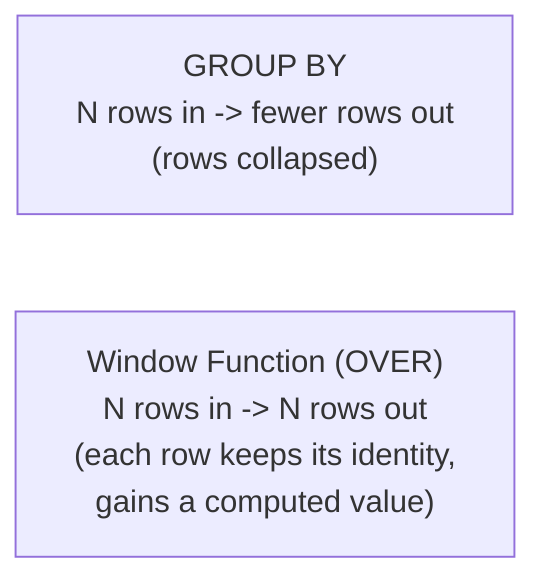

# Window Functions

> [!abstract] Definition
> Window functions perform a calculation across a set of related rows (a "window") **without collapsing them** into a single output row, unlike `GROUP BY`. Every input row keeps its own row in the result, but gains access to aggregate/ranking values computed across its window.



---

## Basic Syntax

```sql
function_name(...) OVER (
    [PARTITION BY column]
    [ORDER BY column]
    [frame_clause]
)
```

```sql
SELECT
    name,
    department,
    salary,
    AVG(salary) OVER (PARTITION BY department) AS dept_avg_salary
FROM employees;
```

> Every employee row is preserved, but each also shows their department's average alongside their own salary - impossible with plain `GROUP BY`, which would collapse to one row per department.

---

## Ranking Functions

```sql
SELECT
    name, department, salary,
    ROW_NUMBER() OVER (PARTITION BY department ORDER BY salary DESC) AS row_num,
    RANK() OVER (PARTITION BY department ORDER BY salary DESC) AS rank,
    DENSE_RANK() OVER (PARTITION BY department ORDER BY salary DESC) AS dense_rank
FROM employees;
```

| Function | Behavior on ties |
|---|---|
| `ROW_NUMBER()` | assigns a unique, sequential number regardless of ties (1,2,3,4...) |
| `RANK()` | ties share the same rank, next rank skips accordingly (1,2,2,4...) |
| `DENSE_RANK()` | ties share the same rank, next rank does NOT skip (1,2,2,3...) |

```sql
-- Classic pattern: top-N per group (e.g. top 3 highest-paid employees per department)
SELECT * FROM (
    SELECT *, ROW_NUMBER() OVER (PARTITION BY department ORDER BY salary DESC) AS rn
    FROM employees
) ranked
WHERE rn <= 3;
```

---

## `NTILE` - Bucket Rows into N Groups

```sql
SELECT name, salary, NTILE(4) OVER (ORDER BY salary) AS salary_quartile
FROM employees;
```

> Splits rows into 4 roughly equal-sized buckets ordered by salary - quartile 1 is the lowest-paid, quartile 4 the highest.

---

## Aggregate Functions as Window Functions

```sql
SELECT
    name, department, salary,
    SUM(salary) OVER (PARTITION BY department) AS dept_total,
    COUNT(*) OVER (PARTITION BY department) AS dept_headcount,
    salary / SUM(salary) OVER (PARTITION BY department) AS pct_of_dept_total
FROM employees;
```

> [!tip] Any aggregate function works with `OVER`
> `SUM`, `AVG`, `COUNT`, `MIN`, `MAX` all work as window functions simply by adding `OVER (...)` - the key difference from `GROUP BY` is that individual rows are preserved.

---

## Running Totals & Moving Calculations

```sql
SELECT
    order_date, amount,
    SUM(amount) OVER (ORDER BY order_date) AS running_total,
    AVG(amount) OVER (ORDER BY order_date ROWS BETWEEN 6 PRECEDING AND CURRENT ROW) AS trailing_7day_avg
FROM orders;
```

### Frame Clauses - Controlling Which Rows Are "In the Window"

```sql
ROWS BETWEEN UNBOUNDED PRECEDING AND CURRENT ROW     -- from the start through the current row (running total)
ROWS BETWEEN 2 PRECEDING AND 2 FOLLOWING                -- a centered window of 5 rows
ROWS BETWEEN CURRENT ROW AND UNBOUNDED FOLLOWING          -- from current row to the end
RANGE BETWEEN INTERVAL '7 days' PRECEDING AND CURRENT ROW    -- time-based window, needs ORDER BY on a date/time column
```

> [!info] `ROWS` vs `RANGE`
> `ROWS` counts a fixed number of physical rows. `RANGE` (or the newer `GROUPS`) considers logical value ranges - e.g. `RANGE INTERVAL '7 days'` includes all rows within 7 days of the current row's value, regardless of exact row count. `RANGE` is essential for genuinely time-based rolling windows.

---

## `LAG` & `LEAD` - Access Other Rows' Values

```sql
SELECT
    order_date, amount,
    LAG(amount) OVER (ORDER BY order_date) AS previous_amount,
    LEAD(amount) OVER (ORDER BY order_date) AS next_amount,
    amount - LAG(amount) OVER (ORDER BY order_date) AS change_from_previous
FROM orders;

LAG(amount, 2) OVER (ORDER BY order_date)              -- look back 2 rows instead of 1
LAG(amount, 1, 0) OVER (ORDER BY order_date)              -- default to 0 instead of NULL for the first row
```

> [!tip] `LAG`/`LEAD` for period-over-period comparisons
> The standard way to compute "change from previous day/month/order" without a self-join - much simpler and faster than joining the table to itself on a shifted date condition.

---

## `FIRST_VALUE` & `LAST_VALUE`

```sql
SELECT
    name, department, salary,
    FIRST_VALUE(name) OVER (PARTITION BY department ORDER BY salary DESC) AS highest_paid_in_dept
FROM employees;
```

> [!warning] `LAST_VALUE` needs an explicit frame to behave as expected
> By default, the window frame only extends to the "current row," so `LAST_VALUE` often just returns the current row's own value. Fix with an explicit frame: `LAST_VALUE(name) OVER (PARTITION BY department ORDER BY salary DESC ROWS BETWEEN UNBOUNDED PRECEDING AND UNBOUNDED FOLLOWING)`.

---

## Named Windows (`WINDOW` Clause - Avoid Repetition)

```sql
SELECT
    name,
    RANK() OVER w AS rank,
    SUM(salary) OVER w AS running_total
FROM employees
WINDOW w AS (PARTITION BY department ORDER BY salary DESC);
```

> Define the window specification once, reuse it across multiple function calls in the same query - keeps things DRY when several window functions share the same `PARTITION BY`/`ORDER BY`.

---

## Related
- [[08-Aggregation-GroupBy]]
- [[09-Subqueries-CTEs]]
- [[16-Window-Rolling-Expanding|Pandas: Window Functions]]
