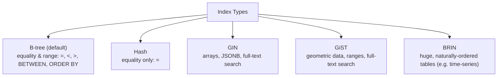

# Indexes

> [!abstract] Definition
> An **index** is a separate data structure that lets Postgres find rows matching a condition without scanning the entire table - the database equivalent of a book's index. Indexes speed up reads dramatically but add overhead to writes (every `INSERT`/`UPDATE`/`DELETE` must also update each index).

---

## Basic Index Creation

```sql
CREATE INDEX idx_users_email ON users (email);
CREATE INDEX idx_orders_user_id ON orders (user_id);

CREATE INDEX idx_users_city_age ON users (city, age);    -- composite index on two columns
CREATE UNIQUE INDEX idx_users_email_unique ON users (email);  -- enforces uniqueness too

DROP INDEX idx_users_email;
```

> [!info] Primary keys and `UNIQUE` constraints get indexes automatically
> Postgres creates a unique B-tree index behind the scenes for every `PRIMARY KEY` and `UNIQUE` constraint - no need to add a separate `CREATE INDEX` for those columns.

---

## Index Types



```sql
CREATE INDEX idx_name ON table_name USING btree (column);   -- default, usually omit "USING btree"
CREATE INDEX idx_name ON table_name USING hash (column);
CREATE INDEX idx_name ON table_name USING gin (tags);          -- for array/JSONB columns
CREATE INDEX idx_name ON table_name USING gist (location);       -- for geometric/range types
CREATE INDEX idx_name ON table_name USING brin (created_at);       -- for huge, sequentially-inserted data
```

| Index type | Best for |
|---|---|
| **B-tree** | the default - equality, ranges, sorting; correct choice 90% of the time |
| **Hash** | pure equality lookups only, rarely needed over B-tree |
| **GIN** | array containment, JSONB key lookups, full-text search |
| **GiST** | geometric data, range types, nearest-neighbor searches |
| **BRIN** | very large tables where data is physically stored in roughly sorted order (e.g. a `created_at` column on an append-only log table) - tiny index size |

---

## Composite (Multi-Column) Indexes

```sql
CREATE INDEX idx_orders_user_date ON orders (user_id, order_date);
```

> [!warning] Column order matters in composite indexes
> This index efficiently supports queries filtering on `user_id` alone, or on `user_id` AND `order_date` together - but NOT queries filtering on `order_date` alone. Postgres can only use a composite index efficiently from its leftmost column(s) inward, similar to a phone book sorted by last name then first name.

---

## Partial Indexes (Index Only Some Rows)

```sql
CREATE INDEX idx_active_users ON users (email) WHERE is_active = true;
```

> [!tip] Partial indexes save space and speed up targeted queries
> If most queries filter on `WHERE is_active = true`, indexing only those rows keeps the index small and fast, ignoring the (potentially much larger) set of inactive users entirely.

---

## Expression Indexes

```sql
CREATE INDEX idx_users_lower_email ON users (LOWER(email));

-- This index is only used if the query's expression matches EXACTLY:
SELECT * FROM users WHERE LOWER(email) = 'alice@example.com';
```

> [!tip] Useful for case-insensitive search
> Without this index, a query like `WHERE LOWER(email) = ...` can't use a plain index on `email`, forcing a full table scan. The expression index precomputes and indexes the lowercased value directly.

---

## `EXPLAIN` & `EXPLAIN ANALYZE` - Understanding Query Performance

```sql
EXPLAIN SELECT * FROM users WHERE email = 'alice@example.com';           -- shows the PLANNED execution strategy
EXPLAIN ANALYZE SELECT * FROM users WHERE email = 'alice@example.com';     -- actually RUNS the query, shows real timing too
```

```
Seq Scan on users  (cost=0.00..25.00 rows=1 width=64) (actual time=0.015..0.412 rows=1 loops=1)
  Filter: (email = 'alice@example.com'::text)
```

vs, with an index:

```
Index Scan using idx_users_email on users  (cost=0.29..8.31 rows=1 width=64) (actual time=0.020..0.021 rows=1 loops=1)
  Index Cond: (email = 'alice@example.com'::text)
```

| Plan node | Meaning |
|---|---|
| `Seq Scan` | full table scan - reads every row, no index used |
| `Index Scan` | uses an index to jump directly to matching rows |
| `Index Only Scan` | even faster - all needed columns exist IN the index, never touches the table itself |
| `Bitmap Heap Scan` | builds a bitmap of matching row locations from an index, then fetches them - common for moderately selective conditions |

> [!tip] Reading the cost numbers
> `cost=0.29..8.31` means the planner's estimated startup cost and total cost (arbitrary units, useful for comparing plans, not real time). `actual time=0.020..0.021` (only shown with `ANALYZE`) is real elapsed milliseconds - always trust `ANALYZE`'s actual numbers over the estimated `cost`.

---

## When NOT to Index

> [!warning] Indexes aren't free
> - Every index slows down `INSERT`/`UPDATE`/`DELETE`, since each write must also update every relevant index
> - Indexes consume disk space, sometimes significantly
> - The query planner may ignore a low-selectivity index anyway (e.g. indexing a boolean column with only two possible values rarely helps, since a `Seq Scan` might touch nearly as many rows regardless)
>
> Index columns that are frequently used in `WHERE`, `JOIN ON`, or `ORDER BY` clauses - not just any column that "might" be searched someday.

---

## Maintaining Indexes

```sql
REINDEX INDEX idx_users_email;         -- rebuild a bloated/corrupted index
REINDEX TABLE users;                     -- rebuild all indexes on a table
VACUUM ANALYZE users;                      -- reclaim space, update planner statistics - see 18-psql-Admin-Commands
```

---

## Related
- [[03-DDL-Tables]]
- [[04-Constraints-Keys]]
- [[DBMS/PostgreSql/19-Common-Errors-Gotchas]]
- [[18-psql-Admin-Commands]]
