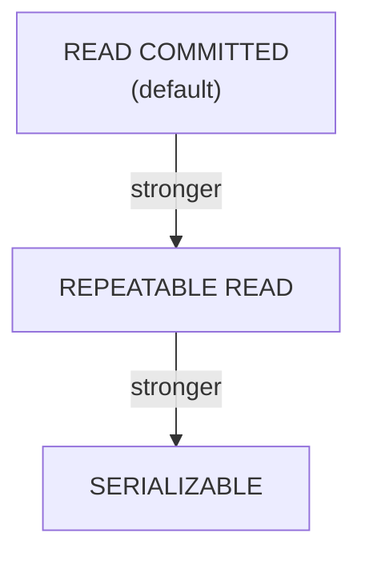

# Transactions

> [!abstract] Definition
> A **transaction** groups multiple statements into a single all-or-nothing unit of work - either every statement succeeds and is permanently saved (`COMMIT`), or none of them are (`ROLLBACK`). This guarantees the database never ends up in a partially-updated, inconsistent state.

---

## Basic Transaction Syntax

```sql
BEGIN;
UPDATE accounts SET balance = balance - 100 WHERE id = 1;
UPDATE accounts SET balance = balance + 100 WHERE id = 2;
COMMIT;
```

```sql
BEGIN;
UPDATE accounts SET balance = balance - 100 WHERE id = 1;
-- something looks wrong...
ROLLBACK;    -- undoes everything back to the BEGIN point, as if it never happened
```

> [!info] Every statement is technically already in a transaction
> Outside an explicit `BEGIN`, Postgres runs each individual statement in its own implicit transaction, auto-committed immediately. `BEGIN`/`COMMIT` simply lets you group several statements into ONE atomic transaction instead.

---

## ACID Properties

| Property | Guarantee |
|---|---|
| **Atomicity** | all statements in the transaction succeed together, or none do |
| **Consistency** | the database moves from one valid state to another, never violating constraints |
| **Isolation** | concurrent transactions don't see each other's uncommitted changes |
| **Durability** | once committed, changes survive even a server crash |

---

## `SAVEPOINT` - Partial Rollback Within a Transaction

```sql
BEGIN;
UPDATE accounts SET balance = balance - 100 WHERE id = 1;

SAVEPOINT before_risky_update;
UPDATE accounts SET balance = balance + 100 WHERE id = 999;   -- oops, wrong id

ROLLBACK TO SAVEPOINT before_risky_update;    -- undo just the risky part, keep the first update
UPDATE accounts SET balance = balance + 100 WHERE id = 2;       -- correct version
COMMIT;
```

> [!tip] Savepoints for complex, multi-step transactions
> Useful when a transaction has several stages and you want the ability to back out of a later stage without discarding everything already done in earlier stages.

---

## Transactional DDL (A Postgres Strength)

```sql
BEGIN;
CREATE TABLE test_table (id INT);
DROP TABLE test_table;
ROLLBACK;    -- the CREATE and DROP are both undone entirely
```

> [!success] Postgres supports fully transactional schema changes
> Unlike many databases, Postgres lets you wrap `CREATE TABLE`, `ALTER TABLE`, `DROP TABLE`, etc. inside a transaction and roll them back - handy for testing risky migrations safely before committing.

---

## Isolation Levels

```sql
BEGIN ISOLATION LEVEL READ COMMITTED;      -- Postgres default
BEGIN ISOLATION LEVEL REPEATABLE READ;
BEGIN ISOLATION LEVEL SERIALIZABLE;
```

| Level | Prevents |
|---|---|
| `READ UNCOMMITTED` | (treated identically to `READ COMMITTED` in Postgres - true dirty reads never happen) |
| `READ COMMITTED` (default) | dirty reads only - each statement sees a fresh snapshot of committed data |
| `REPEATABLE READ` | dirty reads + non-repeatable reads - the whole transaction sees one consistent snapshot |
| `SERIALIZABLE` | everything above + phantom reads and write skew - behaves as if transactions ran one at a time |



> [!tip] Choosing an isolation level
> `READ COMMITTED` is fine for most applications. Use `SERIALIZABLE` for financial/inventory logic where subtle concurrent-write anomalies (e.g. two transactions both reading "5 items in stock" and both decrementing, resulting in -1) would be genuinely damaging - be ready to catch and retry serialization failures, since `SERIALIZABLE` transactions can be aborted by Postgres to preserve correctness.

---

## Locking

```sql
-- Row-level lock: prevents other transactions from modifying these rows until this one ends
SELECT * FROM accounts WHERE id = 1 FOR UPDATE;

SELECT * FROM accounts WHERE id = 1 FOR SHARE;        -- allows other reads, blocks other writes

SELECT * FROM accounts WHERE id = 1 FOR UPDATE NOWAIT;    -- fail immediately instead of waiting if locked
SELECT * FROM accounts WHERE id = 1 FOR UPDATE SKIP LOCKED; -- skip already-locked rows entirely (great for job queues)
```

> [!tip] `SKIP LOCKED` for building a work queue
> A classic pattern for multiple workers pulling jobs from a shared table without stepping on each other: `SELECT * FROM jobs WHERE status = 'pending' FOR UPDATE SKIP LOCKED LIMIT 1` - each worker atomically claims a different row.

---

## Deadlocks

```
ERROR: deadlock detected
DETAIL: Process 123 waits for ShareLock on transaction 456; blocked by process 789.
```

> [!warning] Deadlocks happen when two transactions wait on each other in a cycle
> E.g. Transaction A locks row 1 then wants row 2, while Transaction B locks row 2 then wants row 1 - each waits forever for the other. Postgres automatically detects this and kills one transaction (rolling it back) to break the cycle. Prevent deadlocks by always acquiring locks/updating rows in a **consistent order** across your application.

---

## Common Application Pattern

```sql
BEGIN;
    -- application code performs several related writes here
    -- if any step fails (exception in app code), issue ROLLBACK instead of COMMIT
COMMIT;
```

> [!info] In practice
> Most application frameworks/ORMs wrap this pattern automatically - a `try`/`except` block that commits on success and rolls back on any exception, so a transaction is never left half-applied due to an application-level error partway through.

---

## Related
- [[05-DML-Insert-Update-Delete]]
- [[03-DDL-Tables]]
- [[19-Common-Errors-Gotchas]]
