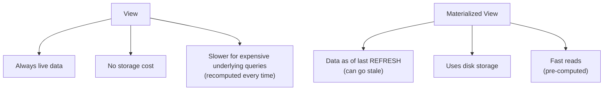

# Views & Materialized Views

> [!abstract] Definition
> A **view** is a saved, named `SELECT` query that behaves like a virtual table - queried like any table, but always reflects live data, computed fresh on every access. A **materialized view** is similar but physically stores its result set on disk, requiring an explicit refresh to stay current.

---

## Creating a View

```sql
CREATE VIEW active_users AS
SELECT id, name, email
FROM users
WHERE is_active = true;

SELECT * FROM active_users WHERE name LIKE 'A%';   -- query a view exactly like a table
```

> [!info] Views run their underlying query every time
> There's no caching - a view is essentially a stored, reusable `SELECT` statement. Performance is identical to running the underlying query directly.

---

## Why Use Views

> [!tip] Common reasons to reach for a view
> - **Simplify complex queries**: hide a multi-join, multi-CTE query behind a simple `SELECT * FROM my_view`
> - **Security/access control**: expose only specific columns/rows to certain users, hiding sensitive columns entirely (e.g. a view that excludes a `password_hash` column)
> - **Backward compatibility**: if a table's structure changes, a view can preserve the old interface for existing application code
> - **Consistency**: define business logic (e.g. "active user" = `is_active = true AND last_login > now() - interval '90 days'`) once, reuse everywhere

---

## Updating Through a View

```sql
UPDATE active_users SET email = 'new@example.com' WHERE id = 1;
```

> [!warning] Not all views are updatable
> Simple views (single table, no aggregation, no `DISTINCT`, no `GROUP BY`) are automatically updatable. Views involving joins, aggregates, or `GROUP BY` are NOT automatically updatable - use an `INSTEAD OF` trigger (see [[15-Triggers]]) or a rule to define custom update behavior for those.

---

## Modifying & Dropping Views

```sql
CREATE OR REPLACE VIEW active_users AS
SELECT id, name, email, created_at
FROM users
WHERE is_active = true;

DROP VIEW active_users;
DROP VIEW IF EXISTS active_users CASCADE;   -- also drops anything depending on this view
```

> [!warning] `CREATE OR REPLACE VIEW` can't change column names/types/order
> To add, remove, or reorder columns, you must `DROP VIEW` first, then `CREATE VIEW` fresh - a straight `REPLACE` only allows appending new columns at the end.

---

## Materialized Views

```sql
CREATE MATERIALIZED VIEW monthly_sales AS
SELECT date_trunc('month', order_date) AS month, SUM(amount) AS total
FROM orders
GROUP BY date_trunc('month', order_date);

SELECT * FROM monthly_sales;    -- fast - reads pre-computed, stored data
```

### Refreshing

```sql
REFRESH MATERIALIZED VIEW monthly_sales;                    -- locks the view during refresh, blocks reads
REFRESH MATERIALIZED VIEW CONCURRENTLY monthly_sales;          -- allows reads during refresh, requires a unique index
```

> [!warning] `CONCURRENTLY` requires a unique index on the materialized view
> Without at least one `UNIQUE` index defined on it, `REFRESH ... CONCURRENTLY` fails - add one with `CREATE UNIQUE INDEX ON monthly_sales (month)` before using this option.

---

## View vs Materialized View



| | View | Materialized View |
|---|---|---|
| Data freshness | Always current | As of last `REFRESH` |
| Read speed | Same as underlying query | Fast - pre-computed |
| Storage | None (just stores the query definition) | Physically stored on disk |
| Best for | Simplifying/securing everyday queries | Expensive aggregations/reports queried often, where slightly stale data is acceptable |

> [!tip] Scheduling refreshes
> Materialized views don't refresh automatically - schedule `REFRESH MATERIALIZED VIEW` via a cron job, `pg_cron` extension, or application-triggered job for dashboards/reports that can tolerate being minutes or hours old.

---

## Inspecting Views

```sql
\dv                             -- list all views (psql meta-command)
\d+ active_users                  -- view definition and details

SELECT view_definition FROM information_schema.views WHERE table_name = 'active_users';
```

---

## Related
- [[06-Querying-Select-Where]]
- [[08-Aggregation-GroupBy]]
- [[15-Triggers]]
- [[18-psql-Admin-Commands]]
