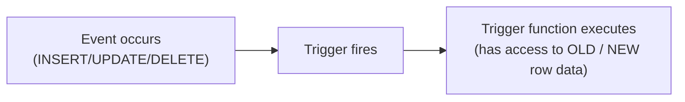

# Triggers

> [!abstract] Definition
> A **trigger** automatically fires a function in response to `INSERT`, `UPDATE`, `DELETE`, or `TRUNCATE` on a table - useful for auditing, enforcing complex business rules, keeping denormalized data in sync, or cascading side effects without relying on application code to remember to do so.

---

## The Two-Part Pattern

Every trigger requires two objects: a **trigger function** (the logic) and the **trigger itself** (which event/table it's attached to).



---

## Basic Example: Auto-Updating `updated_at`

```sql
-- Step 1: the trigger function
CREATE OR REPLACE FUNCTION set_updated_at()
RETURNS TRIGGER AS $$
BEGIN
    NEW.updated_at = now();
    RETURN NEW;
END;
$$ LANGUAGE plpgsql;

-- Step 2: attach it to a table
CREATE TRIGGER trg_users_updated_at
BEFORE UPDATE ON users
FOR EACH ROW
EXECUTE FUNCTION set_updated_at();
```

Now every `UPDATE users SET ...` automatically refreshes `updated_at` - no application code needs to remember to set it.

---

## `NEW` and `OLD` Pseudo-Records

| Available in | `NEW` | `OLD` |
|---|---|---|
| `INSERT` trigger | ✅ the row being inserted | ❌ doesn't exist yet |
| `UPDATE` trigger | ✅ the row after the change | ✅ the row before the change |
| `DELETE` trigger | ❌ doesn't exist anymore | ✅ the row being deleted |

```sql
CREATE OR REPLACE FUNCTION log_price_change()
RETURNS TRIGGER AS $$
BEGIN
    IF NEW.price <> OLD.price THEN
        INSERT INTO price_history (product_id, old_price, new_price, changed_at)
        VALUES (OLD.id, OLD.price, NEW.price, now());
    END IF;
    RETURN NEW;
END;
$$ LANGUAGE plpgsql;

CREATE TRIGGER trg_log_price_change
AFTER UPDATE ON products
FOR EACH ROW
EXECUTE FUNCTION log_price_change();
```

---

## `BEFORE` vs `AFTER` vs `INSTEAD OF`

```sql
CREATE TRIGGER ... BEFORE INSERT ON table_name ...     -- can MODIFY the row (via NEW) before it's written
CREATE TRIGGER ... AFTER INSERT ON table_name ...         -- row is already written; use for side effects (logging, notifications)
CREATE TRIGGER ... INSTEAD OF INSERT ON view_name ...        -- defines custom write behavior for a non-updatable view
```

| Timing | Can modify the row? | Typical use |
|---|---|---|
| `BEFORE` | Yes, via `NEW.column = ...` | validation, auto-filling defaults, normalizing data |
| `AFTER` | No, row is already committed to the statement | audit logging, cascading updates to other tables, notifications |
| `INSTEAD OF` | N/A - replaces the action entirely | making complex views updatable |

---

## Row-Level vs Statement-Level

```sql
FOR EACH ROW           -- fires once PER ROW affected
FOR EACH STATEMENT        -- fires ONCE per statement, regardless of how many rows it affects
```

```sql
CREATE TRIGGER trg_audit_bulk_delete
AFTER DELETE ON orders
FOR EACH STATEMENT
EXECUTE FUNCTION log_bulk_delete();
```

> [!tip] Statement-level triggers for bulk-operation summaries
> If you only need to know "a delete happened," not details about each individual row, `FOR EACH STATEMENT` avoids the overhead of firing thousands of times for a bulk `DELETE`.

---

## Conditional Triggers (`WHEN` Clause)

```sql
CREATE TRIGGER trg_notify_low_stock
AFTER UPDATE ON products
FOR EACH ROW
WHEN (NEW.stock < 10 AND OLD.stock >= 10)
EXECUTE FUNCTION notify_low_stock();
```

> [!tip] Filter at the trigger level, not inside the function
> A `WHEN` clause avoids invoking the trigger function entirely when the condition isn't met - more efficient than calling the function every time and checking the condition inside it.

---

## Preventing an Action (`BEFORE` Trigger Returning `NULL`)

```sql
CREATE OR REPLACE FUNCTION prevent_negative_balance()
RETURNS TRIGGER AS $$
BEGIN
    IF NEW.balance < 0 THEN
        RAISE EXCEPTION 'Balance cannot go negative (attempted: %)', NEW.balance;
    END IF;
    RETURN NEW;
END;
$$ LANGUAGE plpgsql;

CREATE TRIGGER trg_no_negative_balance
BEFORE UPDATE ON accounts
FOR EACH ROW
EXECUTE FUNCTION prevent_negative_balance();
```

> [!tip] `RAISE EXCEPTION` inside a `BEFORE` trigger blocks the operation entirely
> The whole statement is rolled back - a powerful way to enforce invariants that a simple `CHECK` constraint can't express (e.g. rules spanning multiple tables).

---

## Managing Triggers

```sql
\dS+ users                                   -- psql: view triggers on a table (alongside table structure)

ALTER TABLE users DISABLE TRIGGER trg_users_updated_at;   -- temporarily turn a trigger off
ALTER TABLE users ENABLE TRIGGER trg_users_updated_at;
ALTER TABLE users DISABLE TRIGGER ALL;                        -- disable ALL triggers on the table (e.g. for bulk loads)

DROP TRIGGER trg_users_updated_at ON users;
```

> [!warning] Triggers add hidden complexity
> They fire automatically and invisibly to whoever wrote the `INSERT`/`UPDATE` statement, which can make debugging unexpected behavior harder - document triggers clearly, and consider whether application-level logic might be simpler to reason about for non-critical rules.

---

## Related
- [[14-Functions-Stored-Procedures]]
- [[13-Views]] (`INSTEAD OF` triggers)
- [[03-DDL-Tables]]
