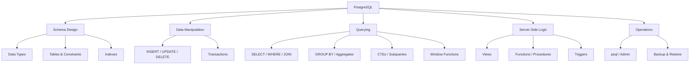

# 🐘 PostgreSQL - Map of Content

> [!abstract] What is PostgreSQL?
> **PostgreSQL** ("Postgres") is a powerful, open-source, object-relational database system known for standards compliance, extensibility, and advanced features like JSONB, window functions, full-text search, and custom types. This folder is a full command and syntax reference, organized the same way as the [[Pandas/00-Pandas-MOC|Pandas]], [[NumPy/00-NumPy-MOC|NumPy]], and [[Scikit-learn/00-Sklearn-MOC|Scikit-learn]] folders.

```sql
-- The classic sanity check
SELECT version();
```

> [!info] Version note
> This vault assumes **PostgreSQL 16+**. Syntax notes flag anything version-specific (e.g. `MERGE` requires 15+, multirange types require 14+).

---

## 📂 Folder Contents

| # | Note | Covers |
|---|------|--------|
| 01 | [[01-Installation-Connection]] | Installing Postgres, `psql`, connecting, roles |
| 02 | [[02-Data-Types]] | Numeric, text, date/time, boolean, arrays, JSON, UUID |
| 03 | [[03-DDL-Tables]] | `CREATE`, `ALTER`, `DROP TABLE`, schemas |
| 04 | [[04-Constraints-Keys]] | Primary/foreign keys, `CHECK`, `UNIQUE`, `NOT NULL` |
| 05 | [[05-DML-Insert-Update-Delete]] | `INSERT`, `UPDATE`, `DELETE`, `UPSERT`, `MERGE` |
| 06 | [[06-Querying-Select-Where]] | `SELECT`, `WHERE`, `ORDER BY`, `LIMIT`, operators |
| 07 | [[07-Joins]] | `INNER`, `LEFT`, `RIGHT`, `FULL`, `CROSS`, `SELF` joins |
| 08 | [[08-Aggregation-GroupBy]] | `GROUP BY`, `HAVING`, aggregate functions |
| 09 | [[09-Subqueries-CTEs]] | Subqueries, `WITH`, recursive CTEs |
| 10 | [[10-Window-Functions]] | `OVER`, `PARTITION BY`, ranking, running totals |
| 11 | [[11-Indexes]] | B-tree, GIN, GiST, partial/expression indexes |
| 12 | [[12-Transactions]] | `BEGIN`/`COMMIT`/`ROLLBACK`, isolation levels, locks |
| 13 | [[13-Views]] | Views, materialized views |
| 14 | [[14-Functions-Stored-Procedures]] | `PL/pgSQL`, functions, procedures |
| 15 | [[15-Triggers]] | `CREATE TRIGGER`, trigger functions |
| 16 | [[16-JSON-JSONB]] | JSON/JSONB storage, operators, functions |
| 17 | [[17-Full-Text-Search]] | `tsvector`, `tsquery`, ranking |
| 18 | [[18-psql-Admin-Commands]] | Meta-commands, backup/restore, users/permissions |
| 19 | [[DBMS/PostgreSql/19-Common-Errors-Gotchas]] | Common errors, NULL traps, performance pitfalls |

---

## 🗺️ Conceptual Map



---

## ⚡ Quick Reference - Most-Used Statements

```sql
-- Connect
psql -U username -d database_name -h localhost

-- Table lifecycle
CREATE TABLE users (id SERIAL PRIMARY KEY, name TEXT NOT NULL, email TEXT UNIQUE);
ALTER TABLE users ADD COLUMN age INT;
DROP TABLE users;

-- CRUD
INSERT INTO users (name, email) VALUES ('Alice', 'alice@example.com');
SELECT * FROM users WHERE age > 25 ORDER BY name LIMIT 10;
UPDATE users SET age = 26 WHERE id = 1;
DELETE FROM users WHERE id = 1;

-- Joins & aggregation
SELECT u.name, COUNT(o.id) AS order_count
FROM users u
LEFT JOIN orders o ON o.user_id = u.id
GROUP BY u.name
HAVING COUNT(o.id) > 0;

-- Transactions
BEGIN;
UPDATE accounts SET balance = balance - 100 WHERE id = 1;
UPDATE accounts SET balance = balance + 100 WHERE id = 2;
COMMIT;
```

---

## 🔗 Related in LORE
- [[03-IO-Reading-Writing|Pandas: IO Reading & Writing]] - `pd.read_sql()` pulls query results straight into a DataFrame
- [[git-setup|Git Complete Setup Guide]]
- ML Study Notes - SQL is typically the data-extraction layer feeding into pandas/sklearn pipelines

> [!tip] How to use this vault section
> Same skeleton throughout: **Definition -> Syntax -> Key Parameters/Clauses -> Examples -> Notes/Gotchas**. Use `Ctrl/Cmd+O` and type "PostgreSQL" or the note number to jump around.
