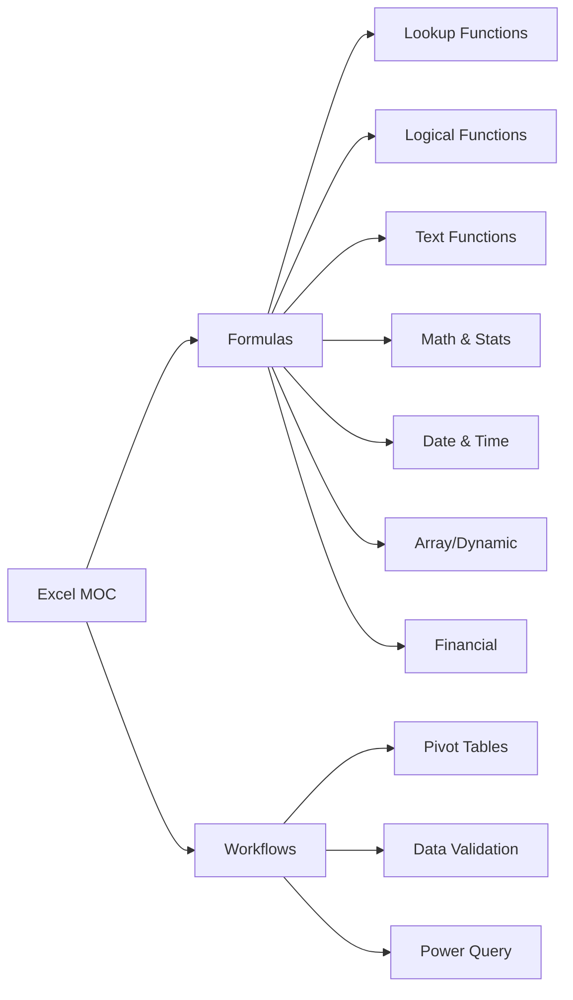

# Excel MOC

> [!abstract] About
> Map of Content for everything Excel — formulas, features, and workflows. Part of **LORE**.

## 📚 Formula References
- [[Formula Basics]]
- [[Lookup Functions]]
- [[Logical Functions]]
- [[Text Functions]]
- [[Math & Statistical Functions]]
- [[Date & Time Functions]]
- [[Array & Dynamic Array Functions]]
- [[Financial Functions]]

## 🛠️ Features & Workflows
- [[Pivot Tables]]
- [[Data Validation & Conditional Formatting]]
- [[Power Query Basics]]
- [[Keyboard Shortcuts]]
- [[Common Errors Reference]]

## 🗺️ Quick Map

