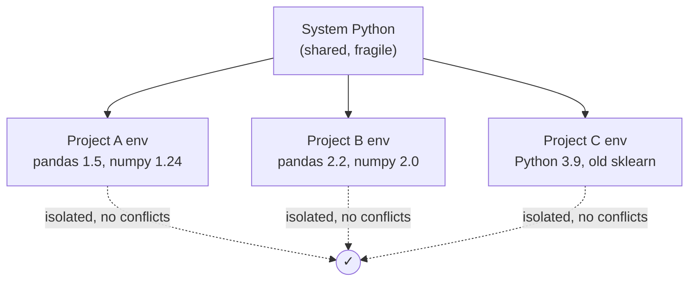
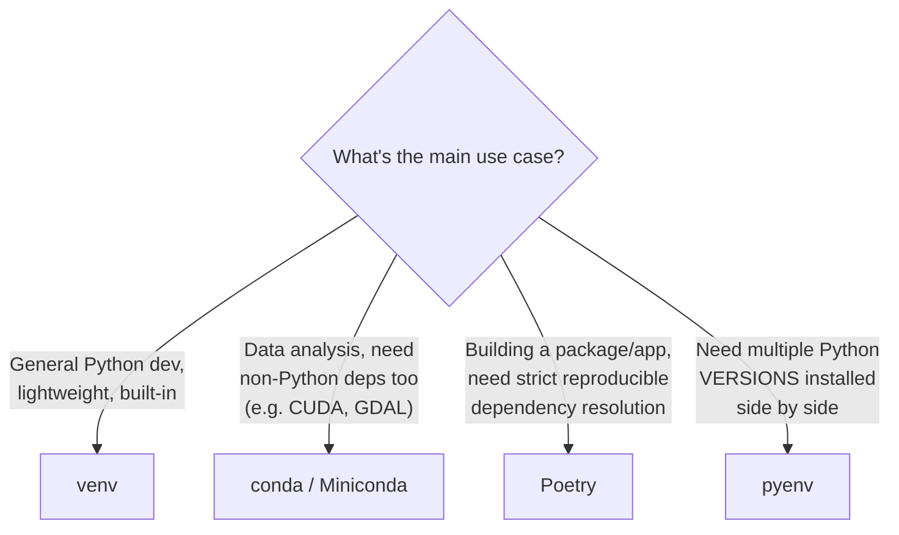
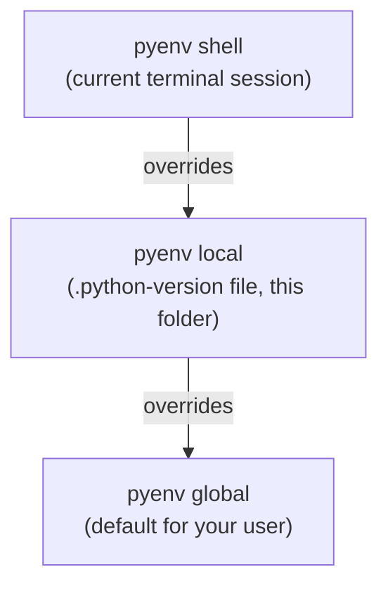

# 🐍 Python Virtual Environments - Complete Setup & Reference Guide

> [!abstract] What this guide covers
> Everything needed to set up isolated, reproducible Python environments for both dev work and data analysis: why virtual environments matter, the major tools (`venv`, `virtualenv`, `pyenv`, `conda`, `poetry`), a full command reference for each, dependency-file conventions, Jupyter integration, and troubleshooting. One reference note, searchable top to bottom.

## 📑 Table of Contents

- [[#1 Why Virtual Environments]]
- [[#2 Choosing a Tool]]
- [[#3 venv (Built-in, Recommended Default)]]
- [[#4 pyenv (Managing Python Versions)]]
- [[#5 conda / Miniconda (Best for Data Analysis)]]
- [[#6 Poetry (Best for Application/Package Dev)]]
- [[#7 pipenv (Alternative)]]
- [[#8 Dependency Files Explained]]
- [[#9 Jupyter Integration]]
- [[#10 VS Code Integration]]
- [[#11 .gitignore for Python Projects]]
- [[#12 Common Workflows]]
- [[#13 Full Command Cheat Sheet]]
- [[#14 Troubleshooting]]
- [[#15 Best Practice Checklist]]

---

## 1. Why Virtual Environments

> [!abstract] The core problem
> Every Python project tends to need different, sometimes conflicting, package versions. Installing everything globally (`pip install` with no environment active) means Project A's `pandas==1.5` and Project B's `pandas==2.2` fight for the same global install location - a **virtual environment** gives each project its own isolated Python interpreter and package set, so they never collide.



> [!warning] Never `pip install` directly into your system Python
> Doing so risks breaking OS-level tools that depend on a specific Python setup (common on Linux/macOS), and guarantees version conflicts as soon as you have more than one project. Always work inside an activated virtual environment.

---

## 2. Choosing a Tool



| Tool | Manages Python versions? | Manages packages? | Non-Python deps? | Best for |
|---|---|---|---|---|
| **venv** | No (uses whatever Python it was created with) | Yes, via pip | No | Default choice for most dev work |
| **pyenv** | Yes | No (pairs with venv/pip) | No | Switching between Python 3.10/3.11/3.12 etc. |
| **conda** | Yes | Yes | Yes (C libraries, R, etc.) | Data science/ML, especially with heavy binary deps |
| **Poetry** | No (pairs with pyenv) | Yes, with lockfile | No | Publishable packages, applications needing strict reproducibility |
| **pipenv** | No | Yes, with lockfile | No | Similar niche to Poetry, less popular now |

> [!tip] A common, solid combo
> `pyenv` (for Python version switching) + `venv` (for per-project isolation) covers most general dev work. For data analysis with heavy scientific libraries (especially anything needing compiled binaries like GDAL, CUDA, or specific BLAS backends), **conda/Miniconda** is usually smoother.

---

## 3. `venv` (Built-in, Recommended Default)

`venv` ships with Python itself (3.3+) - no separate install needed.

### Creating an Environment

```bash
python3 -m venv .venv           # creates a folder named .venv in the current directory
python3 -m venv myproject_env     # or any custom name
```

> [!tip] Name it `.venv`
> The leading dot hides it from casual directory listings, and `.venv` is the name most editors (VS Code, PyCharm) auto-detect and offer to activate automatically.

### Activating

```bash
# macOS / Linux
source .venv/bin/activate

# Windows (Command Prompt)
.venv\Scripts\activate.bat

# Windows (PowerShell)
.venv\Scripts\Activate.ps1

# Windows (Git Bash)
source .venv/Scripts/activate
```

Once active, the shell prompt is prefixed with `(.venv)`, and `python`/`pip` now point inside the environment.

### Deactivating

```bash
deactivate
```

### Verifying Which Python/Pip Is Active

```bash
which python      # macOS/Linux
where python         # Windows
python -c "import sys; print(sys.prefix)"
```

### Installing Packages

```bash
pip install pandas numpy scikit-learn
pip install pandas==2.2.0        # pin an exact version
pip install "pandas>=2.0,<3.0"     # version range
pip install -r requirements.txt      # install everything listed in a file
```

### Saving & Recreating an Environment

```bash
pip freeze > requirements.txt        # snapshot everything currently installed, with exact versions
pip install -r requirements.txt        # recreate that exact set elsewhere
```

> [!info] See [[#8 Dependency Files Explained]] for why `pip freeze` output isn't always the ideal `requirements.txt` to commit.

### Removing an Environment

```bash
deactivate            # first, if currently active
rm -rf .venv             # macOS/Linux
rmdir /s .venv              # Windows
```

> There's no "uninstall" command - a venv is just a folder. Deleting it removes the entire environment.

---

## 4. `pyenv` (Managing Python Versions)

Use `pyenv` when a project needs a specific Python version (e.g. 3.11) different from what's installed system-wide, or when juggling several versions across projects.

### Installation

```bash
# macOS
brew install pyenv

# Linux
curl https://pyenv.run | bash
```

Then add to `~/.bashrc` / `~/.zshrc`:

```bash
export PYENV_ROOT="$HOME/.pyenv"
export PATH="$PYENV_ROOT/bin:$PATH"
eval "$(pyenv init -)"
```

Restart the shell, then verify:

```bash
pyenv --version
```

### Core Commands

```bash
pyenv install --list             # see all installable Python versions
pyenv install 3.12.3                # install a specific version
pyenv versions                        # list installed versions on this machine
pyenv global 3.12.3                     # set the DEFAULT Python version, system-wide for your user
pyenv local 3.11.8                        # set the Python version for THIS DIRECTORY only (writes .python-version)
pyenv shell 3.10.13                         # set the version for the CURRENT SHELL SESSION only
pyenv which python                            # show the actual path pyenv is pointing to
pyenv uninstall 3.9.18                          # remove a version
```



### Combining `pyenv` with `venv`

```bash
pyenv local 3.12.3                  # pin this project to Python 3.12.3
python -m venv .venv                  # venv now uses that pinned version
source .venv/bin/activate
```

> [!tip] `pyenv-virtualenv` plugin
> An optional plugin (`brew install pyenv-virtualenv`) that lets `pyenv` create and manage virtual environments directly (`pyenv virtualenv 3.12.3 myproject`), combining both steps - popular, but plain `pyenv local` + `venv` works just as well and has fewer moving parts.

---

## 5. `conda` / Miniconda (Best for Data Analysis)

Conda manages Python versions AND packages (including non-Python binary dependencies) together, which is why it's the default choice in much of the data science world.

### Installing Miniconda (Lightweight, Recommended over Full Anaconda)

```bash
# Download from https://docs.conda.io/en/latest/miniconda.html, then:

# macOS / Linux
bash Miniconda3-latest-*.sh

# Windows: run the downloaded .exe installer
```

> [!tip] Miniconda over Anaconda
> Miniconda installs just `conda` itself plus Python - Anaconda bundles 150+ packages upfront (several GB), most of which go unused. Install only what each project actually needs via Miniconda instead.

### Creating an Environment

```bash
conda create --name myenv python=3.12
conda create --name myenv python=3.12 pandas numpy scikit-learn    # install packages at creation time
```

### Activating / Deactivating

```bash
conda activate myenv
conda deactivate
```

### Installing Packages

```bash
conda install pandas
conda install -c conda-forge scikit-learn      # from a specific channel (conda-forge = the most complete community channel)
pip install some-package                          # pip ALSO works inside a conda env, for packages conda lacks
```

> [!warning] Mixing `conda install` and `pip install` in the same environment
> Generally safe, but always run `conda install` for everything possible FIRST, then `pip install` only for packages conda doesn't have. Doing it in reverse order can cause conda's dependency solver to overwrite pip-installed packages unexpectedly.

### Listing & Removing Environments

```bash
conda env list                    # list all environments
conda list                          # list packages in the currently active environment
conda remove --name myenv --all       # delete an environment entirely
```

### Exporting & Recreating

```bash
conda env export > environment.yml                        # full snapshot, includes exact builds (platform-specific)
conda env export --from-history > environment.yml            # cleaner - only packages YOU explicitly installed
conda env create -f environment.yml                             # recreate elsewhere
```

> [!tip] Prefer `--from-history` for the file you commit to git
> A full `conda env export` bakes in exact build hashes tied to your specific OS/architecture, which often fails to install on a different platform. `--from-history` produces a much more portable file.

### Updating

```bash
conda update conda              # update conda itself
conda update --all                # update everything in the active environment
conda env update -f environment.yml --prune   # sync environment to match the file exactly, removing extras
```

---

## 6. Poetry (Best for Application/Package Dev)

Poetry manages dependencies AND packaging/publishing together, with a lockfile for fully reproducible installs - popular for building libraries or production applications.

### Installation

```bash
curl -sSL https://install.python-poetry.org | python3 -
poetry --version
```

### Starting a Project

```bash
poetry new myproject          # scaffolds a new project with standard structure
cd myproject
# OR, inside an existing directory:
poetry init                      # interactively creates pyproject.toml for an existing folder
```

### Adding & Removing Dependencies

```bash
poetry add pandas
poetry add pandas@2.2.0            # exact version
poetry add pytest --group dev        # a development-only dependency (not needed in production)
poetry remove pandas
```

### Installing From an Existing `pyproject.toml`

```bash
poetry install                 # installs all dependencies AND creates/uses a virtual environment automatically
poetry install --no-dev           # skip dev-only dependencies
```

### Running Commands Inside the Environment

```bash
poetry run python script.py
poetry run pytest
poetry shell                     # activate the environment directly into your current shell
```

### The Lockfile

```bash
poetry.lock          # auto-generated - pins EXACT versions of every dependency and sub-dependency
```

> [!tip] Always commit `poetry.lock`
> Unlike a loose `requirements.txt`, the lockfile guarantees that everyone on the team (and CI) installs the exact same dependency tree, down to transitive dependencies - eliminating "works on my machine" version drift.

```bash
poetry update              # update dependencies AND the lockfile, respecting version constraints in pyproject.toml
poetry show --tree            # visualize the full dependency tree
```

---

## 7. pipenv (Alternative)

Similar goals to Poetry (lockfile-based reproducibility), less commonly chosen for new projects today but still found in existing codebases.

```bash
pip install pipenv

pipenv install pandas          # installs AND creates a Pipfile + virtual environment automatically
pipenv install pytest --dev       # dev-only dependency
pipenv shell                        # activate the environment
pipenv run python script.py           # run a command without activating first
pipenv lock                             # regenerate Pipfile.lock
pipenv install                            # install from an existing Pipfile.lock
```

---

## 8. Dependency Files Explained

| File | Used by | Purpose |
|---|---|---|
| `requirements.txt` | pip / venv | flat list of packages (optionally pinned versions) |
| `environment.yml` | conda | packages + Python version + channels |
| `pyproject.toml` | Poetry (and modern pip) | project metadata + dependencies + build config |
| `poetry.lock` | Poetry | exact, reproducible dependency tree |
| `Pipfile` / `Pipfile.lock` | pipenv | equivalent to pyproject.toml / poetry.lock |

### `requirements.txt` Conventions

```txt
# requirements.txt
pandas==2.2.0            # exact pin - most reproducible, can go stale
numpy>=1.24,<2.0            # range - flexible, but can drift over time
scikit-learn                  # unpinned - gets whatever's latest at install time (least reproducible)
-r base-requirements.txt        # include another requirements file
```

> [!tip] Split dev and production requirements
> A common pattern: `requirements.txt` (production essentials only) plus `requirements-dev.txt` (adds `pytest`, `black`, `ruff`, etc., often with `-r requirements.txt` at the top to include the base set too).

### Generating a Clean `requirements.txt` (Better Than Raw `pip freeze`)

```bash
pip install pipreqs
pipreqs /path/to/project      # scans actual imports in your code, lists only what's truly used
```

> [!warning] `pip freeze` dumps EVERYTHING installed, including indirect dependencies
> This can bloat `requirements.txt` with dozens of packages you never directly import (sub-dependencies pulled in automatically). `pipreqs` or a lockfile-based tool (Poetry/pipenv) gives a cleaner picture of your project's actual direct dependencies.

---

## 9. Jupyter Integration

To use a virtual environment as a selectable **kernel** inside Jupyter Notebook/Lab:

```bash
# Inside the ACTIVATED virtual environment:
pip install ipykernel
python -m ipykernel install --user --name=myproject --display-name "Python (myproject)"
```

```bash
jupyter kernelspec list        # see all registered kernels
jupyter kernelspec uninstall myproject     # remove a kernel you no longer need
```

> [!tip] Now the kernel shows up in the notebook's kernel picker
> Open Jupyter (from anywhere, doesn't need to be launched from inside the venv), then select **Python (myproject)** from the Kernel menu - the notebook now runs using that specific environment's packages, without needing to activate it manually each session.

### For conda environments

```bash
conda activate myenv
conda install ipykernel
python -m ipykernel install --user --name=myenv --display-name "Python (myenv)"
```

---

## 10. VS Code Integration

> [!tip] VS Code auto-detects `.venv`
> Open the project folder; VS Code usually prompts to select the interpreter automatically. If not:
> 1. `Ctrl/Cmd + Shift + P` -> **Python: Select Interpreter**
> 2. Choose the one showing `./.venv/bin/python` (or the conda env's path)

Once selected, the integrated terminal auto-activates the environment on open, and the Python extension uses it for linting/IntelliSense/debugging.

```json
// .vscode/settings.json - pin the interpreter explicitly for the whole team
{
    "python.defaultInterpreterPath": "${workspaceFolder}/.venv/bin/python"
}
```

---

## 11. `.gitignore` for Python Projects

```gitignore
# Virtual environments
.venv/
venv/
env/
ENV/

# Conda
.conda/

# Python cache
__pycache__/
*.pyc
*.pyo

# Jupyter
.ipynb_checkpoints/

# Environment variables / secrets
.env

# Packaging
*.egg-info/
dist/
build/

# Editor
.vscode/
.idea/
```

> [!warning] Never commit a virtual environment folder to git
> It's large, platform-specific, and entirely reproducible from `requirements.txt`/`environment.yml`/`pyproject.toml` - committing it bloats the repo for no benefit. Commit the dependency FILE, not the environment itself.

---

## 12. Common Workflows

### Starting a New Analysis Project (conda)

```bash
conda create --name analysis python=3.12 pandas numpy scikit-learn matplotlib jupyter
conda activate analysis
python -m ipykernel install --user --name=analysis --display-name "Python (analysis)"
jupyter lab
```

### Starting a New Dev Project (venv + pyenv)

```bash
pyenv local 3.12.3
python -m venv .venv
source .venv/bin/activate
pip install --upgrade pip
pip install -r requirements.txt      # or start adding packages fresh
```

### Cloning Someone Else's Project

```bash
git clone git@github.com:user/repo.git
cd repo

# If it has requirements.txt:
python -m venv .venv && source .venv/bin/activate && pip install -r requirements.txt

# If it has environment.yml:
conda env create -f environment.yml && conda activate <env-name-from-file>

# If it has pyproject.toml + poetry.lock:
poetry install
```

### Freezing Before Sharing/Deploying

```bash
pip freeze > requirements.txt          # venv/pip projects
conda env export --from-history > environment.yml    # conda projects
poetry lock                               # poetry projects (auto-updates poetry.lock)
```

---

## 13. Full Command Cheat Sheet

```bash
# venv
python -m venv .venv
source .venv/bin/activate          # macOS/Linux
.venv\Scripts\activate               # Windows
deactivate
pip install -r requirements.txt
pip freeze > requirements.txt

# pyenv
pyenv install 3.12.3
pyenv local 3.12.3
pyenv global 3.12.3
pyenv versions

# conda
conda create --name myenv python=3.12
conda activate myenv
conda deactivate
conda install pandas
conda env export --from-history > environment.yml
conda env create -f environment.yml
conda env list
conda remove --name myenv --all

# poetry
poetry init
poetry add pandas
poetry install
poetry run python script.py
poetry shell
poetry update

# Jupyter kernel registration
pip install ipykernel
python -m ipykernel install --user --name=myproject --display-name "Python (myproject)"
```

---

## 14. Troubleshooting

### `command not found: python` (only `python3` works)

> [!info] macOS/Linux often alias only `python3`, not `python`
> Either always type `python3`, or create an alias, or - once inside an activated venv - `python` correctly points to the venv's interpreter regardless of the system default.

### Wrong Python version still showing after activating

```bash
which python              # check what's ACTUALLY active
deactivate                  # exit any currently active env first
source .venv/bin/activate     # then re-activate the intended one - nested activations can shadow each other
```

### `pip install` succeeds but `import` still fails

> [!warning] Usually means the package installed into a DIFFERENT Python than the one running your code
> Check `which python` and `which pip` match the same environment. Common cause: installing with a global `pip3` while running code with a venv's `python`, or vice versa. Prefer `python -m pip install ...` over bare `pip install ...` - it guarantees pip runs under the currently active `python`.

### `ModuleNotFoundError` for a package you're sure is installed

```bash
pip show package-name          # confirms it's installed, and shows WHICH environment
python -c "import sys; print(sys.path)"    # see where Python is actually looking for packages
```

### Conda environment creation extremely slow

> [!tip] Use the `libmamba` solver
> Since conda 23.10, a much faster dependency solver is available:
> ```bash
> conda install -n base conda-libmamba-solver
> conda config --set solver libmamba
> ```
> Alternatively, install `mamba` (a conda-compatible drop-in with a faster solver by default) and swap `conda` for `mamba` in commands.

### Two package managers fighting (conda + pip conflicts)

> [!warning] Symptoms: packages mysteriously break after mixing `conda install` and `pip install`
> Recreate the environment from scratch, installing everything possible via `conda install` FIRST, then `pip install` only for what remains. When in doubt, `conda env export --from-history` and `conda env create -f environment.yml` fresh is more reliable than trying to fix a tangled environment in place.

### `.python-version` file causing confusion

> [!info] `pyenv local` writes a `.python-version` file to the directory
> If a project behaves unexpectedly with the "wrong" Python version, check for a stray `.python-version` file in the current or a parent directory - `pyenv` reads the nearest one going up the directory tree.

### Permission errors on `pip install` (Linux/macOS)

> [!danger] Never use `sudo pip install`
> This installs into system-protected directories and can break OS tools. If you see a permission error, it almost always means no virtual environment is active - activate one first, rather than reaching for `sudo`.

---

## 15. Best Practice Checklist

> [!todo] Setup checklist for a new machine
> - [ ] Install Python (via system package manager, or `pyenv` for version flexibility)
> - [ ] Install `pyenv` if working across multiple Python versions
> - [ ] Install Miniconda if doing data analysis/ML work regularly
> - [ ] Install Poetry if building publishable packages/applications
> - [ ] Confirm `python -m venv --help` works (built-in, should always be available)

> [!todo] Habits for every project
> - [ ] Create a dedicated environment before installing ANY packages
> - [ ] Never install packages into the system/global Python
> - [ ] Commit a dependency file (`requirements.txt` / `environment.yml` / `pyproject.toml` + lockfile) - never the environment folder itself
> - [ ] Add environment folders to `.gitignore` immediately, before the first commit
> - [ ] Pin exact versions for production/shared projects; loose ranges are fine for quick personal scripts
> - [ ] Register a Jupyter kernel per project if doing notebook-based analysis
> - [ ] Re-freeze/update the dependency file whenever new packages are added

---

## 🔗 Related in LORE
- [[git-setup|Git Complete Setup Guide]]
- [[Pandas|Pandas Reference]]
- [[Sklearn|Scikit-learn Reference]]

> [!quote] Reminder
> A virtual environment is disposable by design - if it ever gets into a confusing, broken state, deleting it and recreating from the committed dependency file is almost always faster than trying to debug it in place.
