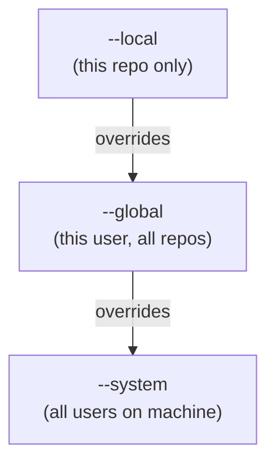
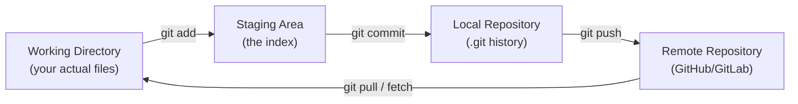
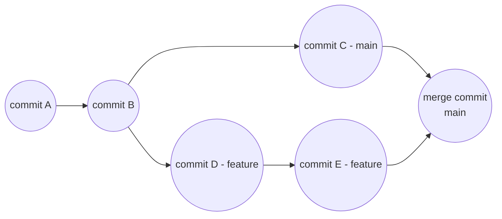
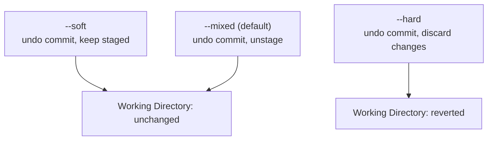
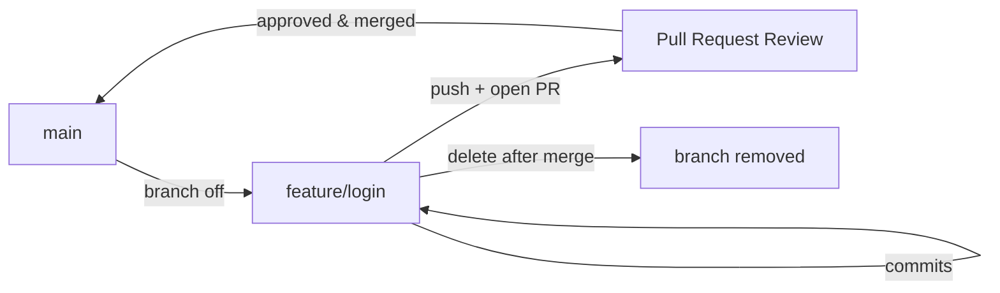

---
# 🌱 Git - Complete Setup & Reference Guide

> [!abstract] What this guide covers 
> Everything needed to go from a fresh machine to a fully configured, productive git setup: installation, identity/SSH config, the core daily workflow, branching, undoing mistakes, and a full command reference with tips. Written as a single reference note so it can be searched top to bottom or jumped into via the table of contents below.

## 📑 Table of Contents

- [[#1 Installation]]
- [[#2 Initial Configuration]]
- [[#3 SSH Key Setup (GitHub/GitLab)]]
- [[#4 Core Concepts]]
- [[#5 Starting a Repository]]
- [[#6 The Daily Workflow]]
- [[#7 Branching & Merging]]
- [[#8 Working with Remotes]]
- [[#9 Undoing Things]]
- [[#10 Stashing]]
- [[#11 Tags & Releases]]
- [[#12 .gitignore]]
- [[#13 Useful Aliases]]
- [[#14 Full Command Reference]]
- [[#15 Common Workflows]]
- [[#16 Troubleshooting]]
- [[#17 Best Practice Checklist]]

---

## 1. Installation

```bash
# Debian / Ubuntu
sudo apt update && sudo apt install git

# macOS (Homebrew)
brew install git

# Windows
# Download from https://git-scm.com/download/win
# or via winget:
winget install --id Git.Git -e --source winget
```

Verify installation:

```bash
git --version
```

> [!tip] Windows users 
> Install **Git Bash** alongside Git for Windows. It gives a Unix-like shell so every command in this guide works identically, instead of translating to PowerShell equivalents.

---

## 2. Initial Configuration

Git config exists at three levels, checked in this order of priority:



### Identity (required before your first commit)

```bash
git config --global user.name "Your Name"
git config --global user.email "you@example.com"
```

> [!warning] Match your email to your GitHub/GitLab account
>  Commits made with an email not linked to your account won't show up as "yours" on the contribution graph or be attributed to your profile.

### Recommended baseline settings

```bash
git config --global init.defaultBranch main         # new repos start on 'main', not 'master'
git config --global core.editor "vim"                 # or "code --wait" for VS Code
git config --global pull.rebase false                    # merge (safe default) instead of rebase on pull
git config --global credential.helper cache                # remember credentials temporarily
git config --global color.ui auto                             # colored output
git config --global core.autocrlf input                         # Linux/Mac line-ending handling
git config --global core.autocrlf true                            # Windows line-ending handling
```

### Viewing configuration

```bash
git config --list                  # everything currently set, with source
git config --global --list           # just global settings
git config user.name                   # a single value
```

> [!info] Config file locations
> 
> - Global: `~/.gitconfig`
> - Local (per repo): `.git/config` inside the repository
> - System: `/etc/gitconfig`

---

## 3. SSH Key Setup (GitHub/GitLab)

> [!tip] Why SSH over HTTPS 
> Once set up, SSH means no username/password or token prompts on every push/pull. Set it up once per machine.

### Step 1: Check for an existing key

```bash
ls -al ~/.ssh
```

Look for `id_ed25519.pub` or `id_rsa.pub`. If one exists, you can skip to Step 3.

### Step 2: Generate a new key

```bash
ssh-keygen -t ed25519 -C "you@example.com"
```

Press Enter to accept the default file location. Set a passphrase (recommended) or leave blank.

### Step 3: Add the key to the SSH agent

```bash
eval "$(ssh-agent -s)"
ssh-add ~/.ssh/id_ed25519
```

### Step 4: Copy the public key

```bash
# Linux
cat ~/.ssh/id_ed25519.pub

# macOS (copies to clipboard directly)
pbcopy < ~/.ssh/id_ed25519.pub

# Windows (Git Bash)
clip < ~/.ssh/id_ed25519.pub
```

### Step 5: Add it to your account

GitHub -> Settings -> SSH and GPG keys -> New SSH key -> paste -> Save.

### Step 6: Test the connection

```bash
ssh -T git@github.com
# Expect: "Hi <username>! You've successfully authenticated..."
```

> [!success] Once this works 
> Use SSH-style remote URLs from now on: `git@github.com:username/repo.git` instead of `https://github.com/username/repo.git`.

---

## 4. Core Concepts



|Term|Meaning|
|---|---|
|**Working directory**|The actual files you see and edit on disk|
|**Staging area (index)**|A holding zone for changes you're about to commit|
|**Repository (repo)**|The `.git` folder containing full project history|
|**Commit**|A saved snapshot of staged changes, with a message and unique hash|
|**Branch**|A movable pointer to a commit, letting you diverge from the main line of history|
|**HEAD**|A pointer to the commit your working directory currently reflects (usually the tip of the current branch)|
|**Remote**|A version of the repo hosted elsewhere (e.g. GitHub), referenced by a short name like `origin`|

---

## 5. Starting a Repository

### New project

```bash
mkdir my-project && cd my-project
git init
```

### Cloning an existing project

```bash
git clone git@github.com:username/repo.git
git clone git@github.com:username/repo.git custom-folder-name   # clone into a specific folder name
git clone --depth 1 git@github.com:username/repo.git               # shallow clone, only latest commit (faster, smaller)
```

---

## 6. The Daily Workflow

```bash
git status                    # see what's changed, staged, or untracked
git add file.txt                # stage a specific file
git add .                         # stage everything in the current directory
git add -p                          # stage interactively, chunk by chunk (great for reviewing your own diff before committing)

git commit -m "Add feature X"         # commit staged changes
git commit -am "Fix bug"                # stage AND commit all tracked, modified files in one step (skips new/untracked files)

git push                                  # send commits to the remote
git pull                                    # fetch + merge remote changes into current branch
```

> [!tip] Commit often, in small logical chunks 
> Small commits with clear messages are easier to review, revert individually, and bisect through later when hunting for a bug. Avoid one giant "final changes" commit.

### Writing good commit messages

```
<type>: <short summary, imperative mood, under 50 chars>

<optional longer description explaining WHY, not just what>
```

```bash
git commit -m "fix: correct off-by-one error in pagination"
git commit -m "feat: add dark mode toggle to settings page"
git commit -m "docs: update README install instructions"
```

|Prefix|Use for|
|---|---|
|`feat`|a new feature|
|`fix`|a bug fix|
|`docs`|documentation only|
|`refactor`|code change that neither fixes a bug nor adds a feature|
|`chore`|tooling, dependencies, config|
|`test`|adding or correcting tests|

---

## 7. Branching & Merging

```bash
git branch                       # list local branches
git branch -a                      # list local AND remote branches
git branch feature/login             # create a new branch (doesn't switch to it)

git switch feature/login               # switch to an existing branch (modern syntax)
git switch -c feature/login              # create AND switch in one step
git checkout feature/login                 # older equivalent of 'switch'
git checkout -b feature/login                # older equivalent of 'switch -c'

git branch -d feature/login                    # delete a branch (safe - refuses if unmerged)
git branch -D feature/login                      # force delete, even if unmerged
```

### Merging

```bash
git switch main
git merge feature/login          # merge feature/login INTO the current branch (main)
```



### Rebasing (Alternative to Merging)

```bash
git switch feature/login
git rebase main            # replay feature/login's commits on top of the latest main
```

> [!warning] Never rebase commits that have already been pushed and shared with others 
> Rebasing rewrites commit history (new hashes). If anyone else has pulled the old commits, rebasing creates conflicting histories. Safe to use freely on local, unpublished branches.

> [!tip] Merge vs rebase, in one line 
> **Merge** preserves true history with a merge commit (safer for shared branches). **Rebase** creates a cleaner, linear history (better for tidying up a personal feature branch before opening a pull request).

### Resolving merge conflicts

```bash
git status                     # shows which files have conflicts
# open the file, look for conflict markers:
```

```
<<<<<<< HEAD
your current branch's version
=======
the incoming branch's version
>>>>>>> feature/login
```

```bash
# after manually editing to resolve:
git add resolved-file.txt
git commit               # completes the merge
# OR, if mid-rebase:
git rebase --continue
```

```bash
git merge --abort         # bail out of a merge entirely, back to pre-merge state
git rebase --abort           # same, for a rebase in progress
```

---

## 8. Working with Remotes

```bash
git remote -v                                       # list remotes with URLs
git remote add origin git@github.com:me/repo.git      # link a local repo to a remote
git remote set-url origin git@github.com:me/new.git      # change a remote's URL
git remote remove origin                                    # unlink a remote

git push -u origin main            # push AND set upstream tracking (only needed once per branch)
git push                              # subsequent pushes, once upstream is set
git push origin feature/login           # push a specific branch

git fetch                    # download remote changes WITHOUT merging them into your working branch
git fetch origin               # fetch from a specific remote
git pull                         # fetch + merge in one step
git pull --rebase                  # fetch + rebase instead of merge (cleaner history)

git push origin --delete feature/login   # delete a branch on the remote
```

> [!info] `fetch` vs `pull` 
> `git fetch` downloads new commits and branches but leaves your working branch untouched, letting you inspect changes (`git log main..origin/main`) before deciding to merge. `git pull` does fetch + merge immediately, which is faster to type but skips that inspection step.

---

## 9. Undoing Things

> [!danger] Read this section before panicking about lost work 
> Git rarely truly deletes anything for at least 30-90 days. `git reflog` (see [[#16 Troubleshooting]]) can usually recover a "lost" commit.

### Unstage a file (keep the changes)

```bash
git restore --staged file.txt        # modern syntax
git reset file.txt                     # older equivalent
```

### Discard changes in the working directory (DESTRUCTIVE)

```bash
git restore file.txt          # discard uncommitted changes to a specific file
git restore .                   # discard ALL uncommitted changes, everywhere
git checkout -- file.txt          # older equivalent
```

### Amend the last commit

```bash
git commit --amend -m "New corrected message"      # fix the last commit's message
git commit --amend --no-edit                          # add currently staged changes to the last commit, keep its message
```

> [!warning] Only amend commits that haven't been pushed yet 
> Amending rewrites the commit hash - same rule as rebasing applies.

### Reset (move the branch pointer, with three modes)

```bash
git reset --soft HEAD~1       # undo last commit, keep changes STAGED
git reset --mixed HEAD~1        # undo last commit, keep changes UNSTAGED (default mode)
git reset --hard HEAD~1           # undo last commit, DISCARD changes entirely
```



> [!danger] `--hard` permanently discards uncommitted work 
> Double-check `git status` before running it - there's no undo for uncommitted changes lost this way.

### Revert (undo via a NEW commit - safe for shared/pushed history)

```bash
git revert <commit-hash>          # creates a new commit that undoes the specified commit
git revert HEAD                     # revert the most recent commit
```

> [!tip] `reset` vs `revert` 
> `reset` rewrites history (only safe locally, before pushing). `revert` adds a new commit that cancels out an old one, preserving full history - always safe on shared/pushed branches.

---

## 10. Stashing

Temporarily shelve uncommitted changes without committing them, e.g. to switch branches quickly.

```bash
git stash                            # stash all uncommitted changes
git stash -u                           # also stash untracked files
git stash save "WIP: login form"         # stash with a descriptive message

git stash list                             # see all stashes
git stash apply                              # re-apply the most recent stash, KEEP it in the stash list
git stash pop                                  # re-apply the most recent stash, REMOVE it from the list
git stash apply stash@{2}                        # apply a specific, older stash
git stash drop stash@{2}                           # delete a specific stash without applying it
git stash clear                                      # delete ALL stashes
git stash show -p stash@{0}                            # view the diff of a stash without applying it
```

---

## 11. Tags & Releases

```bash
git tag v1.0.0                                     # lightweight tag on the current commit
git tag -a v1.0.0 -m "First stable release"          # annotated tag (recommended - stores author, date, message)
git tag                                                # list all tags
git tag -a v1.0.0 <commit-hash> -m "message"             # tag a specific past commit

git push origin v1.0.0            # push a single tag
git push origin --tags              # push all tags

git tag -d v1.0.0                     # delete a local tag
git push origin --delete v1.0.0         # delete a remote tag
```

> [!tip] Annotated vs lightweight tags 
> Use annotated tags (`-a`) for releases - they're stored as full objects with metadata. Lightweight tags are just a name pointing to a commit, better suited for temporary/private bookmarks.

---

## 12. .gitignore

Create a `.gitignore` file in the repo root to exclude files from tracking.

```gitignore
# Dependencies
node_modules/
venv/
__pycache__/

# Environment/secrets
.env
*.key

# Build output
dist/
build/
*.pyc

# OS/editor junk
.DS_Store
Thumbs.db
.vscode/
.idea/

# Logs
*.log
```

```bash
git check-ignore -v file.txt        # test whether a file is being ignored, and by which rule
```

> [!warning] `.gitignore` only prevents tracking NEW files 
> If a file is already tracked, adding it to `.gitignore` won't remove it from git. Untrack it first:
> 
> ```bash
> git rm --cached file.txt
> git commit -m "Stop tracking file.txt"
> ```

> [!tip] Use a template 
> GitHub maintains ready-made `.gitignore` templates per language/framework at `github.com/github/gitignore` - start from one instead of writing from scratch.

---

## 13. Useful Aliases

Add to `~/.gitconfig` under `[alias]`, or set via command line:

```bash
git config --global alias.st status
git config --global alias.co checkout
git config --global alias.br branch
git config --global alias.cm "commit -m"
git config --global alias.last "log -1 HEAD"
git config --global alias.unstage "restore --staged"
git config --global alias.visual "log --graph --oneline --all --decorate"
```

Resulting `~/.gitconfig` snippet:

```ini
[alias]
    st = status
    co = checkout
    br = branch
    cm = commit -m
    last = log -1 HEAD
    unstage = restore --staged
    visual = log --graph --oneline --all --decorate
```

Now `git st` works exactly like `git status`, `git visual` gives a readable branch graph, etc.

---

## 14. Full Command Reference

### Inspecting history

```bash
git log                                # full commit history
git log --oneline                        # condensed, one line per commit
git log --oneline --graph --all            # visual branch graph across all branches
git log -p file.txt                          # history of a specific file, with diffs
git log --author="Name"                        # filter by author
git log --since="2 weeks ago"                    # filter by date
git log -n 5                                       # limit to the last 5 commits
git show <commit-hash>                               # full details of a single commit
git blame file.txt                                     # who last changed each line, and in which commit
```

### Comparing changes

```bash
git diff                          # unstaged changes vs the last commit
git diff --staged                   # staged changes vs the last commit
git diff main feature/login           # differences between two branches
git diff HEAD~3 HEAD                    # differences over the last 3 commits
```

### Removing / moving files

```bash
git rm file.txt              # delete a file and stage the deletion
git rm --cached file.txt       # stop tracking a file, but KEEP it on disk
git mv old.txt new.txt           # rename/move a file, staged automatically
```

### Cherry-picking

```bash
git cherry-pick <commit-hash>      # apply a specific commit from another branch onto the current one
git cherry-pick <hash1> <hash2>      # apply multiple specific commits
```

### Bisecting (binary search for the commit that introduced a bug)

```bash
git bisect start
git bisect bad                    # current commit is broken
git bisect good v1.0.0              # this earlier commit was known-good
# git checks out a midpoint commit - test it, then:
git bisect good     # or
git bisect bad
# repeat until git identifies the exact breaking commit
git bisect reset      # exit bisect mode, return to original HEAD
```

### Submodules

```bash
git submodule add git@github.com:user/lib.git libs/lib      # add a submodule
git submodule update --init --recursive                        # initialize/fetch submodules after cloning
git clone --recurse-submodules git@github.com:user/repo.git      # clone a repo AND its submodules in one step
```

---

## 15. Common Workflows

### Feature Branch Workflow



```bash
git switch main
git pull                                # start from the latest main
git switch -c feature/login               # branch off
# ... work, commit ...
git push -u origin feature/login             # push, open a Pull Request on GitHub/GitLab
# after PR is approved and merged on the remote:
git switch main
git pull
git branch -d feature/login                     # clean up the now-merged local branch
```

### Syncing a Fork with Upstream

```bash
git remote add upstream git@github.com:original-owner/repo.git    # one-time setup
git fetch upstream
git switch main
git merge upstream/main            # or: git rebase upstream/main
git push origin main
```

### Undo a Bad Push Safely (Shared Branch)

```bash
git revert <bad-commit-hash>       # never force-push over shared history
git push
```

---

## 16. Troubleshooting

### "Detached HEAD" state

```bash
git status
# HEAD detached at <hash>
```

> [!info] What happened 
> You checked out a specific commit or tag directly, rather than a branch. You CAN commit here, but those commits won't belong to any branch and can be lost.

```bash
git switch -c new-branch-name      # save your work by creating a branch from this point
# OR, if you don't need to keep changes:
git switch main                      # simply move back to a real branch
```

### Recovering "lost" commits with reflog

```bash
git reflog                    # shows EVERY HEAD movement, including resets and rebases
git checkout <hash-from-reflog>    # jump back to a commit that git log no longer shows
git switch -c recovered-branch       # save it permanently as a new branch
```

> [!success] `git reflog` is the safety net 
> Even after `git reset --hard` or a botched rebase, the old commits usually still exist in git's object database for a while - `reflog` finds them.

### Accidentally committed to the wrong branch

```bash
git reset --soft HEAD~1        # undo the commit, keep changes staged
git switch correct-branch
git commit -m "Original message"    # recommit on the right branch
```

### Merge conflict panic

```bash
git status                # see which files are conflicted
git diff                    # see the conflict markers in context
# edit files to resolve, removing <<<<<<< ======= >>>>>>> markers
git add <resolved-files>
git commit                  # or 'git rebase --continue' if mid-rebase
```

### Force-push safety

```bash
git push --force              # DANGEROUS - can silently overwrite others' commits on the remote
git push --force-with-lease     # SAFER - fails if the remote has commits you haven't seen yet
```

> [!warning] Prefer `--force-with-lease` over `--force`, always
>  `--force-with-lease` checks that no one else has pushed since your last fetch, refusing the push if so - preventing you from accidentally destroying a collaborator's work.

### Large file accidentally committed

```bash
# For a file in the LAST commit only:
git rm --cached big-file.zip
git commit --amend --no-edit

# For a file buried deep in history, use a dedicated tool instead of manual surgery:
# pip install git-filter-repo
git filter-repo --path big-file.zip --invert-paths
```

---

## 17. Best Practice Checklist

> [!todo] Setup checklist for a new machine
> 
> - [ ] Install git, verify with `git --version`
> - [ ] Set `user.name` and `user.email` globally
> - [ ] Generate an SSH key and add it to GitHub/GitLab
> - [ ] Set `init.defaultBranch main`
> - [ ] Set a preferred `core.editor`
> - [ ] Add the alias shortcuts from [[#13 Useful Aliases]]
> - [ ] Create a global `.gitignore` for OS/editor junk files: `git config --global core.excludesfile ~/.gitignore_global`

> [!todo] Habits for every project
> 
> - [ ] Add a `.gitignore` before the first commit
> - [ ] Commit in small, logical chunks with clear messages
> - [ ] Pull before starting new work, to avoid unnecessary conflicts
> - [ ] Use feature branches, not direct commits to `main`
> - [ ] Prefer `--force-with-lease` over `--force`, always
> - [ ] Use `git revert` instead of `git reset` on anything already pushed
> - [ ] Tag stable releases with annotated tags

---

## 🔗 Related in LORE

- [[Pandas|Pandas Reference]]
- [[NumPy|NumPy Reference]]
- [[Sklearn|Scikit-learn Reference]]

> [!quote] Reminder Git tracks everything you commit, forever recoverable via `reflog`. The main way to truly lose work is to never commit it in the first place - commit early, commit often.