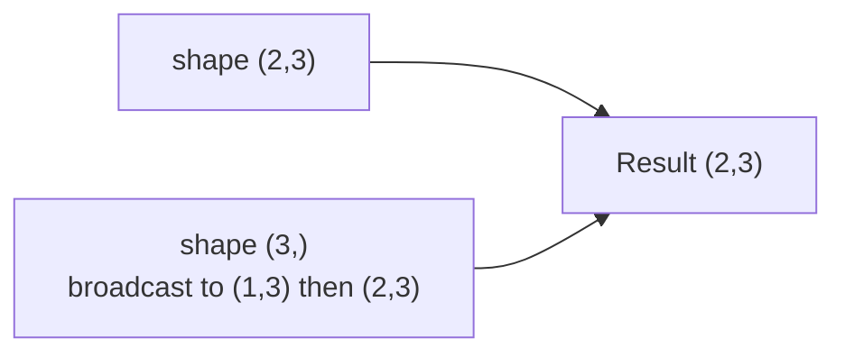

# Broadcasting & Operations

> [!abstract] Definition
> **Broadcasting** is NumPy's set of rules for performing element-wise operations on arrays of different (but compatible) shapes, without explicitly copying data. Element-wise operations themselves are implemented as **ufuncs** (universal functions) — compiled C loops that apply an operation across every element.

---

## Element-Wise Arithmetic

```python
a = np.array([1, 2, 3])
b = np.array([10, 20, 30])

a + b        # [11, 22, 33]
a - b         # [-9, -18, -27]
a * b          # [10, 40, 90]
a / b           # [0.1, 0.1, 0.1]
a ** 2           # [1, 4, 9]
a % 2             # [1, 0, 1]
```

> [!note] All arithmetic is element-wise by default
> `a * b` multiplies element-by-element (NOT matrix multiplication). For matrix multiplication, use `a @ b` or `np.matmul(a, b)` — see [[06-Linear-Algebra]].

---

## Broadcasting Rules

Two shapes are compatible for broadcasting if, comparing dimensions from the **right**:
1. They are equal, OR
2. One of them is 1, OR
3. One of them doesn't exist (treated as 1)

```python
a = np.array([[1, 2, 3], [4, 5, 6]])   # shape (2, 3)
b = np.array([10, 20, 30])                # shape (3,)
a + b
# b is broadcast across each row:
# [[11, 22, 33],
#  [14, 25, 36]]

c = np.array([[100], [200]])           # shape (2, 1)
a + c
# c is broadcast across each column:
# [[101, 102, 103],
#  [204, 205, 206]]
```



> [!tip] Mental model
> Broadcasting "stretches" the smaller array's size-1 dimensions to match, without actually copying memory — it's a virtual expansion, so it's memory-efficient.

---

## Scalar Broadcasting

```python
arr * 2               # every element doubled
arr + 100
arr > 5                 # element-wise boolean array
```

---

## Common ufuncs

```python
np.sqrt(arr)
np.exp(arr)
np.log(arr) / np.log10(arr) / np.log2(arr)
np.abs(arr)
np.round(arr, 2)
np.floor(arr) / np.ceil(arr)
np.sin(arr) / np.cos(arr) / np.tan(arr)
np.power(arr, 3)
np.mod(arr, 2)               # equivalent to arr % 2
np.maximum(a, b)                # element-wise max between two arrays
np.minimum(a, b)
np.clip(arr, a_min=0, a_max=100)  # cap values to a range
```

---

## Comparison Operators (Return Boolean Arrays)

```python
a == b
a != b
a > b
a >= b
np.array_equal(a, b)      # True if entire arrays match exactly
np.allclose(a, b, atol=1e-8)  # True if arrays match within tolerance (for floats)
```

---

## In-Place Operations (Memory-Efficient)

```python
arr += 5           # modifies arr in place, no new array allocated
arr *= 2
np.add(a, b, out=result_arr)   # write result into a pre-allocated array
```

> [!tip] Use `out=` or augmented assignment (`+=`) for large arrays
> These avoid allocating a new array for the result, which matters for memory-bound loops over big datasets.

---

## Custom ufuncs

```python
def my_func(x):
    return x ** 2 + 1

vectorized = np.vectorize(my_func)
vectorized(arr)      # applies element-wise, but still Python-loop speed under the hood
```

> [!warning] `np.vectorize` is a convenience wrapper, not a performance tool
> It's implemented as a Python loop internally — for real speed, express the logic using actual NumPy ufuncs/broadcasting instead. See [[11-Performance-Vectorization]].

---

## Related
- [[01-Arrays-Basics]]
- [[04-Math-Statistical-Functions]]
- [[08-Boolean-Masking-Where]]
- [[11-Performance-Vectorization]]
