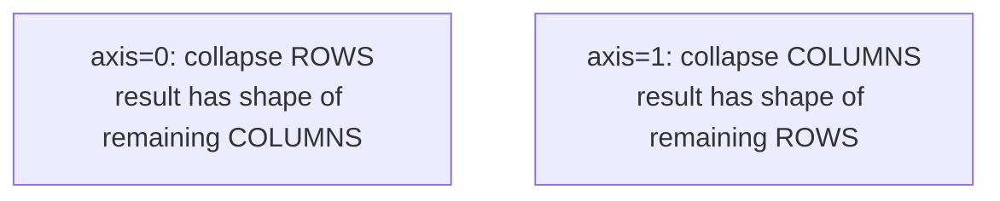

# Math & Statistical Functions

> [!abstract] Definition
> NumPy provides vectorized aggregation functions (sum, mean, std, etc.) that operate over an entire array or along a specific **axis** of a multi-dimensional array.

---

## The `axis` Parameter — Critical to Understand

```python
arr = np.array([[1, 2, 3], [4, 5, 6]])   # shape (2, 3)

arr.sum()             # 21 — sum of ALL elements
arr.sum(axis=0)         # [5, 7, 9] — sum DOWN each column (collapses rows)
arr.sum(axis=1)           # [6, 15] — sum ACROSS each row (collapses columns)
```



> [!tip] Memory trick
> `axis=0` moves **down** the rows (like walking down a spreadsheet column) — the operation happens per-column. `axis=1` moves **across** the columns — the operation happens per-row. This matches pandas' `axis` convention.

---

## Aggregation Functions

```python
arr.sum() / np.sum(arr)
arr.mean() / np.mean(arr)
arr.std() / np.std(arr)            # population std by default (ddof=0)
arr.std(ddof=1)                       # sample std (matches pandas default)
arr.var() / np.var(arr)
arr.min() / arr.max()
arr.argmin() / arr.argmax()           # INDEX of min/max, not the value
np.median(arr)
np.percentile(arr, 75)
np.quantile(arr, 0.75)                # equivalent, 0-1 scale
```

```python
arr.sum(axis=0, keepdims=True)   # keeps reduced dimension as size 1 — useful for broadcasting back
```

---

## Cumulative Functions

```python
np.cumsum(arr)          # running total, flattened by default
np.cumsum(arr, axis=0)    # running total down each column
np.cumprod(arr)             # running product
np.diff(arr)                  # discrete difference between consecutive elements
```

---

## Rounding

```python
np.round(arr, decimals=2)
np.floor(arr)
np.ceil(arr)
np.trunc(arr)         # truncate toward zero
```

---

## Correlation & Covariance

```python
np.corrcoef(a, b)      # correlation matrix between two 1D arrays
np.cov(a, b)              # covariance matrix
```

---

## Set-Like Operations

```python
np.unique(arr)                              # sorted unique values
np.unique(arr, return_counts=True)            # + frequency counts
np.intersect1d(a, b)
np.union1d(a, b)
np.setdiff1d(a, b)                                # values in a but not in b
np.in1d(a, b)                                       # boolean: is each element of a in b?
```

---

## NaN-Aware Aggregations

```python
np.nansum(arr)       # sum, ignoring NaN
np.nanmean(arr)
np.nanstd(arr)
np.nanmax(arr) / np.nanmin(arr)
np.isnan(arr)          # boolean mask of NaN positions
```

> [!warning] Plain `np.sum()` propagates `NaN`
> If any element is `NaN`, `arr.sum()` returns `NaN`. Use the `nan*` variants (`np.nansum`, `np.nanmean`, etc.) when missing values should be skipped — pandas does this automatically, NumPy does not.

---

## Weighted Statistics

```python
np.average(arr, weights=[0.2, 0.3, 0.5])   # weighted mean
```

---

## Related
- [[03-Broadcasting-Operations]]
- [[09-Sorting-Searching]]
- [[12-Aggregation-Statistics|Pandas: Aggregation & Statistics]]
