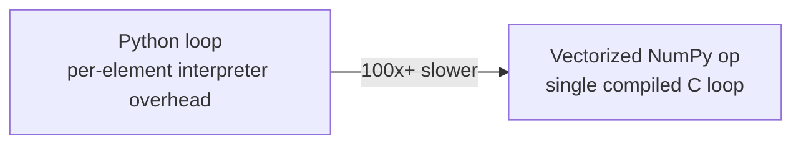

# Performance & Vectorization

> [!abstract] Definition
> NumPy's speed comes from **vectorization** (pushing loops into compiled C code) and **contiguous memory layout**. Understanding these mechanics helps write code that's orders of magnitude faster than equivalent pure-Python loops.

---

## Why Vectorization Matters

```python
# SLOW — pure Python loop
result = []
for x in arr:
    result.append(x ** 2 + 1)

# FAST — vectorized (runs in compiled C, no per-element Python overhead)
result = arr ** 2 + 1
```



> [!tip] Rule of thumb
> If you're writing a `for` loop over a NumPy array's elements, stop and ask: "is there a ufunc, broadcasting expression, or boolean mask that does this instead?" Nearly always, yes.

---

## Memory Layout — C-order vs Fortran-order

```python
arr.flags               # shows C_CONTIGUOUS / F_CONTIGUOUS
np.array(data, order="C")   # row-major (default) — rows are contiguous in memory
np.array(data, order="F")     # column-major — columns are contiguous
```

> [!info] Why layout matters
> Operations along the contiguous axis (rows for C-order) are faster than across it, because sequential memory access is cache-friendly. Usually irrelevant for small arrays, but matters for large-scale numerical code.

---

## dtype Sizing

```python
arr.astype("float32")    # half the memory of float64, often sufficient precision for ML
arr.astype("int16")        # if values fit in range [-32768, 32767]
arr.nbytes                   # check actual memory footprint
```

| dtype | Bytes/element | Typical use |
|---|---|---|
| `float64` | 8 | default, full precision |
| `float32` | 4 | ML/GPU workloads, large arrays |
| `int64` | 8 | default integer |
| `int32` | 4 | IDs, counts within range |
| `bool` | 1 | flags/masks |

---

## Avoiding Unnecessary Copies

```python
arr.reshape(...)       # view when possible — cheap
arr.ravel()               # view when possible — cheap
arr.flatten()               # ALWAYS a copy — more expensive
arr[condition]                 # boolean indexing — ALWAYS a copy
arr.copy()                       # explicit copy — use only when truly needed
```

> [!tip] Check `.base` to see if an array owns its data
> `arr.base is None` means `arr` owns its memory; otherwise `arr.base` points to the original array it's a view into.

---

## Pre-Allocating Output Arrays

```python
result = np.empty_like(arr)         # pre-allocate memory once
np.add(a, b, out=result)              # write directly into it, avoids repeated allocation in loops
```

---

## Avoiding `np.append()` in Loops

```python
# SLOW — reallocates the entire array on every call
result = np.array([])
for x in data:
    result = np.append(result, x * 2)

# FAST — build a list, convert once at the end
result = []
for x in data:
    result.append(x * 2)
result = np.array(result)

# FASTEST — fully vectorized
result = data * 2
```

> [!warning] `np.append()` is not like `list.append()`
> Every call to `np.append()` allocates a brand-new array and copies all existing data into it — O(n) per call, O(n²) total in a loop. Never call it repeatedly inside a loop.

---

## Timing & Profiling

```python
%timeit arr ** 2                    # Jupyter/IPython magic
import time
start = time.perf_counter()
result = arr ** 2
print(time.perf_counter() - start)
```

---

## When NumPy Isn't Enough

> [!info] Scaling beyond NumPy
> For arrays too large for RAM or requiring multi-core/GPU parallelism, consider **Dask** (parallel, chunked, NumPy-like API), **CuPy** (GPU-accelerated, drop-in NumPy replacement), or **Numba** (`@njit` JIT-compiles Python loops directly, useful when logic can't be vectorized).

---

## Related
- [[01-Arrays-Basics]]
- [[03-Broadcasting-Operations]]
- [[18-Options-Performance|Pandas: Options & Performance]]
