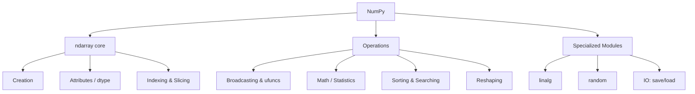

# 🔢 NumPy — Map of Content

> [!abstract] What is NumPy?
> **NumPy** (Numerical Python) is the foundational library for numerical computing in Python. Its core object, the **`ndarray`**, is a fast, memory-efficient, homogeneously-typed N-dimensional array that supports vectorized operations, broadcasting, and linear algebra. [[01-Series|pandas]] is built directly on top of it.

```python
import numpy as np
```

> [!info] Version note
> This vault assumes **NumPy ≥ 1.24**. The legacy `np.random` global-state API still works but `np.random.default_rng()` (Generator API) is the modern recommended approach — both are covered in [[07-Random-Module]].

---

## 📂 Folder Contents

| # | Note | Covers |
|---|------|--------|
| 01 | [[01-Arrays-Basics]] | `ndarray` creation, attributes, dtypes |
| 02 | [[02-Indexing-Slicing]] | Basic/fancy indexing, boolean masks, views vs copies |
| 03 | [[03-Broadcasting-Operations]] | Element-wise ops, broadcasting rules, ufuncs |
| 04 | [[04-Math-Statistical-Functions]] | `sum`, `mean`, `std`, aggregations, axis logic |
| 05 | [[05-Reshaping-Arrays]] | `reshape`, `flatten`, `transpose`, `concatenate`, `stack` |
| 06 | [[06-Linear-Algebra]] | `dot`, `matmul`, `linalg` module, eigenvalues, solving systems |
| 07 | [[07-Random-Module]] | `np.random`, distributions, seeding, sampling |
| 08 | [[08-Boolean-Masking-Where]] | Boolean indexing, `np.where`, `np.select`, `np.any`/`np.all` |
| 09 | [[09-Sorting-Searching]] | `sort`, `argsort`, `searchsorted`, `unique`, `argmax` |
| 10 | [[10-IO-Files]] | `save`, `load`, `savetxt`, `genfromtxt`, `.npy`/`.npz` |
| 11 | [[11-Performance-Vectorization]] | Vectorization, memory layout, `dtype` sizing, timing |
| 12 | [[12-Common-Errors-Gotchas]] | Shape mismatches, view/copy traps, dtype surprises |

---

## 🗺️ Conceptual Map



---

## ⚡ Quick Reference — Most-Used Calls

```python
np.array([1, 2, 3])                # create from list
np.zeros((3, 4)) / np.ones((3, 4))  # pre-filled arrays
np.arange(0, 10, 2)                  # like range(), returns array
np.linspace(0, 1, 5)                  # 5 evenly spaced points

arr.shape / arr.dtype / arr.ndim       # inspect structure
arr[arr > 5]                             # boolean filter
arr.reshape(2, 3)                          # change shape
arr.sum(axis=0) / arr.mean(axis=1)           # aggregate along an axis
np.where(arr > 0, 1, -1)                       # conditional element-wise
a @ b                                            # matrix multiplication
np.random.default_rng(42).random(5)                # reproducible random numbers
np.save("arr.npy", arr) / np.load("arr.npy")         # persist to disk
```

---

## 🔗 Related in LORE
- [[pandas|Pandas Reference]] — pandas' `Series`/`DataFrame` wrap NumPy arrays internally; `.to_numpy()` converts back
- [[Excel|Excel Reference]] — array formulas and `SUMPRODUCT` are Excel's closest analog to NumPy's vectorized math
- ML Study Notes — NumPy is the computational backbone for cost functions, gradients, and matrix math in linear regression

> [!tip] How to use this vault section
> Each note follows the same skeleton: **Definition → Syntax → Key Parameters → Examples → Notes/Gotchas**, matching the Pandas folder's structure.
