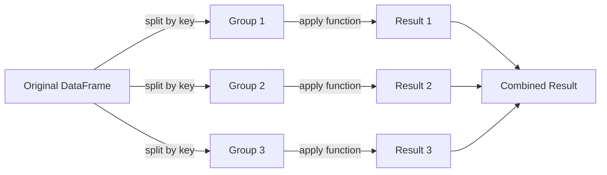

# GroupBy

> [!abstract] Definition
> `.groupby()` implements the **split-apply-combine** pattern: split the data into groups based on some criteria, apply a function to each group independently, then combine the results back into a data structure. It's pandas' equivalent of SQL's `GROUP BY`.



---

## Syntax

```python
df.groupby(
    by,                  # column name, list of columns, or function/mapping
    axis=0,
    sort=True,             # sort group keys
    as_index=True,          # group keys become index of result
    dropna=True              # exclude NaN group keys
)
```

---

## Basic Grouping

```python
df.groupby("city")["age"].mean()             # single column aggregation
df.groupby("city").mean(numeric_only=True)    # aggregate all numeric columns
df.groupby(["city", "gender"])["age"].mean()   # multi-key grouping -> MultiIndex result
df.groupby("city", as_index=False)["age"].mean()  # keep group key as a column, not index
```

---

## `.agg()` — Multiple / Custom Aggregations

```python
df.groupby("city")["age"].agg(["mean", "min", "max", "count"])

df.groupby("city").agg({
    "age": "mean",
    "salary": ["min", "max"],
    "name": "count"
})

# Named aggregation (clean column names, pandas >= 0.25)
df.groupby("city").agg(
    avg_age=("age", "mean"),
    max_salary=("salary", "max"),
    n=("name", "count")
)

df.groupby("city")["age"].agg(lambda x: x.max() - x.min())  # custom function
```

---

## Iterating Over Groups

```python
for name, group in df.groupby("city"):
    print(name)
    print(group)

df.groupby("city").get_group("Mumbai")   # extract a single group as a DataFrame
```

---

## `.transform()` — Same Shape as Input

```python
df["age_zscore"] = df.groupby("city")["age"].transform(
    lambda x: (x - x.mean()) / x.std()
)
df["group_mean"] = df.groupby("city")["age"].transform("mean")  # broadcast mean back to every row
```

> [!tip] `transform` vs `agg`
> `agg` **reduces** each group to a scalar (or a row); `transform` returns a result with the **same length/index** as the original data — perfect for creating new feature columns without losing row-level granularity.

---

## `.filter()` — Keep/Drop Entire Groups

```python
# Keep only groups (cities) with more than 5 rows
df.groupby("city").filter(lambda x: len(x) > 5)

# Keep only groups whose mean age exceeds 30
df.groupby("city").filter(lambda x: x["age"].mean() > 30)
```

---

## `.apply()` — General-Purpose (Group -> Anything)

```python
df.groupby("city").apply(lambda g: g.sort_values("age").head(2))  # top-2 per group

def summarize(g):
    return pd.Series({
        "n": len(g),
        "avg_age": g["age"].mean(),
        "top_earner": g.loc[g["salary"].idxmax(), "name"]
    })

df.groupby("city").apply(summarize)
```

> [!warning] `.apply()` is the most flexible but slowest GroupBy method. Prefer `.agg()` or `.transform()` when they can express the same logic — they're vectorized and much faster.

---

## Useful GroupBy Methods

```python
df.groupby("city").size()          # row count per group (includes NaN keys unless dropna=True)
df.groupby("city")["age"].count()   # non-null count per group
df.groupby("city").ngroups           # number of groups
df.groupby("city").groups             # dict: {group_key: index_labels}
df.groupby("city")["age"].describe()   # full stats per group
df.groupby("city")["age"].nlargest(2)   # top 2 ages per city
df.groupby("city")["age"].first()        # first value per group
df.groupby("city")["age"].last()          # last value per group
df.groupby("city")["age"].nunique()        # distinct count per group
df.groupby("city")["age"].cumsum()          # running total within group
df.groupby("city")["age"].rank()             # rank within group
```

---

## Grouping by Multiple Keys / Custom Functions

```python
df.groupby([df["date"].dt.year, df["date"].dt.month])["sales"].sum()
df.groupby(pd.Grouper(key="date", freq="M"))["sales"].sum()   # resample-like monthly grouping
df.groupby(lambda idx: "even" if idx % 2 == 0 else "odd")     # group by index-based function
```

---

## Related
- [[08-Reshaping]] (pivot_table is essentially groupby + reshape)
- [[12-Aggregation-Statistics]]
- [[16-Window-Rolling-Expanding]]
- [[10-DateTime]] (`pd.Grouper`, resampling)
