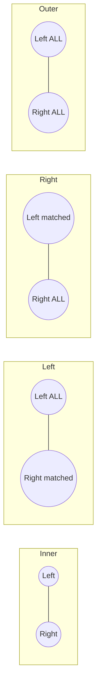

# Merge, Join & Concat

> [!abstract] Definition
> pandas offers three complementary ways to combine DataFrames: **`concat`** (stack along an axis), **`merge`** (SQL-style key-based joins), and **`join`** (index-based shorthand for merge).

---

## `pd.concat()` — Stacking

```python
pd.concat(
    objs,                 # list of Series/DataFrames
    axis=0,                 # 0 = stack rows (vertical), 1 = stack columns (horizontal)
    join="outer",            # 'outer' (union) or 'inner' (intersection) of the other axis
    ignore_index=False,        # renumber the resulting index
    keys=None                   # create a MultiIndex identifying source of each chunk
)
```

```python
pd.concat([df1, df2], ignore_index=True)          # stack rows, fresh 0..n index
pd.concat([df1, df2], axis=1)                       # stack columns side by side
pd.concat([df1, df2], keys=["2025", "2026"])          # tag origin with MultiIndex
pd.concat([df1, df2], join="inner")                     # keep only shared columns
```

> [!tip] `.append()` is removed / deprecated
> Use `pd.concat([df1, df2], ignore_index=True)` instead of the old `df1.append(df2)`.

---

## `pd.merge()` — SQL-Style Joins

```python
pd.merge(
    left, right,
    how="inner",          # 'inner' | 'left' | 'right' | 'outer' | 'cross'
    on=None,                # column(s) present in both frames
    left_on=None,             # column name in left (if names differ)
    right_on=None,              # column name in right
    left_index=False,             # join on left's index
    right_index=False,              # join on right's index
    suffixes=("_x", "_y"),            # applied to overlapping non-key columns
    indicator=False                     # add a "_merge" column showing source
)
```

```python
pd.merge(orders, customers, on="customer_id", how="left")
pd.merge(orders, customers, left_on="cust_id", right_on="id", how="inner")
orders.merge(customers, on="customer_id", how="outer", indicator=True)
```

### Join Types Visualized



| `how` | Keeps |
|---|---|
| `inner` | only rows with matching keys in **both** frames |
| `left` | all rows from **left**, matched data from right (NaN if no match) |
| `right` | all rows from **right**, matched data from left |
| `outer` | union of keys from **both**, NaN where no match |
| `cross` | cartesian product of both frames (no key needed) |

---

## `.join()` — Index-Based Shorthand

```python
df1.join(df2, how="left")                          # joins on index by default
df1.join(df2, on="key_col", how="left")             # left's column -> right's index
df1.join([df2, df3], how="outer")                     # join multiple frames at once
```

> [!tip] `.join()` is essentially `merge()` with `left_index=True`/`right_index=True` as the default — reach for `merge()` when joining on columns, `.join()` when joining on index.

---

## Merge Validation & Diagnostics

```python
pd.merge(a, b, on="id", validate="one_to_one")   # raise if not truly 1:1
pd.merge(a, b, on="id", validate="one_to_many")
pd.merge(a, b, on="id", validate="many_to_one")

merged = pd.merge(a, b, on="id", how="outer", indicator=True)
merged["_merge"].value_counts()   # "left_only" / "right_only" / "both" — useful to spot mismatches
```

---

## Combining on Multiple Keys

```python
pd.merge(a, b, on=["year", "month"])
pd.merge(a, b, left_on=["y", "m"], right_on=["year", "month"])
```

---

## `combine_first` and `update`

```python
a.combine_first(b)     # fill a's NaN with b's values (element-wise, aligned by index/columns)
a.update(b)              # overwrite a's values with b's (in place, ignores NaN in b)
```

---

## Common Pitfalls

> [!warning] Duplicate keys cause row explosion
> If the join key isn't unique in either frame, `merge()` produces the cartesian product of matching rows — row counts can balloon unexpectedly. Always check `df["key"].is_unique` beforehand, or use `validate=`.

> [!warning] Overlapping non-key column names
> Non-key columns with the same name in both frames get suffixed automatically (`_x`, `_y` by default) — pass `suffixes=("_left", "_right")` for clarity.

---

## Related
- [[06-GroupBy]]
- [[02-DataFrame-Basics]]
- [[08-Reshaping]]
