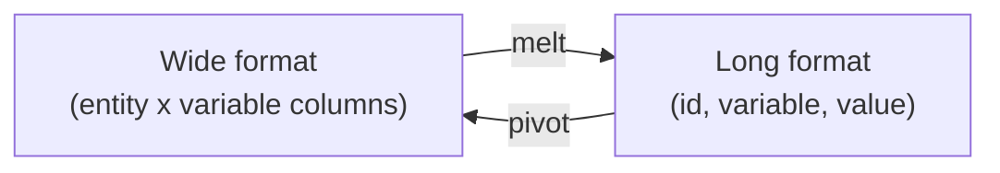

# Reshaping — Pivot, Melt, Stack

> [!abstract] Definition
> Reshaping converts data between **wide** format (one row per entity, variables as columns) and **long/tidy** format (one row per observation). pandas' main tools: `pivot`, `pivot_table`, `melt`, `stack`/`unstack`, and `crosstab`.



---

## `melt()` — Wide → Long

```python
df.melt(
    id_vars=None,          # columns to keep fixed (identifiers)
    value_vars=None,         # columns to unpivot; default = all others
    var_name="variable",       # name for the new "variable" column
    value_name="value"           # name for the new "value" column
)
```

```python
df_wide = pd.DataFrame({
    "student": ["A", "B"],
    "math": [90, 80],
    "science": [85, 95]
})

df_wide.melt(id_vars="student", var_name="subject", value_name="score")
#   student  subject  score
# 0       A     math     90
# 1       B     math     80
# 2       A  science     85
# 3       B  science     95
```

---

## `pivot()` — Long → Wide (no aggregation, requires unique index/column pairs)

```python
df.pivot(index="student", columns="subject", values="score")
```

> [!warning] `pivot()` fails on duplicate (index, columns) combinations
> If there are multiple rows for the same `(index, columns)` pair, `pivot()` raises a `ValueError`. Use `pivot_table()` instead if aggregation is needed.

---

## `pivot_table()` — Long → Wide, WITH Aggregation

```python
pd.pivot_table(
    df,
    values="score",           # column to aggregate
    index="student",            # row grouper
    columns="subject",            # column grouper
    aggfunc="mean",                 # 'sum' | 'mean' | 'count' | list | dict | custom func
    fill_value=0,                    # replace resulting NaN
    margins=True,                      # add row/column totals ("All")
    margins_name="Total"
)
```

```python
pd.pivot_table(
    sales_df,
    values="revenue",
    index="region",
    columns="quarter",
    aggfunc="sum",
    fill_value=0,
    margins=True
)
```

> [!tip] `pivot_table` ≈ Excel PivotTable
> Conceptually identical to building an Excel Pivot Table: rows = `index`, columns = `columns`, cell values = `aggfunc(values)`.

---

## `stack()` / `unstack()` — Move Between Columns and (Multi)Index

```python
df.stack()      # pivot innermost COLUMN level into the row index (wide -> long)
df.unstack()     # pivot innermost ROW index level into columns (long -> wide)

df.unstack(level=0)     # specify which index level to unstack
df.stack(dropna=False)   # keep resulting NaN rows instead of dropping
```

```python
# Typical use after groupby with multiple keys
s = df.groupby(["region", "quarter"])["revenue"].sum()
s.unstack()   # region as rows, quarter as columns
```

---

## `crosstab()` — Frequency / Contingency Tables

```python
pd.crosstab(df["gender"], df["city"])                        # counts
pd.crosstab(df["gender"], df["city"], normalize="index")      # row percentages
pd.crosstab(df["gender"], df["city"], values=df["age"], aggfunc="mean")  # custom aggregation
pd.crosstab([df["gender"], df["age_group"]], df["city"])        # multi-level rows
```

> [!tip] `crosstab` vs `pivot_table`
> `crosstab` defaults to **counting** occurrences (like a frequency table); `pivot_table` defaults to **mean** and expects you to specify `values`. Use `crosstab` for quick "how many of each combination" questions.

---

## `wide_to_long()` — Structured Column Prefix Reshaping

```python
pd.wide_to_long(
    df,
    stubnames="score",         # common prefix, e.g. score1, score2 -> "score"
    i="student",                  # id column
    j="attempt"                     # name for suffix-derived column
)
```

---

## `explode()` — Expand List-Like Cells into Rows

```python
df = pd.DataFrame({"id": [1, 2], "tags": [["a", "b"], ["c"]]})
df.explode("tags")
#    id tags
# 0   1    a
# 0   1    b
# 1   2    c
```

---

## `T` — Transpose

```python
df.T   # swap rows and columns
```

---

## Related
- [[06-GroupBy]]
- [[14-MultiIndex]]
- [[02-DataFrame-Basics]]
