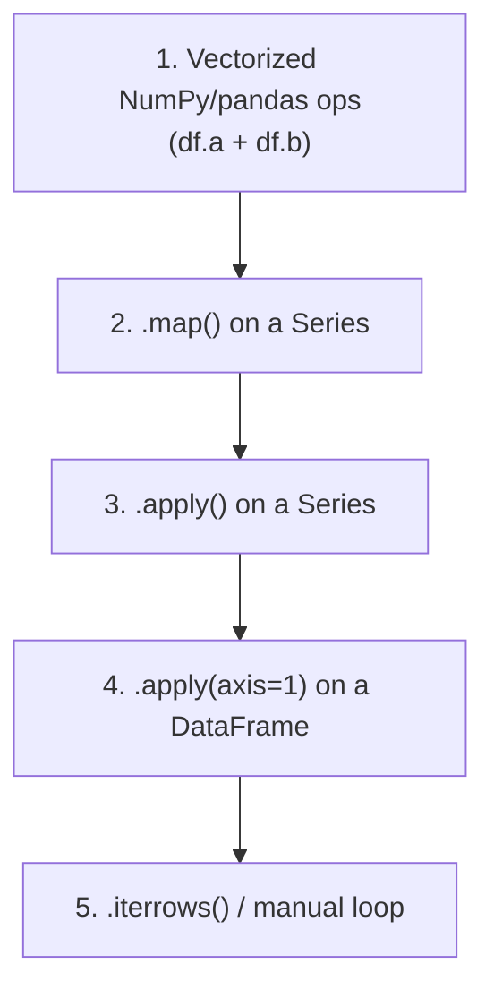

# Apply, Map & Vectorization

> [!abstract] Definition
> pandas provides several ways to run custom logic across data: `.map()` (Series, element-wise), `.apply()` (Series or DataFrame, element/row/column-wise), the deprecated `.applymap()` (now `.map()` at the DataFrame level), and `.pipe()` (function chaining). Whenever possible, prefer **vectorized** operations over these — they're implemented in C and are far faster.

---

## The Performance Hierarchy (fastest → slowest)



> [!tip] Rule of thumb
> If there's a built-in vectorized method or NumPy ufunc that does what you need, use it. Reach for `.apply()` only when the logic genuinely can't be vectorized (e.g. calling an external API, complex conditional branching across columns).

---

## `Series.map()` — Element-Wise Substitution/Function

```python
s.map({"M": "Male", "F": "Female"})       # dict lookup, unmatched -> NaN
s.map(lambda x: x.upper())                  # function applied to every element
s.map(other_series)                           # map values using another Series as a lookup
```

---

## `Series.apply()` — Element-Wise Function (More General than `.map`)

```python
s.apply(lambda x: x ** 2)
s.apply(np.sqrt)

def categorize(age):
    if age < 18: return "minor"
    elif age < 65: return "adult"
    return "senior"

s.apply(categorize)
```

---

## `DataFrame.apply()` — Row-Wise or Column-Wise

```python
df.apply(np.sum, axis=0)          # apply down each COLUMN (default axis=0)
df.apply(np.sum, axis=1)           # apply across each ROW

df.apply(lambda row: row["price"] * row["qty"], axis=1)   # row-wise custom calc

df[["a", "b"]].apply(lambda col: col.max() - col.min())    # per-column range
```

> [!warning] `axis=1` (row-wise apply) is slow
> It processes one row at a time as a Python-level Series object. For row-wise math, prefer vectorized expressions: `df["price"] * df["qty"]` instead of `df.apply(..., axis=1)`.

---

## `DataFrame.map()` (formerly `.applymap()`) — Element-Wise Over Entire Frame

```python
df.map(lambda x: x * 2 if isinstance(x, (int, float)) else x)   # pandas >= 2.1
df.applymap(lambda x: round(x, 2))    # older pandas versions (deprecated in 2.1+)
```

---

## `.pipe()` — Chaining Custom Functions Readably

```python
def remove_outliers(df, col, z=3):
    zscores = (df[col] - df[col].mean()) / df[col].std()
    return df[zscores.abs() < z]

def add_log(df, col):
    df[f"log_{col}"] = np.log1p(df[col])
    return df

result = (
    df
    .pipe(remove_outliers, col="revenue", z=3)
    .pipe(add_log, col="revenue")
)
```

> [!tip] `.pipe()` keeps custom transformation steps readable in a method chain, rather than nesting function calls: `f(g(h(df)))` becomes `df.pipe(h).pipe(g).pipe(f)`.

---

## Vectorization Examples (Prefer These)

```python
# Instead of: df.apply(lambda r: r["a"] + r["b"], axis=1)
df["sum"] = df["a"] + df["b"]

# Instead of: df["cat"].apply(lambda x: "A" if x > 0 else "B")
df["cat"] = np.where(df["x"] > 0, "A", "B")

# Multi-condition vectorized branching
conditions = [df["score"] >= 90, df["score"] >= 60]
choices = ["A", "B"]
df["grade"] = np.select(conditions, choices, default="F")

# Vectorized string ops (see 09-String-Methods)
df["name"].str.upper()
```

---

## `np.vectorize` and `np.select` / `np.where`

```python
np.where(condition, value_if_true, value_if_false)
np.select([cond1, cond2, cond3], [val1, val2, val3], default=val_default)
np.vectorize(python_function)(df["col"])   # wraps a scalar function to broadcast (still Python-loop speed under the hood)
```

---

## `eval()` / `query()` for Expression-Based Speed

```python
df.eval("total = price * qty", inplace=True)     # vectorized expression evaluation, avoids intermediate temporaries
df.query("total > 1000")                            # see 04-Indexing-Selection
```

> [!info] See [[18-Options-Performance]] for when `eval`/`query` (numexpr-backed) beat plain vectorized pandas on large DataFrames.

---

## Related
- [[04-Indexing-Selection]]
- [[09-String-Methods]]
- [[18-Options-Performance]]
