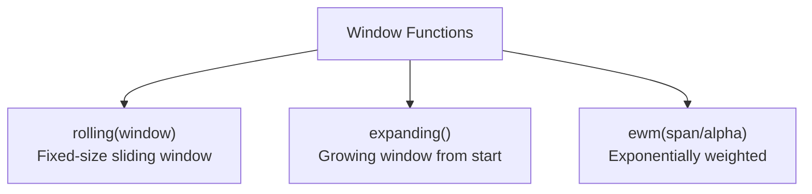

# Window Functions — Rolling, Expanding, EWM

> [!abstract] Definition
> Window functions compute a statistic over a sliding subset of data. pandas offers three flavors: **`rolling`** (fixed-size moving window), **`expanding`** (growing window from the start), and **`ewm`** (exponentially weighted, recent values weighted more heavily).



---

## `.rolling()` — Fixed-Size Moving Window

```python
df["sales"].rolling(
    window=7,              # window size (int = row count, or offset string like "7D")
    min_periods=1,           # minimum observations required to produce a value
    center=False,              # whether the window is centered on the current row
    win_type=None                # e.g. "triang", "gaussian" for weighted windows
).mean()
```

```python
df["sales_7d_avg"] = df["sales"].rolling(7).mean()
df["sales_7d_sum"] = df["sales"].rolling(7).sum()
df["sales_7d_std"] = df["sales"].rolling(7).std()
df["sales_7d_max"] = df["sales"].rolling(7, min_periods=1).max()

# Time-based window (requires a DatetimeIndex)
df.rolling("7D").mean()

# Custom function
df["sales"].rolling(7).apply(lambda x: x.max() - x.min())
```

> [!tip] `min_periods` avoids leading NaNs
> With the default `min_periods=window`, the first `window - 1` rows are `NaN` (not enough data yet). Set `min_periods=1` to get a partial-window result from the very first row instead.

---

## `.expanding()` — Cumulative/Growing Window

```python
df["sales"].expanding().mean()      # running average from row 0 to current row
df["sales"].expanding().sum()        # equivalent to cumsum()
df["sales"].expanding(min_periods=3).std()
```

> [!note] `expanding()` vs cumulative methods
> `.expanding().sum()` ≈ `.cumsum()`, and `.expanding().max()` ≈ `.cummax()` — `expanding` is more general because it accepts arbitrary aggregation functions, including custom ones via `.apply()`.

---

## `.ewm()` — Exponentially Weighted

```python
df["sales"].ewm(span=7).mean()          # exponential moving average, "span" ~ window size analog
df["sales"].ewm(alpha=0.3).mean()         # direct smoothing factor (0 < alpha <= 1)
df["sales"].ewm(halflife=3).mean()          # weight halves every 3 periods
```

| Parameter | Meaning |
|---|---|
| `span` | analogous to a simple moving average's window size |
| `alpha` | smoothing factor directly; higher = more weight on recent data |
| `halflife` | periods for the weight to decay by half |
| `com` | center of mass, alternate parameterization |

> [!tip] EWMA reacts faster to recent changes
> Unlike a plain rolling mean where all points in the window are weighted equally, `ewm()` gives exponentially decreasing weight to older observations — useful for trend-following metrics (e.g. stock price smoothing).

---

## Combining with GroupBy — Rolling Per Group

```python
df.groupby("city")["sales"].rolling(7).mean()
df.groupby("city")["sales"].transform(lambda x: x.rolling(7).mean())   # keeps original row alignment
```

---

## Common Aggregations Available on All Window Types

```python
.mean() / .sum() / .std() / .var() / .min() / .max()
.median() / .count() / .corr(other) / .cov(other)
.apply(custom_func) / .agg([...])
```

---

## Related
- [[10-DateTime]]
- [[06-GroupBy]]
- [[12-Aggregation-Statistics]]
