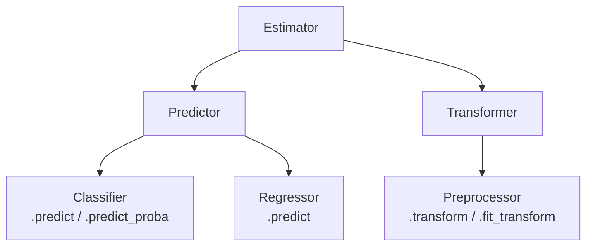

# Estimator API Basics

> [!abstract] Definition
> Every scikit-learn model/transformer follows the same **Estimator API** — a consistent contract of methods (`fit`, `predict`, `transform`, `fit_transform`, `score`) that makes any estimator swappable inside a [[04-Pipelines-ColumnTransformer|Pipeline]] without changing surrounding code.

---

## The Core Method Contract

| Method | Used by | Purpose |
|---|---|---|
| `.fit(X, y)` | all estimators | learn parameters from training data |
| `.predict(X)` | supervised models | generate predictions on new data |
| `.predict_proba(X)` | classifiers | class probability estimates |
| `.transform(X)` | transformers | apply a learned transformation |
| `.fit_transform(X)` | transformers | fit + transform in one call (more efficient for some transformers) |
| `.score(X, y)` | supervised models | default evaluation metric (R² for regressors, accuracy for classifiers) |
| `.get_params()` / `.set_params()` | all estimators | inspect/modify hyperparameters |

```python
from sklearn.linear_model import LogisticRegression

model = LogisticRegression()      # 1. Instantiate with hyperparameters
model.fit(X_train, y_train)         # 2. Fit — learn from training data
predictions = model.predict(X_test)   # 3. Predict on new data
probabilities = model.predict_proba(X_test)  # class probabilities
accuracy = model.score(X_test, y_test)  # quick built-in evaluation
```

---

## Estimator Types



---

## X and y Conventions

```python
X.shape      # (n_samples, n_features) — always 2D, even with 1 feature
y.shape        # (n_samples,) — 1D for single-target problems

X = df[["feature1", "feature2"]]     # DataFrame or NumPy array both work
y = df["target"]                       # Series or 1D array
```

> [!warning] X with a single feature must still be 2D
> `df[["feature1"]]` (double brackets, DataFrame) works; `df["feature1"]` (single brackets, Series) raises a shape error when passed directly to `.fit()`. Reshape a 1D array explicitly with `.reshape(-1, 1)` if needed.

---

## Inspecting Fitted Attributes (trailing underscore convention)

```python
model.coef_              # learned coefficients (linear models)
model.intercept_           # learned intercept
model.feature_importances_   # tree-based models
model.classes_                 # class labels seen during fit (classifiers)
model.n_features_in_             # number of features seen during fit
```

> [!tip] Trailing underscore = "learned from data"
> Any attribute ending in `_` (e.g. `coef_`, `labels_`) only exists **after** `.fit()` has been called — accessing it beforehand raises `NotFittedError`.

---

## Hyperparameters vs Learned Parameters

```python
model = LogisticRegression(C=1.0, penalty="l2", max_iter=1000)  # hyperparameters set at construction
model.get_params()          # dict of current hyperparameters
model.set_params(C=0.5)       # change a hyperparameter (before re-fitting)
```

---

## `random_state` — Reproducibility

```python
model = RandomForestClassifier(random_state=42)
train_test_split(X, y, random_state=42)
```

> [!tip] Set `random_state` everywhere
> Any estimator or splitting function with inherent randomness (tree splits, bootstrapping, shuffling) accepts `random_state` — always set it for reproducible experiments and debugging.

---

## Related
- [[04-Pipelines-ColumnTransformer]]
- [[05-Linear-Models]]
- [[06-Tree-Ensemble-Models]]
