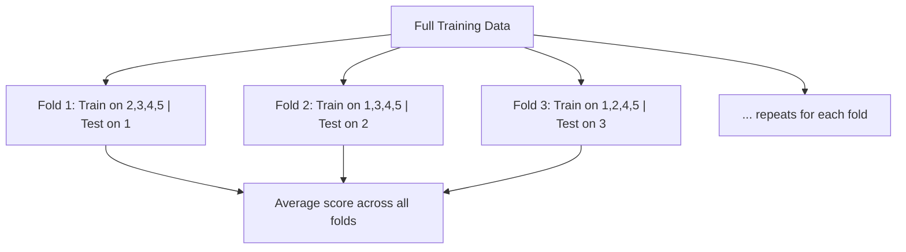

# Train-Test Split & Cross-Validation

> [!abstract] Definition
> Model evaluation requires holding out data the model hasn't seen. `train_test_split` creates a single hold-out split; **cross-validation** repeats this process across multiple folds for a more robust performance estimate.

---

## `train_test_split()`

```python
from sklearn.model_selection import train_test_split

X_train, X_test, y_train, y_test = train_test_split(
    X, y,
    test_size=0.2,         # 20% held out for testing
    random_state=42,         # reproducibility
    stratify=y                 # preserve class proportions (classification)
)
```

> [!tip] Always use `stratify=y` for classification
> Without it, random splitting can produce a test set with very different class balance than training — especially problematic for imbalanced datasets.

```python
# Three-way split: train / validation / test
X_train, X_temp, y_train, y_temp = train_test_split(X, y, test_size=0.3, random_state=42)
X_val, X_test, y_val, y_test = train_test_split(X_temp, y_temp, test_size=0.5, random_state=42)
```

---

## Cross-Validation Concept



> [!tip] Why cross-validation over a single split
> A single train/test split gives one noisy estimate of performance. K-fold CV averages across K different splits, giving a more reliable estimate and a sense of variance (via the standard deviation across folds).

---

## `cross_val_score()` — Quick CV Scoring

```python
from sklearn.model_selection import cross_val_score

scores = cross_val_score(model, X, y, cv=5, scoring="accuracy")
scores.mean()          # average accuracy across 5 folds
scores.std()             # variability across folds
```

```python
cross_val_score(model, X, y, cv=5, scoring="neg_mean_squared_error")  # regression — note the "neg_" prefix
cross_val_score(model, X, y, cv=5, scoring="f1_weighted")               # classification, imbalanced classes
```

---

## `cross_validate()` — Multiple Metrics + Timing

```python
from sklearn.model_selection import cross_validate

results = cross_validate(
    model, X, y, cv=5,
    scoring=["accuracy", "precision", "recall", "f1"],
    return_train_score=True
)
results["test_accuracy"]      # array of 5 scores
results["fit_time"]             # time taken per fold
```

---

## CV Splitter Strategies

```python
from sklearn.model_selection import KFold, StratifiedKFold, TimeSeriesSplit, LeaveOneOut, GroupKFold

KFold(n_splits=5, shuffle=True, random_state=42)          # standard K-fold
StratifiedKFold(n_splits=5, shuffle=True, random_state=42)  # preserves class ratios per fold — use for classification
TimeSeriesSplit(n_splits=5)                                   # respects temporal order, no future leakage
GroupKFold(n_splits=5)                                          # ensures groups (e.g. same patient) don't span train/test
LeaveOneOut()                                                      # each fold = single sample as test (small datasets only)
```

| Splitter | Use case |
|---|---|
| `KFold` | general regression |
| `StratifiedKFold` | classification (preserves class balance) |
| `TimeSeriesSplit` | time series — never test on data that predates training |
| `GroupKFold` | grouped/clustered data (e.g. multiple rows per patient/user) |

```python
cv = StratifiedKFold(n_splits=5, shuffle=True, random_state=42)
scores = cross_val_score(model, X, y, cv=cv)
```

---

## Manual CV Loop (For Full Control)

```python
from sklearn.model_selection import KFold

kf = KFold(n_splits=5, shuffle=True, random_state=42)
scores = []

for train_idx, val_idx in kf.split(X):
    X_train_fold, X_val_fold = X.iloc[train_idx], X.iloc[val_idx]
    y_train_fold, y_val_fold = y.iloc[train_idx], y.iloc[val_idx]

    model.fit(X_train_fold, y_train_fold)
    scores.append(model.score(X_val_fold, y_val_fold))
```

---

## Notes & Gotchas

> [!warning] Preprocess INSIDE the CV loop, not before it
> Fitting a scaler or imputer on the full dataset before splitting into folds leaks information from validation folds into training. Always wrap preprocessing + model in a [[04-Pipelines-ColumnTransformer|Pipeline]] and pass the whole pipeline to `cross_val_score`.

---

## Related
- [[04-Pipelines-ColumnTransformer]]
- [[12-Hyperparameter-Tuning]]
- [[Machine Learning/Libraries/ML/sklearn/17-Common-Errors-Gotchas]]
