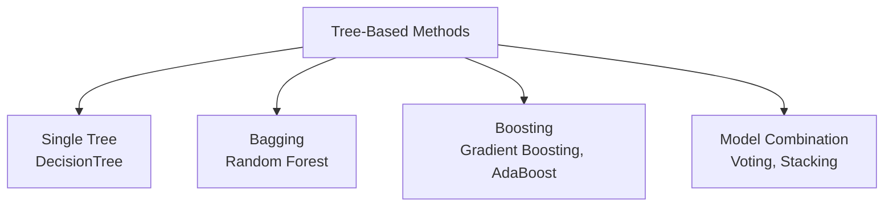

# Tree & Ensemble Models

> [!abstract] Definition
> Decision trees split data recursively on feature thresholds to make predictions. **Ensembles** combine many trees (or other models) to reduce overfitting and improve accuracy — via **bagging** (parallel, independent trees, e.g. Random Forest), **boosting** (sequential, error-correcting trees, e.g. Gradient Boosting), or **voting/stacking** (combining different model types).



---

## Decision Trees

```python
from sklearn.tree import DecisionTreeClassifier, DecisionTreeRegressor

model = DecisionTreeClassifier(
    max_depth=5,               # limit tree depth — controls overfitting
    min_samples_split=10,        # minimum samples required to split a node
    min_samples_leaf=5,            # minimum samples required at a leaf
    criterion="gini",                # 'gini' | 'entropy' | 'log_loss' for classification
    random_state=42
)
model.fit(X_train, y_train)
model.feature_importances_        # relative importance of each feature (sums to 1)
```

```python
from sklearn.tree import plot_tree
import matplotlib.pyplot as plt
plot_tree(model, feature_names=X.columns, class_names=["No", "Yes"], filled=True)
plt.show()
```

> [!warning] Single decision trees overfit easily
> Without depth/leaf constraints, a tree can memorize the training data perfectly (100% training accuracy, poor generalization). Always tune `max_depth`/`min_samples_leaf`, or prefer an ensemble.

---

## Random Forest (Bagging)

```python
from sklearn.ensemble import RandomForestClassifier, RandomForestRegressor

model = RandomForestClassifier(
    n_estimators=100,          # number of trees
    max_depth=None,              # trees grow fully by default (each tree still randomized)
    max_features="sqrt",           # features considered per split — 'sqrt' is the classic default for classification
    n_jobs=-1,                       # use all CPU cores
    random_state=42
)
model.fit(X_train, y_train)
model.feature_importances_
```

> [!tip] Why Random Forest generalizes better than a single tree
> Each tree trains on a bootstrap sample (random subset with replacement) and considers only a random subset of features at each split. Averaging many such de-correlated trees reduces variance without much increase in bias.

---

## Gradient Boosting

```python
from sklearn.ensemble import GradientBoostingClassifier, GradientBoostingRegressor
from sklearn.ensemble import HistGradientBoostingClassifier   # faster, handles missing values natively

model = GradientBoostingClassifier(
    n_estimators=100,
    learning_rate=0.1,          # shrinks each tree's contribution — lower = more trees needed, less overfitting
    max_depth=3,                   # boosted trees are usually shallow ("weak learners")
    random_state=42
)
model.fit(X_train, y_train)
```

> [!tip] `HistGradientBoostingClassifier`/`Regressor` for large datasets
> Histogram-based gradient boosting (inspired by LightGBM) is much faster than `GradientBoostingClassifier` on large data and natively handles missing values without imputation.

---

## AdaBoost

```python
from sklearn.ensemble import AdaBoostClassifier

model = AdaBoostClassifier(n_estimators=50, learning_rate=1.0, random_state=42)
```

> Sequentially re-weights misclassified samples so subsequent weak learners focus on the harder cases.

---

## External Boosting Libraries (Not Built Into sklearn, But sklearn-Compatible)

```python
# pip install xgboost lightgbm catboost
from xgboost import XGBClassifier
from lightgbm import LGBMClassifier
```

> [!info] XGBoost/LightGBM/CatBoost
> These libraries implement optimized, often faster/more accurate gradient boosting than sklearn's built-in version, and expose the same `.fit()`/`.predict()` API — drop-in compatible with sklearn Pipelines, GridSearchCV, etc.

---

## Voting Classifier (Combine Different Model Types)

```python
from sklearn.ensemble import VotingClassifier
from sklearn.linear_model import LogisticRegression
from sklearn.svm import SVC

voting = VotingClassifier(
    estimators=[
        ("lr", LogisticRegression()),
        ("rf", RandomForestClassifier()),
        ("svc", SVC(probability=True))
    ],
    voting="soft"          # 'hard' = majority vote on labels; 'soft' = average predicted probabilities
)
voting.fit(X_train, y_train)
```

---

## Stacking

```python
from sklearn.ensemble import StackingClassifier

stack = StackingClassifier(
    estimators=[("rf", RandomForestClassifier()), ("svc", SVC())],
    final_estimator=LogisticRegression()    # "meta-model" learns how to best combine base models' outputs
)
```

---

## Feature Importance Comparison

```python
import pandas as pd
importances = pd.Series(model.feature_importances_, index=X.columns).sort_values(ascending=False)
importances.plot.barh()
```

> [!info] See [[13-Feature-Selection]] for permutation importance, an alternative that's less biased toward high-cardinality features than the built-in `feature_importances_`.

---

## Related
- [[01-Estimator-API-Basics]]
- [[13-Feature-Selection]]
- [[12-Hyperparameter-Tuning]]
