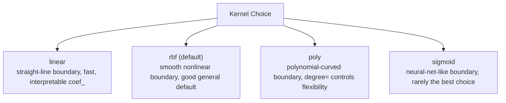

# Support Vector Machines (SVM)

> [!abstract] Definition
> SVMs find the hyperplane that best separates classes, maximizing the margin (distance) to the nearest points (**support vectors**) of each class. The **kernel trick** lets SVMs model nonlinear boundaries by implicitly mapping data into a higher-dimensional space.

---

## Classification — `SVC`

```python
from sklearn.svm import SVC

model = SVC(
    C=1.0,                 # regularization — smaller C = wider margin, more tolerance for misclassification
    kernel="rbf",             # 'linear' | 'poly' | 'rbf' | 'sigmoid'
    gamma="scale",               # kernel coefficient for rbf/poly/sigmoid — controls influence radius of a single point
    probability=False              # set True to enable .predict_proba() (slower, uses internal CV)
)
model.fit(X_train, y_train)
model.predict(X_test)
model.support_vectors_             # the actual support vector data points
model.support_                       # their indices in the training set
model.n_support_                       # count of support vectors per class
```

---

## Kernel Choices



```python
SVC(kernel="linear")             # linear boundary — model.coef_ available, interpretable
SVC(kernel="rbf", gamma=0.5)       # Gaussian/RBF — most common, flexible nonlinear boundary
SVC(kernel="poly", degree=3)         # polynomial boundary
```

> [!tip] `gamma` controls how "wiggly" the RBF boundary is
> High `gamma` = each point's influence is very local → complex, tightly-fit boundary (risk of overfitting). Low `gamma` = smoother, simpler boundary (risk of underfitting).

---

## Regression — `SVR`

```python
from sklearn.svm import SVR

model = SVR(kernel="rbf", C=1.0, epsilon=0.1)   # epsilon = margin of tolerance where errors aren't penalized
model.fit(X_train, y_train)
```

---

## Linear SVM for Large Datasets — `LinearSVC`

```python
from sklearn.svm import LinearSVC

model = LinearSVC(C=1.0, max_iter=10000)
```

> [!tip] `LinearSVC` vs `SVC(kernel="linear")`
> `LinearSVC` uses a different, more scalable optimization (liblinear) and is significantly faster on large datasets — prefer it whenever a linear kernel is sufficient.

---

## Feature Scaling is Essential

```python
from sklearn.preprocessing import StandardScaler
from sklearn.pipeline import make_pipeline

svm_pipe = make_pipeline(StandardScaler(), SVC(kernel="rbf"))
svm_pipe.fit(X_train, y_train)
```

> [!warning] SVMs are extremely sensitive to feature scale
> Distance-based margin calculations are dominated by features with larger numeric ranges if left unscaled — always scale features (typically `StandardScaler`) before fitting an SVM.

---

## Tuning `C` and `gamma`

```python
from sklearn.model_selection import GridSearchCV

param_grid = {"svc__C": [0.1, 1, 10, 100], "svc__gamma": [0.001, 0.01, 0.1, 1]}
grid = GridSearchCV(svm_pipe, param_grid, cv=5)
grid.fit(X_train, y_train)
```

> [!info] See [[12-Hyperparameter-Tuning]] for the full tuning workflow.

---

## When to Use SVMs

> [!tip] Good fit for
> - Small-to-medium datasets with clear margins between classes
> - High-dimensional data (e.g. text/genomic data) where dimensions > samples
>
> Less ideal for very large datasets (training scales poorly, roughly O(n²)-O(n³)) — consider `LinearSVC`, `SGDClassifier`, or tree ensembles instead at scale.

---

## Related
- [[02-Preprocessing-Scaling]]
- [[12-Hyperparameter-Tuning]]
- [[11-Model-Evaluation-Metrics]]
