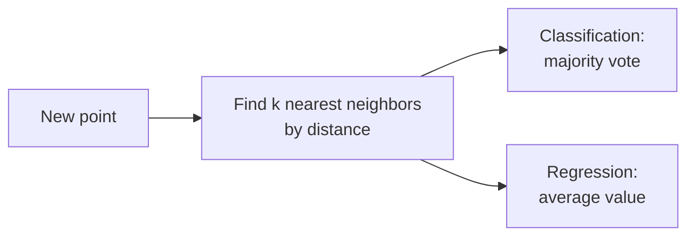

# k-Nearest Neighbors & Naive Bayes

> [!abstract] Definition
> **KNN** classifies/predicts a point based on the majority class (or average value) of its `k` closest neighbors in feature space — a simple, non-parametric, "lazy" learner. **Naive Bayes** applies Bayes' theorem with a (naive) assumption of feature independence, and is fast, effective on high-dimensional data like text.

---

## k-Nearest Neighbors

```python
from sklearn.neighbors import KNeighborsClassifier, KNeighborsRegressor

model = KNeighborsClassifier(
    n_neighbors=5,           # k — number of neighbors to consider
    weights="uniform",         # 'uniform' (equal vote) or 'distance' (closer neighbors count more)
    metric="minkowski",          # distance metric — 'minkowski' with p=2 is Euclidean
    p=2
)
model.fit(X_train, y_train)
model.predict(X_test)
model.predict_proba(X_test)     # fraction of neighbors voting for each class
```



> [!warning] KNN is extremely sensitive to feature scale
> Distance calculations are dominated by unscaled features with large numeric ranges — always scale features first (`StandardScaler`), just like SVM.

> [!tip] Choosing `k`
> Small `k` (e.g. 1-3) → low bias, high variance (sensitive to noise, can overfit). Large `k` → high bias, low variance (smoother, can underfit). Tune via [[03-Train-Test-Split-Cross-Validation|cross-validation]] — odd `k` avoids ties in binary classification.

> [!warning] KNN scales poorly with large datasets
> Prediction requires computing distance to every training point (`O(n)` per query, or better with tree-based indexes) — slow for large `n`. `algorithm="ball_tree"` or `"kd_tree"` can speed this up for lower-dimensional data.

---

## Naive Bayes Variants

```python
from sklearn.naive_bayes import GaussianNB, MultinomialNB, BernoulliNB

GaussianNB()          # continuous features, assumes each feature is normally distributed per class
MultinomialNB()          # discrete counts — classic choice for text classification (word counts, TF-IDF)
BernoulliNB()               # binary/boolean features (word present/absent)
```

```python
model = GaussianNB()
model.fit(X_train, y_train)
model.predict(X_test)
model.predict_proba(X_test)
```

### Text Classification Example (MultinomialNB)

```python
from sklearn.feature_extraction.text import CountVectorizer
from sklearn.naive_bayes import MultinomialNB
from sklearn.pipeline import make_pipeline

text_pipe = make_pipeline(CountVectorizer(), MultinomialNB())
text_pipe.fit(X_train_text, y_train)
text_pipe.predict(["a new email to classify"])
```

> [!info] See [[14-Text-Feature-Extraction]] for the full `CountVectorizer`/`TfidfVectorizer` reference.

---

## Why "Naive"?

> [!info] The independence assumption
> Naive Bayes assumes all features are conditionally independent given the class — rarely true in practice, but the model still performs surprisingly well, especially for text classification, because it only needs relative probability ranking to be correct, not exact probability values.

---

## Naive Bayes Strengths

> [!tip] When to reach for Naive Bayes
> - Very fast to train, even on large datasets
> - Works well with high-dimensional, sparse data (text)
> - Good baseline model — quick to try before more complex approaches
> - Handles multi-class problems natively without extra configuration

---

## Related
- [[02-Preprocessing-Scaling]]
- [[14-Text-Feature-Extraction]]
- [[11-Model-Evaluation-Metrics]]
