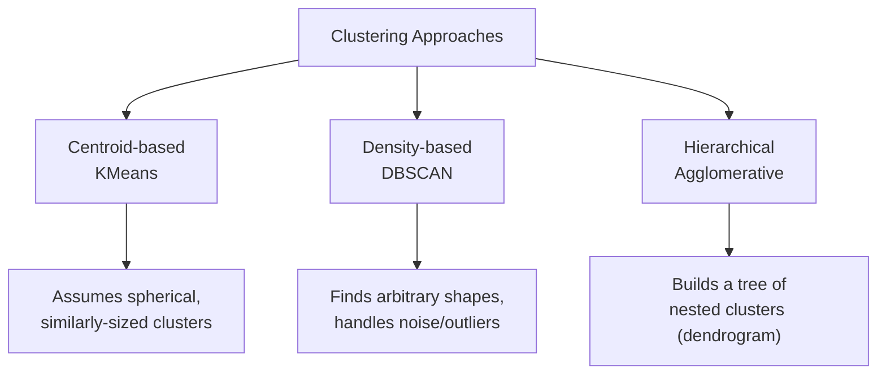

# Clustering

> [!abstract] Definition
> Clustering is unsupervised learning that groups similar data points together without labeled targets. scikit-learn's `sklearn.cluster` module implements centroid-based (KMeans), density-based (DBSCAN), and hierarchical (Agglomerative) approaches, each with different assumptions about cluster shape.



---

## KMeans

```python
from sklearn.cluster import KMeans

model = KMeans(
    n_clusters=3,           # k — number of clusters (must be chosen in advance)
    init="k-means++",         # smart initialization — avoids poor random starting centroids
    n_init="auto",               # number of times to run with different seeds, keeps the best
    random_state=42
)
model.fit(X)
model.labels_               # cluster assignment for each point
model.cluster_centers_        # coordinates of each cluster's centroid
model.predict(X_new)            # assign new points to the nearest existing centroid
model.inertia_                    # sum of squared distances to nearest centroid — lower is tighter clusters
```

### Choosing `k` — Elbow Method

```python
inertias = []
for k in range(1, 11):
    km = KMeans(n_clusters=k, random_state=42, n_init="auto").fit(X)
    inertias.append(km.inertia_)

import matplotlib.pyplot as plt
plt.plot(range(1, 11), inertias, marker="o")
plt.xlabel("k"); plt.ylabel("Inertia")   # look for the "elbow" where the curve flattens
```

### Choosing `k` — Silhouette Score

```python
from sklearn.metrics import silhouette_score

for k in range(2, 11):
    labels = KMeans(n_clusters=k, random_state=42, n_init="auto").fit_predict(X)
    print(k, silhouette_score(X, labels))   # closer to 1 = better-defined clusters
```

> [!warning] KMeans assumes roughly spherical, similarly-sized clusters
> It struggles with elongated, irregularly-shaped, or very differently-sized clusters — consider DBSCAN or Agglomerative Clustering in those cases.

> [!tip] Scale features before KMeans
> Like KNN/SVM, KMeans relies on Euclidean distance — unscaled features with larger ranges dominate the clustering. Use `StandardScaler` first.

---

## DBSCAN (Density-Based)

```python
from sklearn.cluster import DBSCAN

model = DBSCAN(
    eps=0.5,                # max distance between two points to be considered neighbors
    min_samples=5              # minimum points required to form a dense region (core point)
)
model.fit(X)
model.labels_                 # cluster labels; -1 indicates NOISE/outlier points
```

> [!tip] DBSCAN's key advantages
> - Doesn't require specifying the number of clusters in advance
> - Finds arbitrarily-shaped clusters
> - Naturally identifies outliers (labeled `-1`) rather than forcing every point into a cluster

> [!warning] Sensitive to `eps` and `min_samples`
> Poor choices can merge distinct clusters or label everything as noise. Use a k-distance plot to help choose `eps`, and scale features first.

---

## Agglomerative (Hierarchical) Clustering

```python
from sklearn.cluster import AgglomerativeClustering

model = AgglomerativeClustering(
    n_clusters=3,
    linkage="ward"          # 'ward' | 'complete' | 'average' | 'single' — how to measure distance between clusters
)
labels = model.fit_predict(X)
```

### Dendrogram Visualization

```python
from scipy.cluster.hierarchy import dendrogram, linkage
import matplotlib.pyplot as plt

Z = linkage(X, method="ward")
dendrogram(Z)
plt.show()          # visually inspect where to "cut" the tree for a chosen number of clusters
```

| `linkage` | Description |
|---|---|
| `ward` | minimizes variance within clusters — good general default |
| `complete` | maximum distance between cluster points |
| `average` | average distance between cluster points |
| `single` | minimum distance — can produce elongated "chained" clusters |

---

## Evaluating Clusters (No Ground Truth Labels)

```python
from sklearn.metrics import silhouette_score, davies_bouldin_score, calinski_harabasz_score

silhouette_score(X, labels)          # -1 to 1, higher = better-separated clusters
davies_bouldin_score(X, labels)        # lower = better (0 = perfect separation)
calinski_harabasz_score(X, labels)       # higher = better (ratio of between/within cluster dispersion)
```

---

## Related
- [[02-Preprocessing-Scaling]]
- [[10-Dimensionality-Reduction]]
- [[11-Model-Evaluation-Metrics]]
