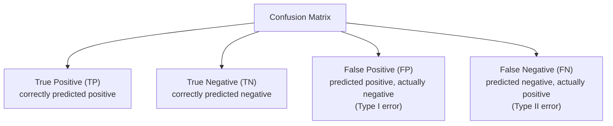

# Model Evaluation & Metrics

> [!abstract] Definition
> `sklearn.metrics` provides scoring functions for classification, regression, and clustering — used to quantify how well a model performs, both during evaluation and as the `scoring=` argument in cross-validation/tuning.

---

## Classification Metrics

```python
from sklearn.metrics import (
    accuracy_score, precision_score, recall_score, f1_score,
    confusion_matrix, classification_report, roc_auc_score
)

accuracy_score(y_test, y_pred)          # (correct predictions) / (total predictions)
precision_score(y_test, y_pred)           # of predicted positives, how many were actually positive?
recall_score(y_test, y_pred)                # of actual positives, how many did we catch?
f1_score(y_test, y_pred)                      # harmonic mean of precision and recall

classification_report(y_test, y_pred)           # precision/recall/f1/support per class, in one table
```

### Confusion Matrix

```python
cm = confusion_matrix(y_test, y_pred)
#              Predicted 0   Predicted 1
# Actual 0    [    TN     ,      FP    ]
# Actual 1    [    FN     ,      TP    ]

from sklearn.metrics import ConfusionMatrixDisplay
ConfusionMatrixDisplay.from_predictions(y_test, y_pred)
```



| Metric | Formula | Answers |
|---|---|---|
| Accuracy | `(TP+TN) / Total` | Overall, how often is the model right? |
| Precision | `TP / (TP+FP)` | Of positive predictions, how many were correct? |
| Recall (Sensitivity) | `TP / (TP+FN)` | Of actual positives, how many were found? |
| F1 Score | `2 * (Precision*Recall)/(Precision+Recall)` | Balance of precision and recall |

> [!warning] Accuracy is misleading on imbalanced datasets
> A model predicting "no fraud" for every transaction can score 99% accuracy if fraud is rare — always check precision/recall/F1 (or `classification_report`) on imbalanced data, not just accuracy.

---

## ROC-AUC & Precision-Recall Curves

```python
from sklearn.metrics import roc_auc_score, roc_curve, RocCurveDisplay

roc_auc_score(y_test, y_proba[:, 1])       # requires predicted PROBABILITIES, not labels
RocCurveDisplay.from_predictions(y_test, y_proba[:, 1])

from sklearn.metrics import PrecisionRecallDisplay
PrecisionRecallDisplay.from_predictions(y_test, y_proba[:, 1])
```

> [!tip] ROC-AUC vs Precision-Recall curves
> ROC-AUC is a good general summary; Precision-Recall curves are more informative for heavily imbalanced datasets (fraud, disease detection) where the negative class dominates.

---

## Multi-Class Averaging

```python
f1_score(y_test, y_pred, average="macro")        # unweighted mean across classes — treats all classes equally
f1_score(y_test, y_pred, average="weighted")        # weighted by class frequency (support)
f1_score(y_test, y_pred, average="micro")             # aggregate TP/FP/FN globally, then compute
```

---

## Regression Metrics

```python
from sklearn.metrics import (
    mean_absolute_error, mean_squared_error, root_mean_squared_error,
    r2_score, mean_absolute_percentage_error
)

mean_absolute_error(y_test, y_pred)             # average absolute error, same units as target
mean_squared_error(y_test, y_pred)                # penalizes large errors more heavily
root_mean_squared_error(y_test, y_pred)             # RMSE — same units as target, still penalizes large errors
r2_score(y_test, y_pred)                              # proportion of variance explained (1.0 = perfect)
mean_absolute_percentage_error(y_test, y_pred)          # error as a % — scale-independent
```

| Metric | Sensitive to outliers? | Interpretability |
|---|---|---|
| MAE | Less | Same units as target, easy to explain |
| MSE / RMSE | More (squares errors) | RMSE is same units, MSE is squared units |
| R² | N/A | 0-1 scale, "% variance explained" |
| MAPE | Less | Percentage — good for comparing across different scales |

---

## Custom Scorers

```python
from sklearn.metrics import make_scorer, fbeta_score

f2_scorer = make_scorer(fbeta_score, beta=2)   # weight recall higher than precision
cross_val_score(model, X, y, cv=5, scoring=f2_scorer)
```

---

## Class Imbalance Handling

```python
model = LogisticRegression(class_weight="balanced")   # auto-adjusts weights inversely to class frequency
model = RandomForestClassifier(class_weight={0: 1, 1: 10})  # manual weights
```

> [!info] For deeper imbalance handling (SMOTE, undersampling), see the external `imbalanced-learn` package (`pip install imbalanced-learn`), which extends the sklearn API with resampling transformers.

---

## Related
- [[03-Train-Test-Split-Cross-Validation]]
- [[12-Hyperparameter-Tuning]]
- [[Machine Learning/Libraries/ML/sklearn/17-Common-Errors-Gotchas]]
