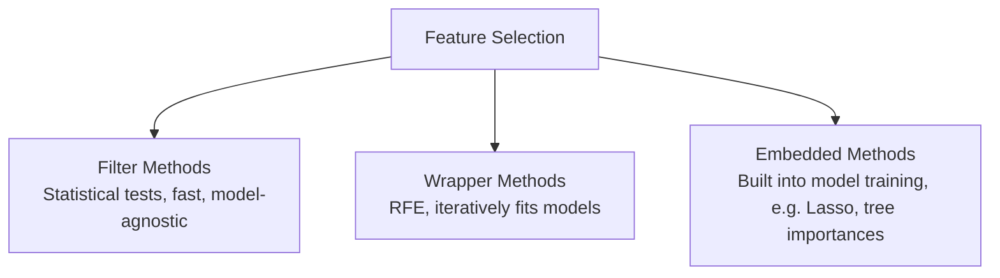

# Feature Selection

> [!abstract] Definition
> Feature selection reduces the number of input features to a model — improving interpretability, reducing overfitting, and speeding up training — via filter methods (statistical tests), wrapper methods (iterative model-based selection), or embedded methods (built into the model itself, like Lasso).



---

## Filter Methods — `SelectKBest`

```python
from sklearn.feature_selection import SelectKBest, f_classif, f_regression, chi2, mutual_info_classif

selector = SelectKBest(score_func=f_classif, k=10)     # keep top 10 features by ANOVA F-value
X_selected = selector.fit_transform(X_train, y_train)

selector.get_support()                  # boolean mask of selected features
selector.get_feature_names_out()          # names of selected features (if input was a DataFrame)
selector.scores_                            # score per feature — inspect to understand ranking
```

| `score_func` | Use case |
|---|---|
| `f_classif` | classification, continuous features |
| `f_regression` | regression, continuous features |
| `chi2` | classification, non-negative features (e.g. counts) |
| `mutual_info_classif` | classification, captures nonlinear relationships |
| `mutual_info_regression` | regression equivalent |

---

## `SelectPercentile` — Keep Top X%

```python
from sklearn.feature_selection import SelectPercentile

selector = SelectPercentile(f_classif, percentile=20)   # keep top 20% of features
X_selected = selector.fit_transform(X_train, y_train)
```

---

## Variance Threshold — Remove Low-Information Features

```python
from sklearn.feature_selection import VarianceThreshold

selector = VarianceThreshold(threshold=0.01)   # drop features with variance below threshold
X_selected = selector.fit_transform(X_train)
```

> [!tip] Removes near-constant features
> Useful as a quick first pass to eliminate features that carry almost no information (e.g. a column that's 99.9% the same value).

---

## Wrapper Methods — Recursive Feature Elimination (RFE)

```python
from sklearn.feature_selection import RFE, RFECV
from sklearn.linear_model import LogisticRegression

rfe = RFE(estimator=LogisticRegression(), n_features_to_select=5)
X_selected = rfe.fit_transform(X_train, y_train)

rfe.support_          # boolean mask of selected features
rfe.ranking_             # 1 = selected, higher = eliminated earlier
```

```python
# RFECV — automatically finds the optimal number of features via cross-validation
rfecv = RFECV(estimator=LogisticRegression(), cv=5, scoring="accuracy")
rfecv.fit(X_train, y_train)
rfecv.n_features_        # the number RFECV settled on
```

> [!info] How RFE works
> Repeatedly fits the model, ranks features by importance/coefficient magnitude, discards the weakest, and refits — continuing until the target number of features remains.

---

## Embedded Methods

```python
# Lasso — L1 regularization drives some coefficients to exactly 0
from sklearn.linear_model import Lasso
lasso = Lasso(alpha=0.1).fit(X_train, y_train)
selected_features = X.columns[lasso.coef_ != 0]

# Tree-based feature_importances_
from sklearn.ensemble import RandomForestClassifier
rf = RandomForestClassifier().fit(X_train, y_train)
importances = pd.Series(rf.feature_importances_, index=X.columns).sort_values(ascending=False)

# SelectFromModel — generic wrapper around any embedded-importance model
from sklearn.feature_selection import SelectFromModel
selector = SelectFromModel(rf, threshold="median")   # keep features above median importance
X_selected = selector.fit_transform(X_train, y_train)
```

---

## Permutation Importance (Model-Agnostic, More Reliable Than `feature_importances_`)

```python
from sklearn.inspection import permutation_importance

result = permutation_importance(model, X_test, y_test, n_repeats=10, random_state=42)
importances = pd.Series(result.importances_mean, index=X.columns).sort_values(ascending=False)
```

> [!tip] Why permutation importance is often preferred
> Built-in `feature_importances_` on tree models can be biased toward high-cardinality features. Permutation importance measures the actual drop in model performance when a feature's values are randomly shuffled — more reliable, and works with ANY fitted model, not just trees.

---

## Related
- [[05-Linear-Models]]
- [[06-Tree-Ensemble-Models]]
- [[10-Dimensionality-Reduction]]
