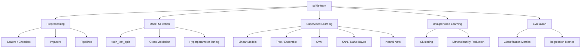

# 🤖 Scikit-learn 

> [!abstract] What is scikit-learn?
> **scikit-learn** (`sklearn`) is Python's core general-purpose machine learning library — consistent APIs for preprocessing, supervised/unsupervised models, model selection, and evaluation, all built on top of [[numpy|NumPy]] and interoperable with [[pandas|pandas]] DataFrames.

```python
import sklearn
from sklearn.model_selection import train_test_split
```

> [!info] Version note
> Assumes **scikit-learn ≥ 1.3**. Key modern conventions: `set_output(transform="pandas")` for DataFrame-native pipelines, and consistent `get_feature_names_out()` across transformers.

---

## 📂 Folder Contents

| # | Note | Covers |
|---|------|--------|
| 01 | [[01-Estimator-API-Basics]] | The `fit`/`predict`/`transform` contract, core conventions |
| 02 | [[02-Preprocessing-Scaling]] | Scalers, encoders, imputers |
| 03 | [[03-Train-Test-Split-Cross-Validation]] | `train_test_split`, `KFold`, `cross_val_score` |
| 04 | [[04-Pipelines-ColumnTransformer]] | `Pipeline`, `ColumnTransformer`, `make_pipeline` |
| 05 | [[05-Linear-Models]] | Linear/Logistic Regression, Ridge, Lasso, ElasticNet |
| 06 | [[06-Tree-Ensemble-Models]] | Decision Trees, Random Forest, Gradient Boosting, Voting/Stacking |
| 07 | [[07-SVM]] | Support Vector Machines, kernels |
| 08 | [[08-KNN-Naive-Bayes]] | k-Nearest Neighbors, Naive Bayes variants |
| 09 | [[09-Clustering]] | KMeans, DBSCAN, Hierarchical/Agglomerative |
| 10 | [[10-Dimensionality-Reduction]] | PCA, t-SNE, LDA, feature reduction |
| 11 | [[11-Model-Evaluation-Metrics]] | Classification/regression metrics, confusion matrix |
| 12 | [[12-Hyperparameter-Tuning]] | `GridSearchCV`, `RandomizedSearchCV`, learning curves |
| 13 | [[13-Feature-Selection]] | `SelectKBest`, RFE, feature importance |
| 14 | [[14-Text-Feature-Extraction]] | `CountVectorizer`, `TfidfVectorizer` |
| 15 | [[15-Neural-Networks-MLP]] | `MLPClassifier`/`MLPRegressor` |
| 16 | [[16-Model-Persistence]] | `joblib`, pickling models |
| 17 | [[Machine Learning/Libraries/ML/sklearn/17-Common-Errors-Gotchas]] | Data leakage, scaling order, common `ValueError`s |

---

## 🗺️ Conceptual Map



---

## ⚡ Quick Reference — Typical Workflow

```python
from sklearn.model_selection import train_test_split
from sklearn.preprocessing import StandardScaler
from sklearn.pipeline import Pipeline
from sklearn.linear_model import LogisticRegression
from sklearn.metrics import accuracy_score, classification_report

X_train, X_test, y_train, y_test = train_test_split(X, y, test_size=0.2, random_state=42)

pipe = Pipeline([
    ("scaler", StandardScaler()),
    ("model", LogisticRegression())
])

pipe.fit(X_train, y_train)
y_pred = pipe.predict(X_test)

print(accuracy_score(y_test, y_pred))
print(classification_report(y_test, y_pred))
```

---

## 🔗 Related in LORE
- [[pandas|Pandas Reference]] — data loading/cleaning before feeding into sklearn
- [[numpy|NumPy Reference]] — sklearn arrays, math under the hood
- ML Study Notes — Cost Function, Linear Regression theory that these models implement

> [!tip] How to use this vault section
> Same skeleton throughout: **Definition → Syntax → Key Parameters → Examples → Notes/Gotchas**. `Ctrl/Cmd+O` and type "Sklearn" to jump between notes.
