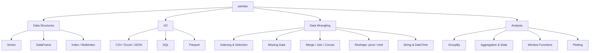

# 🐼 Pandas : Map of Content

> [!abstract] What is pandas?
> **pandas** is an open-source Python library built on top of NumPy for fast, flexible, and expressive **data structures** (`Series`, `DataFrame`) designed to work with structured (tabular, labeled) data. It is the core tool for data cleaning, transformation, exploration, and analysis in the Python data stack.

```python
import pandas as pd
import numpy as np
```

> [!info] Version note
> This vault assumes **pandas ≥ 2.x**. Where behavior changed from 1.x (e.g. Copy-on-Write, `SettingWithCopyWarning`, deprecated `.append()`), a callout flags it.

---

## 📂 Folder Contents

| # | Note | Covers |
|---|------|--------|
| 01 | [[01-Series]] | 1D labeled array, the building block of a DataFrame |
| 02 | [[02-DataFrame-Basics]] | Creation, inspection, attributes, dtypes |
| 03 | [[03-IO-Reading-Writing]] | CSV, Excel, JSON, SQL, Parquet, clipboard |
| 04 | [[04-Indexing-Selection]] | `.loc`, `.iloc`, boolean masks, slicing, `.at`/`.iat` |
| 05 | [[05-Missing-Data]] | `NaN`, `isna`, `fillna`, `dropna`, `interpolate` |
| 06 | [[06-GroupBy]] | Split-apply-combine, aggregation, transform, filter |
| 07 | [[07-Merge-Join-Concat]] | Combining DataFrames: merge, join, concat, append |
| 08 | [[08-Reshaping]] | pivot, pivot_table, melt, stack/unstack, crosstab |
| 09 | [[09-String-Methods]] | The `.str` accessor, regex, text cleaning |
| 10 | [[10-DateTime]] | `.dt` accessor, Timestamps, resampling, time series |
| 11 | [[11-Apply-Map-Vectorization]] | `apply`, `map`, `applymap`, vectorization, `pipe` |
| 12 | [[12-Aggregation-Statistics]] | `describe`, `mean`, `corr`, `value_counts`, agg funcs |
| 13 | [[13-Sorting-Filtering]] | `sort_values`, `sort_index`, `query`, `nlargest` |
| 14 | [[14-MultiIndex]] | Hierarchical indexing, `.xs`, `swaplevel` |
| 15 | [[15-Categorical-Data]] | `Categorical` dtype, ordered categories, memory savings |
| 16 | [[16-Window-Rolling-Expanding]] | `rolling`, `expanding`, `ewm` |
| 17 | [[17-Plotting]] | `.plot()` accessor, matplotlib integration |
| 18 | [[18-Options-Performance]] | `pd.options`, memory, `eval`/`query`, vectorization tips |
| 19 | [[19-Common-Errors-Gotchas]] | `SettingWithCopyWarning`, chained indexing, dtype traps |

---

## 🗺️ Conceptual Map



---

## ⚡ Quick Reference : Most-Used Calls

```python
pd.read_csv("file.csv")            # load data
df.head() / df.tail()              # peek
df.info() / df.describe()          # summary
df.shape / df.columns / df.dtypes  # structure
df.loc[rows, cols]                 # label-based selection
df.iloc[rows, cols]                # position-based selection
df[df["col"] > 0]                  # boolean filter
df.groupby("col").agg(...)         # split-apply-combine
df.merge(other, on="key")          # SQL-style join
df.pivot_table(...)                # reshape + aggregate
df.dropna() / df.fillna(0)         # handle missing data
df.sort_values("col")              # sort
df.to_csv("out.csv", index=False)  # save
```

---

## 🔗 Related in LORE
- [[Excel/00-Excel-MOC|Excel Reference]] : for spreadsheet-side equivalents (VLOOKUP ≈ `merge`, Pivot Table ≈ `pivot_table`)
- ML Study Notes : pandas is the primary data-prep tool referenced there

> [!tip] How to use this vault section
> Each note follows the same skeleton: **Definition → Syntax → Key Parameters → Examples → Notes/Gotchas**. Use `Ctrl/Cmd+O` (Quick Switcher) and start typing "Pandas" to jump between notes.
