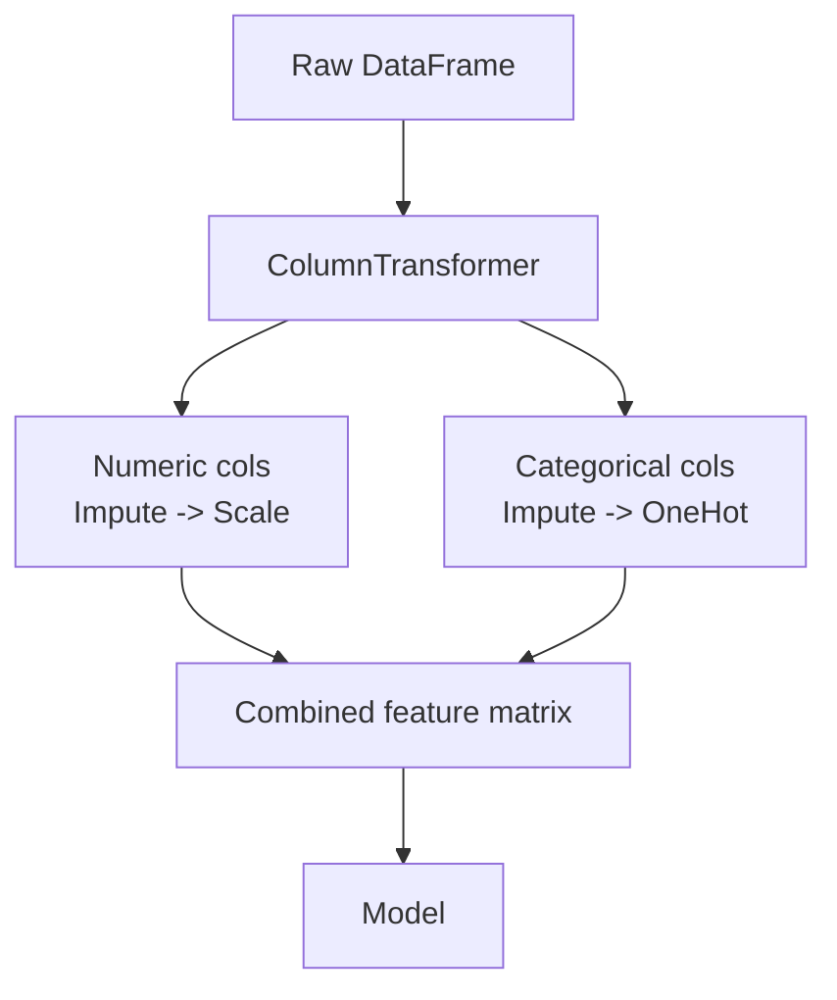

# Pipelines & ColumnTransformer

> [!abstract] Definition
> A **`Pipeline`** chains preprocessing steps and a final estimator into a single object with one `.fit()`/`.predict()` call — preventing data leakage and making cross-validation/deployment trivial. **`ColumnTransformer`** applies different preprocessing to different columns (e.g. scale numeric, one-hot encode categorical) within that same pipeline.

---

## Basic Pipeline

```python
from sklearn.pipeline import Pipeline
from sklearn.preprocessing import StandardScaler
from sklearn.linear_model import LogisticRegression

pipe = Pipeline([
    ("scaler", StandardScaler()),
    ("model", LogisticRegression())
])

pipe.fit(X_train, y_train)          # fits scaler, then model, in sequence
pipe.predict(X_test)                   # applies scaler.transform, then model.predict
pipe.score(X_test, y_test)
```

> [!tip] Why use a Pipeline instead of manual steps
> A Pipeline guarantees the exact same preprocessing is applied consistently at train and predict time, and — critically — it lets `cross_val_score`/`GridSearchCV` refit the scaler correctly **within each fold**, avoiding data leakage. See [[17-Common-Errors-Gotchas]].

---

## `make_pipeline()` — Shorthand (Auto-Named Steps)

```python
from sklearn.pipeline import make_pipeline

pipe = make_pipeline(StandardScaler(), LogisticRegression())
# step names auto-generated: 'standardscaler', 'logisticregression'
```

---

## `ColumnTransformer` — Different Preprocessing per Column Type

```python
from sklearn.compose import ColumnTransformer
from sklearn.preprocessing import StandardScaler, OneHotEncoder
from sklearn.impute import SimpleImputer
from sklearn.pipeline import Pipeline

numeric_features = ["age", "income"]
categorical_features = ["city", "gender"]

numeric_transformer = Pipeline([
    ("imputer", SimpleImputer(strategy="median")),
    ("scaler", StandardScaler())
])

categorical_transformer = Pipeline([
    ("imputer", SimpleImputer(strategy="most_frequent")),
    ("onehot", OneHotEncoder(handle_unknown="ignore"))
])

preprocessor = ColumnTransformer([
    ("num", numeric_transformer, numeric_features),
    ("cat", categorical_transformer, categorical_features)
])

full_pipe = Pipeline([
    ("preprocessor", preprocessor),
    ("model", LogisticRegression())
])

full_pipe.fit(X_train, y_train)
```



---

## Accessing Pipeline Steps

```python
pipe.named_steps["scaler"]              # access a specific step by name
pipe["scaler"]                             # shorthand equivalent
pipe.named_steps["model"].coef_             # reach into the fitted model's learned attributes
pipe[:-1].transform(X_test)                    # apply all steps EXCEPT the final estimator (useful for inspection)
```

---

## `get_feature_names_out()` — Track Column Names Through the Pipeline

```python
preprocessor.get_feature_names_out()
# array(['num__age', 'num__income', 'cat__city_Mumbai', 'cat__city_Pune', ...])
```

---

## `set_output(transform="pandas")` — Keep DataFrames Throughout (sklearn ≥ 1.2)

```python
preprocessor.set_output(transform="pandas")
X_transformed = preprocessor.fit_transform(X_train)   # returns a DataFrame, not a NumPy array
```

---

## Feature Union (Combine Multiple Transformers on the SAME Columns)

```python
from sklearn.pipeline import FeatureUnion
from sklearn.decomposition import PCA
from sklearn.feature_selection import SelectKBest

combined = FeatureUnion([
    ("pca", PCA(n_components=2)),
    ("select_best", SelectKBest(k=3))
])
```

> [!info] `ColumnTransformer` vs `FeatureUnion`
> `ColumnTransformer` applies different transformers to **different columns**; `FeatureUnion` applies different transformers to the **same** data and concatenates their outputs side by side.

---

## Using a Pipeline with GridSearchCV

```python
from sklearn.model_selection import GridSearchCV

param_grid = {
    "model__C": [0.1, 1, 10],                 # note the "stepname__paramname" syntax
    "preprocessor__num__imputer__strategy": ["mean", "median"]
}

grid = GridSearchCV(full_pipe, param_grid, cv=5, scoring="accuracy")
grid.fit(X_train, y_train)
```

> [!info] See [[12-Hyperparameter-Tuning]] for the full GridSearchCV/RandomizedSearchCV reference.

---

## Related
- [[02-Preprocessing-Scaling]]
- [[03-Train-Test-Split-Cross-Validation]]
- [[12-Hyperparameter-Tuning]]
- [[16-Model-Persistence]]
