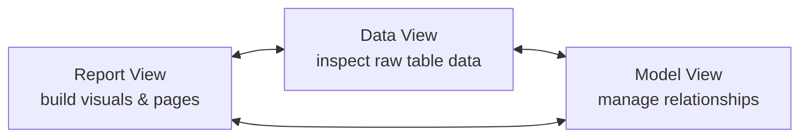

# Interface Overview

> [!abstract] Definition
> **Power BI Desktop** is the free authoring tool used to build reports before publishing them to the **Power BI Service**. Its interface is organized around three switchable views on the left-hand vertical bar, plus a ribbon and several docked panes.

---

## The Three Views



| View | Icon | Purpose |
|---|---|---|
| **Report View** | bar chart icon | the main canvas - drag fields onto visuals, design pages, add slicers |
| **Data View** | table/grid icon | see the actual rows of each loaded table, like a spreadsheet |
| **Model View** | diagram icon | see and edit relationships between tables visually |

> [!tip] Switch views constantly while building
> A common workflow: check **Data View** to confirm a column's actual values/type, jump to **Model View** to verify a relationship exists and has the right direction, then back to **Report View** to build the visual.

---

## Key Panes (Report View)

| Pane | Purpose |
|---|---|
| **Filters** | page-level, visual-level, and report-level filters |
| **Visualizations** | pick chart type, drag fields into wells (Axis, Legend, Values, etc.) |
| **Fields** | list of all loaded tables and their columns/measures, checkboxes to add to the selected visual |
| **Format** (paint roller icon, inside Visualizations pane) | styling for the currently selected visual - colors, fonts, borders, titles |
| **Analytics** (magnifying glass icon) | trend lines, constant lines, reference lines for the selected visual |

> [!info] Fields pane icons
> A calculator icon (𝑓x-like) next to a field means it's a **measure** (a DAX calculation); a plain column icon means it's a **column** from the source data. See [[08-Calculated-Columns-Tables-Measures]] for the distinction.

---

## The Ribbon - Key Tabs

```
Home        - Get Data, Transform Data, Refresh, Publish
Insert      - add visuals, text boxes, shapes, buttons, new pages
Modeling    - New Measure, New Column, New Table, Manage Relationships, Row-Level Security
View        - Themes, Page view (fit to page/width/actual size), gridlines, Performance Analyzer
Optimize    - Performance Analyzer, aggregations
Help        - documentation, what's new
```

---

## Pages & the Canvas

```
Bottom of the screen: page tabs, like sheet tabs in Excel
Right-click a page tab: Duplicate Page, Hide Page, Page Information
```

> [!tip] Hide pages that support other pages but shouldn't be seen
> Drillthrough target pages or "helper" pages used only via bookmarks are commonly hidden (right-click tab > Hide Page) so end users never navigate to them directly, but they still function when triggered.

---

## Status Bar (Bottom of Window)

Shows the currently selected visual's summary stats (e.g. sum of a highlighted data point) and a zoom/page-fit control. Also where refresh progress and error messages briefly appear.

---

## Selection Pane & Layer Order

`View > Selection Pane` (or right-click a visual > Selection Pane) shows every object on the current page as a list, with:
- Eye icon to toggle visibility (useful for bookmark-driven show/hide logic)
- Drag to reorder (controls which visual sits "on top" when overlapping)

> [!info] See [[12-Bookmarks-Buttons-Navigation]] for how the Selection Pane pairs with bookmarks to build toggleable layouts.

---

## Keyboard & Mouse Shortcuts

```
Ctrl + C / Ctrl + V        copy/paste a visual
Ctrl + click                multi-select several visuals
Alt + Shift + arrow keys       nudge a selected visual's position precisely
Ctrl + G                          group selected visuals together
F5 (or the Refresh button)          refresh data from the source
Ctrl + Shift + drag                  duplicate a visual by dragging
```

---

## Related
- [[02-Getting-Data-Connectors]]
- [[03-Power-Query-Editor-M-Language]]
- [[04-Data-Modeling-Relationships]]
