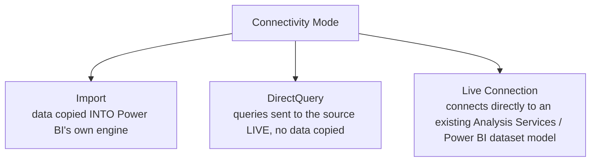

# Getting Data & Connectors

> [!abstract] Definition
> **Get Data** is the entry point for connecting Power BI to any source: files, databases, web APIs, cloud services, and more. Every connector eventually hands data to the **Power Query Editor** for shaping before it's loaded into the model.

---

## Get Data - Common Connector Categories

```
Home > Get Data > choose a source
```

| Category | Examples |
|---|---|
| **File** | Excel, CSV/Text, JSON, XML, PDF, Folder (combine many files) |
| **Database** | SQL Server, PostgreSQL, MySQL, Oracle, Snowflake |
| **Power Platform** | Dataverse, Power BI datasets/dataflows |
| **Azure** | Azure SQL Database, Azure Synapse, Blob Storage |
| **Online Services** | SharePoint, Salesforce, Google Analytics, Dynamics 365 |
| **Other** | Web (any URL/API), OData Feed, ODBC/ OLE DB, Blank Query |

> [!tip] "Web" connector for quick API/HTML table pulls
> `Get Data > Web`, paste a URL, and Power BI will attempt to auto-detect tables on the page or let you drill into a JSON response - a fast way to pull public data without writing custom code.

---

## Import vs DirectQuery vs Live Connection



| Mode | Speed | Data freshness | Model size limit | DAX limitations |
|---|---|---|---|---|
| **Import** | Fastest (in-memory, compressed) | As of last refresh | Yes (workspace/capacity dependent) | None - full DAX available |
| **DirectQuery** | Slower (query hits source every interaction) | Always live | No practical limit | Some functions restricted/slower |
| **Live Connection** | Depends on source | Always live | N/A (reuses existing model) | Can't add new relationships/tables locally |

> [!tip] Default to Import unless there's a specific reason not to
> Import mode gives the best performance and full DAX functionality. Reach for DirectQuery only when data is too large to import, needs to be truly real-time, or security/compliance requires data to stay at the source.

---

## Choosing Tables - The Navigator Window

After selecting a connector and authenticating, the **Navigator** window lists available tables/views with checkboxes.

```
[ ] Select multiple items - check several tables at once
Preview pane on the right shows sample rows before committing
"Load" - loads directly, applying no transformations
"Transform Data" - opens Power Query Editor first (recommended almost always)
```

> [!tip] Always click "Transform Data," rarely "Load" directly
> Even if no cleanup is needed today, opening in Power Query first means the query steps exist and are easy to extend later, rather than needing to re-open a query you loaded blind.

---

## Authentication Methods

```
Anonymous          - no credentials, public sources
Windows             - current Windows login credentials
Database             - username/password specific to that data source
OAuth2 / Organizational - sign in via Microsoft/Google/etc. account, token-based
API Key                    - for services like some REST APIs
```

> [!info] Credentials are stored per data source, not per report
> Once you authenticate to a source (e.g. a specific SQL Server), Power BI remembers those credentials for that exact source going forward across reports - manage/reset them via `File > Options and Settings > Data source settings`.

---

## Parameters (Reusable, Editable Values)

```
Home > Manage Parameters > New Parameter
```

```
Name: ServerName
Type: Text
Current Value: prod-sql-server.company.com
```

> [!tip] Parameters make environment switching trivial
> Define a parameter for things like a server name, file path, or date range, then reference it inside queries. Switching from a Dev to Prod data source (or a test file to the real one) becomes a single parameter edit instead of manually rewriting every query.

---

## Refreshing Data

```
Home > Refresh          - manually refresh all queries in Power BI Desktop
```

| Refresh type | Where | Notes |
|---|---|---|
| Manual refresh | Desktop | Click Refresh anytime while authoring |
| Scheduled refresh | Power BI Service | Set a fixed schedule (e.g. daily at 6am) - see [[15-Publishing-Power-BI-Service]] |
| DirectQuery | Service/Desktop | No "refresh" needed - queries hit the source live every time |
| Incremental refresh | Service (Premium/Fabric capacity) | Only refresh recent partitions of a large table, not the whole history |

> [!info] See [[15-Publishing-Power-BI-Service]] for scheduled refresh setup and gateway requirements for on-premises sources.

---

## Combining Files from a Folder

```
Get Data > Folder > point to a directory of identically-structured files (e.g. monthly CSV exports)
```

Power BI generates a sample query plus a **function** that's applied to every file, then combines all results into one table automatically - the standard pattern for "12 monthly Excel files -> one combined table."

> [!info] See [[03-Power-Query-Editor-M-Language]] for how this combine-files pattern works under the hood as M code.

---

## Related
- [[03-Power-Query-Editor-M-Language]]
- [[04-Data-Modeling-Relationships]]
- [[15-Publishing-Power-BI-Service]]
