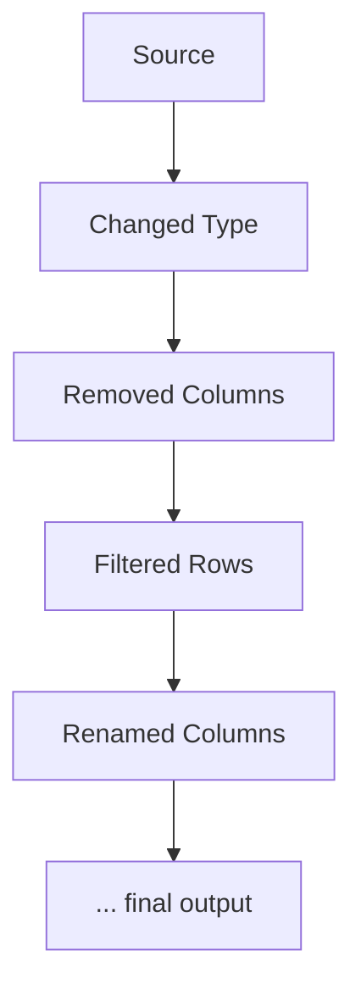

# Power Query Editor & M Language

> [!abstract] Definition
> **Power Query** is Power BI's data transformation engine - a visual, step-by-step editor where every click (removing a column, filtering rows, changing a type) generates a line of **M** code (the underlying functional query language) recorded in the **Applied Steps** pane.

---

## Opening the Editor

```
Home > Transform Data
```

---

## The Applied Steps Pane



Every transformation is recorded as a named, ordered step. Click any step to see the data exactly as it looked at that point - the gear icon next to a step opens its settings for editing without redoing it from scratch.

> [!tip] Steps are fully re-orderable and editable
> Right-click any step to rename, delete, or move it. Reordering can change results (e.g. filtering before vs after a column rename usually doesn't matter, but filtering before vs after a merge/append definitely does) - always sanity-check results after reordering.

---

## Common Transformations (Home / Transform Tabs)

```
Remove Columns / Remove Other Columns
Keep Rows / Remove Rows (top N, duplicates, blank rows, errors)
Change Type (per column: Text, Whole Number, Decimal, Date, etc.)
Split Column (by delimiter, by number of characters, by positions)
Merge Columns (combine several columns into one)
Group By (aggregate - like SQL GROUP BY or pandas groupby)
Pivot Column / Unpivot Column (reshape wide <-> long, like pandas pivot/melt)
Replace Values
Fill Down / Fill Up (propagate a value into blank cells below/above)
Trim / Clean / Capitalize Each Word (text cleanup)
```

> [!tip] `Unpivot Columns` is one of the most-used transforms
> Real-world spreadsheet exports are often "wide" (one column per month/category). Selecting the ID columns, then `Transform > Unpivot Other Columns`, reshapes to "long" tidy format - the standard prerequisite for building proper Power BI visuals and relationships.

---

## Data Types

```
123      Whole Number
1.23      Decimal Number
$        Currency
%          Percentage
ABC          Text
TRUE/FALSE      True/False
📅              Date, Date/Time, Date/Time/Timezone, Time
```

> [!warning] Set correct data types early, right after loading
> Wrong types (e.g. a date stored as text) silently break sorting, date-based visuals, and DAX time intelligence functions later - fix types as one of the very first steps, not an afterthought.

---

## Merge Queries (Joins)

```
Home > Merge Queries
```

```
Left table:  Orders
Right table: Customers
Join on:     Orders[CustomerID] = Customers[CustomerID]
Join Kind:   Left Outer / Right Outer / Full Outer / Inner / Left Anti / Right Anti
```

| Join Kind | Equivalent SQL |
|---|---|
| Left Outer | `LEFT JOIN` |
| Right Outer | `RIGHT JOIN` |
| Full Outer | `FULL JOIN` |
| Inner | `INNER JOIN` |
| Left Anti | rows in Left with NO match in Right (like `WHERE NOT EXISTS`) |
| Right Anti | rows in Right with NO match in Left |

> [!tip] Merge in Power Query vs a relationship in the Model
> Use **Merge Queries** to pull specific COLUMNS from one table directly into another (flattening data before load). Use a **Model relationship** (see [[04-Data-Modeling-Relationships]]) to keep tables separate but linked - generally preferred for star-schema designs, since it keeps the model smaller and more flexible for DAX.

---

## Append Queries (Stacking Rows)

```
Home > Append Queries          - combine 2+ tables with the same columns, stacked vertically (like SQL UNION ALL / pandas concat)
```

---

## Group By (Aggregation in Power Query)

```
Transform > Group By
Group by: Region
New column name: TotalSales, Operation: Sum, Column: Amount
```

Equivalent conceptually to `df.groupby("Region")["Amount"].sum()` in pandas, or `GROUP BY region` in SQL - useful for pre-aggregating data before it even reaches the model.

---

## Custom Columns (Writing M Expressions)

```
Add Column > Custom Column
```

```m
// M syntax examples
[Price] * [Quantity]
if [Amount] > 1000 then "High" else "Low"
Text.Upper([Name])
Date.Year([OrderDate])
```

---

## The M Language - Core Syntax

```m
let
    Source = Csv.Document(File.Contents("C:\data\sales.csv")),
    ChangedType = Table.TransformColumnTypes(Source, {{"Amount", type number}}),
    Filtered = Table.SelectRows(ChangedType, each [Amount] > 0)
in
    Filtered
```

> [!info] Every query is a `let...in` expression
> `let` defines a sequence of named steps (each referencing the previous), and `in` specifies which step is the query's final output - this is exactly what the Applied Steps pane is generating visually behind the scenes.

### Viewing/Editing M Directly

```
View > Advanced Editor        - see and edit the FULL M code for the current query
```

> [!tip] Reading generated M teaches the language fast
> Performing an action visually, then immediately opening the Advanced Editor to see the M it produced, is one of the fastest ways to learn M syntax by example.

---

## Common M Functions

```m
Table.SelectRows(table, each [Column] > 100)         // filter rows
Table.RemoveColumns(table, {"Col1", "Col2"})            // drop columns
Table.RenameColumns(table, {{"Old", "New"}})              // rename columns
Table.AddColumn(table, "NewCol", each [A] + [B])             // add a computed column
Table.Group(table, {"Category"}, {{"Total", each List.Sum([Amount]), type number}})   // group + aggregate
Table.Sort(table, {{"Date", Order.Ascending}})              // sort rows

Text.Upper(text) / Text.Lower(text) / Text.Trim(text)
Text.Start(text, count) / Text.End(text, count)
Text.Contains(text, substring)
Date.Year(date) / Date.Month(date) / Date.AddDays(date, n)
Number.Round(number, digits)
List.Sum(list) / List.Average(list) / List.Max(list)
if condition then value1 else value2
```

---

## Query Dependencies & Reference Queries

```
Right-click a query > Reference     - creates a NEW query that starts from the output of an existing one
```

> [!tip] Reference vs Duplicate
> **Duplicate** copies all steps into an independent query (editing the original later won't affect the copy). **Reference** builds a new query on top of the original as a live dependency - editing the original automatically flows through to anything referencing it. Use References to build a clean "staging query -> several derived queries" pipeline.

---

## Query Folding (Performance)

> [!info] What query folding means
> When connected to a source that understands SQL-like operations (databases), Power Query tries to translate your applied steps (filter, sort, select columns) back into a single query sent to the SOURCE, rather than pulling all raw data first and transforming it locally. This is dramatically faster for large database sources.

```
Right-click a step > "View Native Query"    - if available, confirms folding is happening; if grayed out, folding has stopped
```

> [!warning] Certain steps break query folding
> Custom M functions, merging queries from different source types, and some text/date transformations can prevent folding from continuing past that step - keep foldable operations (filters, column selection, simple renames) as early as possible in the step sequence when working with database sources.

---

## Related
- [[02-Getting-Data-Connectors]]
- [[04-Data-Modeling-Relationships]]
- [[16-Performance-Optimization]]
