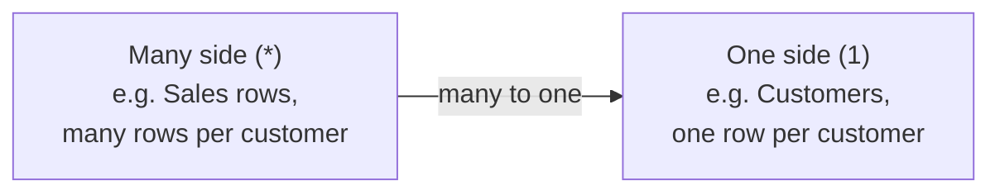
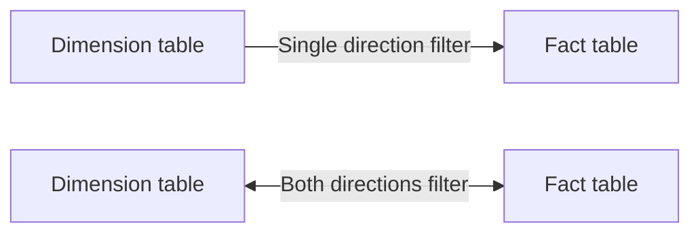
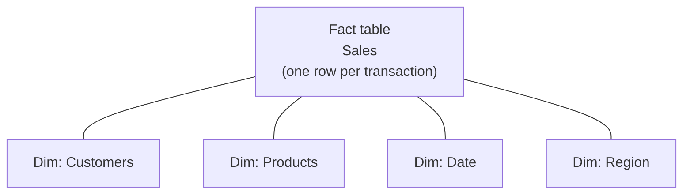
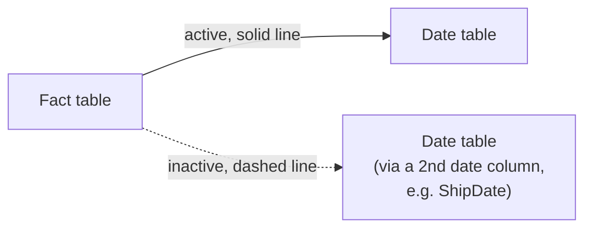

# Data Modeling & Relationships

> [!abstract] Definition
> The **Data Model** defines how loaded tables connect to each other via **relationships**, which determines how filtering flows between tables when building visuals and writing DAX. Getting the model right (usually as a **star schema**) is the single highest-leverage skill in Power BI.

---

## Creating a Relationship

```
Model View > drag a field from one table onto the matching field in another table
```

Or explicitly:

```
Home > Manage Relationships > New
```

```
From: Sales[CustomerID]
To:   Customers[CustomerID]
Cardinality: Many to One (*:1)
Cross filter direction: Single
```

---

## Cardinality



| Cardinality | Meaning | Typical example |
|---|---|---|
| **Many to One** (most common) | many rows on one side match exactly one row on the other | Sales (many) -> Customers (one) |
| **One to One** | exactly one matching row on each side | Employee -> EmployeeDetails |
| **Many to Many** | many rows can match many rows on both sides (Power BI supports this natively) | Products <-> Promotions, via a bridge, or directly |

> [!warning] Many-to-many relationships need extra care
> They're supported but can produce ambiguous, hard-to-debug results if not modeled deliberately (usually via a proper bridge table). Default to many-to-one relationships against a clean dimension table whenever possible.

---

## Cross-Filter Direction



| Direction | Behavior |
|---|---|
| **Single** (default, recommended) | filtering the "one" side filters the "many" side, but not vice versa |
| **Both** | filters flow in both directions - powerful but can cause ambiguity/circular filtering in complex models |

> [!tip] Default to Single direction
> Bidirectional filtering is occasionally necessary (e.g. certain many-to-many scenarios) but is the most common source of confusing, hard-to-diagnose "wrong number" bugs in larger models. Only enable Both when there's a specific, understood need.

---

## Star Schema (The Gold Standard Model Shape)



| | Fact table | Dimension table |
|---|---|---|
| Contains | transactional/event data, numeric measures | descriptive attributes |
| Row count | large (millions of rows possible) | small (hundreds to thousands typically) |
| Example | Sales, Orders, Web Events | Customers, Products, Date, Region |
| Key columns | foreign keys pointing to dimensions | one primary key |

> [!tip] Why star schema beats a single flat table
> A flat, denormalized "everything in one table" export is easy to load but wastes memory (repeating customer/product details on every row) and makes DAX time intelligence and multi-grain calculations much harder. A star schema is smaller, faster, and matches how DAX's filter propagation naturally works.

---

## The Date Table (Essential for Time Intelligence)

```dax
DateTable = CALENDAR(DATE(2020,1,1), DATE(2027,12,31))

Year = YEAR(DateTable[Date])
Month = FORMAT(DateTable[Date], "MMMM")
MonthNumber = MONTH(DateTable[Date])
Quarter = "Q" & FORMAT(DateTable[Date], "Q")
```

Then, in Model View:

```
Mark as Date Table (right-click the table > Mark as Date Table)
```

> [!warning] Time intelligence DAX functions require a proper Date table
> Functions like `TOTALYTD`, `SAMEPERIODLASTYEAR`, and `DATEADD` (see [[07-DAX-Time-Intelligence-Context]]) need a dedicated, continuous, marked Date table related to your fact table(s) - they won't work reliably against a fact table's own date column alone.

---

## Hiding Fields From Report View

```
Model View > right-click a field/table > Hide in Report View
```

> [!tip] Hide foreign keys and helper columns
> Columns only needed for building relationships (like `CustomerID`) or intermediate calculation steps clutter the Fields pane for report builders - hide them once relationships/measures are set up, keeping only meaningful, report-ready fields visible.

---

## Managing Relationships

```
Home > Manage Relationships       - list, edit, activate/deactivate, or delete all relationships in one dialog
```

### Inactive Relationships



A table can have only ONE active relationship to another table at a time; additional relationships (e.g. a second date column like `ShipDate` alongside `OrderDate`) must be marked inactive and activated on demand in DAX:

```dax
Shipped Sales = CALCULATE([Total Sales], USERELATIONSHIP(Sales[ShipDate], 'Date'[Date]))
```

---

## Composite Models & Multiple Data Sources

> [!info] Mixing Import and DirectQuery tables
> Since Power BI supports composite models, a single model can combine Import-mode tables with DirectQuery tables (even from different sources) - useful for blending a large live database with a small imported reference/lookup table, though it adds complexity worth understanding before relying on it heavily.

---

## Related
- [[03-Power-Query-Editor-M-Language]]
- [[05-DAX-Fundamentals]]
- [[07-DAX-Time-Intelligence-Context]]
- [[16-Performance-Optimization]]
