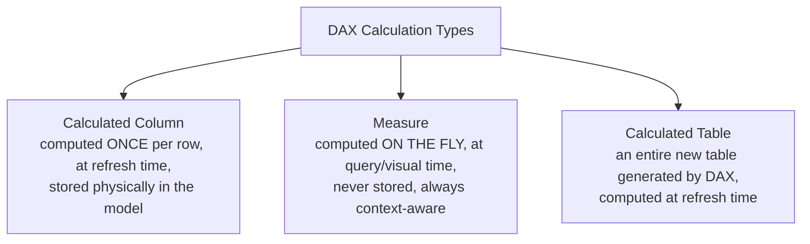
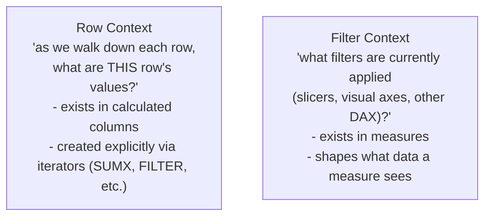

# DAX Fundamentals

> [!abstract] Definition
> **DAX** (Data Analysis Expressions) is the formula language used throughout Power BI for calculated columns, measures, and calculated tables. It looks superficially like Excel formulas, but operates on entire columns/tables and is deeply aware of **filter context** - the set of filters currently applied by slicers, visuals, and other calculations.

---

## Calculated Column vs Measure vs Calculated Table



| | Calculated Column | Measure |
|---|---|---|
| When computed | at data refresh | at query/render time, per visual |
| Storage | takes up model memory (stored per row) | no storage - always computed live |
| Context | row context (see below) | filter context (see below) |
| Use for | a value that needs to sit IN a table (e.g. for slicing/grouping) | almost everything else - aggregations, KPIs, ratios |

> [!tip] Default to measures unless you specifically need a column
> Measures are far more memory-efficient and flexible since they recompute based on whatever's currently filtered. Reach for a calculated COLUMN only when the result needs to be used as a slicer/axis/grouping field, or referenced in a relationship - not for typical aggregations like totals or ratios.

---

## Creating a Measure

```
Modeling > New Measure   (or right-click a table > New Measure)
```

```dax
Total Sales = SUM(Sales[Amount])

Average Order Value = AVERAGE(Sales[Amount])

Order Count = COUNTROWS(Sales)

Profit Margin % = DIVIDE(SUM(Sales[Profit]), SUM(Sales[Amount]), 0)
```

> [!tip] Always use `DIVIDE()` instead of the `/` operator
> `DIVIDE(numerator, denominator, alternate_result)` gracefully handles division by zero (returning the alternate result, e.g. `0` or `BLANK()`) instead of throwing an error that can break an entire visual.

---

## Creating a Calculated Column

```
Modeling > New Column   (or right-click a table > New Column)
```

```dax
Full Name = Customers[FirstName] & " " & Customers[LastName]

Profit Margin = Sales[Profit] / Sales[Amount]

Age Group = IF(Customers[Age] < 18, "Minor", IF(Customers[Age] < 65, "Adult", "Senior"))
```

---

## Row Context vs Filter Context



> [!info] The single most important DAX concept
> A calculated column evaluates its formula once **per row**, aware only of that row's own values (row context) - it has no idea what's filtered in a visual. A measure has no inherent row context at all; instead, it's evaluated within whatever **filter context** the surrounding visual/slicer/other-DAX-function establishes, recalculating fresh every time that context changes.

```dax
-- This works in a calculated column: row context gives direct access to [Amount] and [Quantity] per row
Line Total = Sales[Amount] * Sales[Quantity]

-- This is how a measure achieves something similar, but AGGREGATED across whatever's currently filtered
Total Line Value = SUMX(Sales, Sales[Amount] * Sales[Quantity])
```

---

## Iterator Functions (`X` Suffix) - Row Context Inside a Measure

```dax
Total Revenue = SUMX(Sales, Sales[Quantity] * Sales[UnitPrice])
Average Discount = AVERAGEX(Sales, Sales[Discount])
Max Line Total = MAXX(Sales, Sales[Quantity] * Sales[UnitPrice])
Count of High Value Orders = COUNTX(FILTER(Sales, Sales[Amount] > 1000), Sales[OrderID])
```

> [!tip] Iterators temporarily create row context inside a measure
> `SUMX(table, expression)` walks through `table` row by row (creating row context just for that evaluation), computes `expression` for each row, then sums the results - this is how a measure can do row-level math that a plain `SUM()` on an existing column can't express (e.g. multiplying two columns together before summing).

---

## DAX Syntax Basics

```dax
-- Comments
// single line comment
/* multi-line
   comment */

-- Referencing columns and measures
Table[Column]           -- always reference a column with its table name
[Measure Name]           -- measures are referenced WITHOUT a table prefix (by convention)

-- Operators
+  -  *  /                arithmetic
=  <>  >  <  >=  <=          comparison
&&  ||  NOT                    logical AND / OR / NOT (or use AND()/OR() functions)
&                                 text concatenation
```

```dax
Full Label = "Total: " & FORMAT([Total Sales], "$#,##0")
Is High Value = IF([Total Sales] > 10000, TRUE, FALSE)
Combined Condition = IF([Total Sales] > 1000 && [Order Count] > 5, "Strong", "Weak")
```

---

## `VAR` - Named Variables Inside a Measure

```dax
Sales Growth % =
VAR CurrentSales = [Total Sales]
VAR PriorSales = [Total Sales Last Year]
RETURN
    DIVIDE(CurrentSales - PriorSales, PriorSales)
```

> [!tip] Always use `VAR` for anything computed more than once
> Besides making formulas far more readable, `VAR` also improves performance - the expression is evaluated exactly once and reused, instead of Power BI recalculating the same sub-expression multiple times if it appeared inline in several places.

---

## Implicit vs Explicit Measures

> [!info] Implicit measures
> Dragging a raw numeric COLUMN directly into a visual's Values well and letting Power BI auto-aggregate it (Sum, Average, etc. via the dropdown) creates an "implicit measure" on the fly - convenient, but limited (can't be reused elsewhere, doesn't show in the Fields list as its own measure, and can't be referenced by other DAX).

> [!tip] Prefer explicit measures for anything beyond quick exploration
> Writing `Total Sales = SUM(Sales[Amount])` as a real named measure makes it reusable across every visual/other measure in the report, and is required for anything beyond a simple aggregation (ratios, time intelligence, conditional logic).

---

## Related
- [[06-DAX-Functions-Reference]]
- [[07-DAX-Time-Intelligence-Context]]
- [[04-Data-Modeling-Relationships]]
