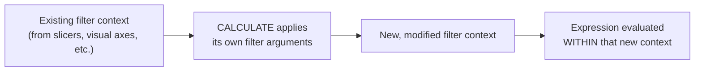

# DAX Time Intelligence & `CALCULATE`

> [!abstract] Definition
> **`CALCULATE`** is the most important function in DAX - it evaluates an expression within a MODIFIED filter context, which is how nearly every advanced calculation (comparisons, exceptions, time intelligence) actually works under the hood.

---

## `CALCULATE` - The Core Mechanic

```dax
CALCULATE(expression, filter1, filter2, ...)
```

```dax
Sales in Mumbai = CALCULATE([Total Sales], Customers[City] = "Mumbai")

Sales Excluding Discounted = CALCULATE([Total Sales], Sales[Discount] = 0)

Sales 2025 Only = CALCULATE([Total Sales], 'Date'[Year] = 2025)
```



> [!info] `CALCULATE`'s filter arguments REPLACE, not add to, filters on the same column
> If a visual is already filtered to `Year = 2024` (via a slicer) and a measure uses `CALCULATE([Total Sales], 'Date'[Year] = 2025)`, the `2025` filter OVERRIDES the slicer's `2024` filter for that column specifically - this is precisely the mechanism time intelligence functions rely on to "ignore" the currently selected year and look at a different one.

---

## Built-In Time Intelligence Functions

```dax
Sales YTD = TOTALYTD([Total Sales], 'Date'[Date])
Sales QTD = TOTALQTD([Total Sales], 'Date'[Date])
Sales MTD = TOTALMTD([Total Sales], 'Date'[Date])

Sales Last Year = CALCULATE([Total Sales], SAMEPERIODLASTYEAR('Date'[Date]))
Sales Prior Month = CALCULATE([Total Sales], DATEADD('Date'[Date], -1, MONTH))
Sales Prior Quarter = CALCULATE([Total Sales], DATEADD('Date'[Date], -1, QUARTER))

Sales Growth YoY % = DIVIDE([Total Sales] - [Sales Last Year], [Sales Last Year])
```

| Function | Computes |
|---|---|
| `TOTALYTD` / `TOTALQTD` / `TOTALMTD` | running total from the start of the year/quarter/month to the current date in context |
| `SAMEPERIODLASTYEAR` | shifts the current date filter back exactly one year |
| `DATEADD(dates, n, interval)` | shifts by any number of days/months/quarters/years, forward (positive `n`) or back (negative) |
| `PARALLELPERIOD` | similar to DATEADD but shifts by whole periods (e.g. entire months), not partial |
| `FIRSTDATE` / `LASTDATE` | first/last date in the current filter context |
| `DATESYTD` / `DATESQTD` / `DATESMTD` | return the DATE RANGE itself (a table), rather than a total - useful as a `CALCULATE` filter argument directly |

> [!warning] All of these require a proper, marked Date table
> See [[04-Data-Modeling-Relationships]] - functions like `TOTALYTD` and `SAMEPERIODLASTYEAR` need a continuous calendar table (no gaps) related to the fact table and marked as the official Date table, or results can be silently wrong.

---

## Building Custom Comparisons

```dax
-- "This period vs same period last year," generalized for any date range currently in context
Sales PY = CALCULATE([Total Sales], SAMEPERIODLASTYEAR('Date'[Date]))

Sales PY Same Weekday = CALCULATE([Total Sales], DATEADD('Date'[Date], -364, DAY))   -- aligns weekdays, not just calendar dates
```

---

## Row Context vs Filter Context, Revisited (Applied to Time Intelligence)

```dax
-- WRONG in a measure - row context doesn't exist here; [Total Sales] has no idea "which row" to compare against
Sales Last Year = [Total Sales] - 'Date'[Year]     -- meaningless, won't compile as intended

-- RIGHT - CALCULATE explicitly manipulates FILTER context, which measures always operate within
Sales Last Year = CALCULATE([Total Sales], SAMEPERIODLASTYEAR('Date'[Date]))
```

---

## Context Transition (`CALCULATE` Inside Row Context)

```dax
-- Inside a calculated column or an iterator (SUMX, etc.), wrapping a measure in CALCULATE
-- converts the current ROW context into an equivalent FILTER context - this is "context transition"
Customer Lifetime Value =
SUMX(
    Customers,
    CALCULATE([Total Sales])    -- CALCULATE here transitions Customers' row context into a filter on CustomerID
)
```

> [!info] Why this matters
> Without `CALCULATE`, a measure referenced inside a row-context iterator like `SUMX` would ignore the current row entirely and just return the grand total for every row. Wrapping it in `CALCULATE` (even with no explicit filter arguments) forces DAX to convert "this row's values" into an equivalent filter, so the measure correctly computes per-customer instead.

---

## `CALCULATETABLE` - Same Idea, Returns a Table

```dax
Top Customers 2025 = CALCULATETABLE(Customers, 'Date'[Year] = 2025, [Total Sales] > 10000)
```

Functionally identical to `CALCULATE`, but returns a filtered TABLE rather than a scalar value - used as an input to other table functions, or as a visual's data source via a calculated table.

---

## Common Time Intelligence Patterns

```dax
-- Rolling 12-month total
Rolling 12M Sales =
CALCULATE(
    [Total Sales],
    DATESINPERIOD('Date'[Date], MAX('Date'[Date]), -12, MONTH)
)

-- Cumulative total (running total) that isn't tied to calendar year
Running Total = CALCULATE([Total Sales], FILTER(ALLSELECTED('Date'[Date]), 'Date'[Date] <= MAX('Date'[Date])))
```

> [!tip] `DATESINPERIOD` for flexible rolling windows
> Unlike `TOTALYTD`/`TOTALQTD`/`TOTALMTD` which reset at fixed calendar boundaries, `DATESINPERIOD` builds an arbitrary N-day/month/quarter/year trailing window ending at the current date in context - the standard tool for "rolling 12 months," "trailing 90 days," etc.

---

## Related
- [[05-DAX-Fundamentals]]
- [[06-DAX-Functions-Reference]]
- [[04-Data-Modeling-Relationships]]
- [[PowerBI/17-Common-Errors-Gotchas]]
