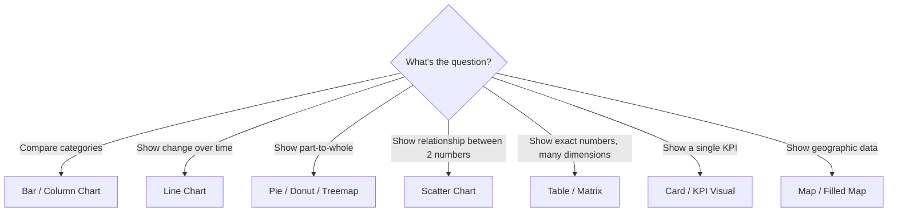

# Visualizations & Chart Types

> [!abstract] Definition
> The **Visualizations pane** lets you pick a chart type and drag fields into its data "wells" (Axis, Legend, Values, etc.). Choosing the right chart type for the question being asked is as important as the underlying data itself.

---

## Adding a Visual

```
Report View > click a visual icon in the Visualizations pane > drag fields into the wells that appear
```

Or: select fields in the Fields pane first (checkboxes) - Power BI auto-suggests a reasonable default chart type.

---

## Core Chart Types & When to Use Them



| Visual | Best for | Avoid when |
|---|---|---|
| **Bar/Column Chart** | comparing values across categories | too many categories (>15-20 gets cluttered) |
| **Line Chart** | trends over a continuous axis (usually time) | comparing unrelated categories (use bar instead) |
| **Pie/Donut Chart** | part-to-whole with very few (2-5) categories | more than ~5 slices - becomes unreadable |
| **Treemap** | part-to-whole with many categories, hierarchical | precise value comparison (area is hard to judge exactly) |
| **Scatter Chart** | relationship/correlation between two numeric measures | categorical comparisons |
| **Table** | exact values, many rows, users need to read specific numbers | high-level trend summaries |
| **Matrix** | pivot-table-style cross-tabulation with subtotals | simple single-category comparisons |
| **Card** | a single important KPI number, prominently displayed | anything needing more than one value |
| **Map/Filled Map** | geographic distribution | precise value comparison (use a table alongside it) |
| **Waterfall Chart** | showing how a total builds up from sequential positive/negative changes | non-sequential/unrelated categories |
| **Gauge** | progress toward a single target | comparing multiple items |
| **Funnel** | sequential stages with dropoff (e.g. sales pipeline) | non-sequential processes |

> [!warning] Pie charts are frequently misused
> Human eyes are poor at comparing angles/areas precisely - beyond 3-4 slices, a bar chart almost always communicates the same data more clearly and accurately.

---

## Visual Data Wells (Vary by Chart Type)

```
Axis / Category      - the categorical grouping (X-axis on a bar chart, categories in a pie)
Legend                 - splits data into colored series
Values                    - the numeric measure(s) being plotted
Tooltips                    - extra fields shown on hover, not plotted directly
Small Multiples                - repeats the same chart once per category, in a grid
```

> [!tip] Small Multiples for comparing trends across many categories at once
> Instead of one crowded line chart with 10 overlapping lines, Small Multiples renders 10 small individual charts side by side, one per category - often far more readable for spotting different trend shapes.

---

## Table vs Matrix

| | Table | Matrix |
|---|---|---|
| Structure | flat rows, like a spreadsheet | pivot-table style, rows AND columns can group |
| Subtotals | no | yes, expandable/collapsible |
| Drill down | no | yes, via hierarchies |

```
Matrix wells: Rows, Columns, Values
```

> [!tip] Matrix is the Power BI equivalent of an Excel Pivot Table
> Drag a hierarchy (e.g. Year > Quarter > Month) into Rows for expandable drill-down, and a category into Columns to cross-tabulate - conceptually identical to `pd.pivot_table()` or an Excel PivotTable.

---

## Custom Visuals (AppSource Marketplace)

```
Visualizations pane > "..." (Get more visuals) > browse or search AppSource
```

> [!info] Popular custom visuals
> Examples include advanced Gantt charts, Sankey diagrams, word clouds, and enhanced KPI cards - not built into the default palette but freely importable. Verify a custom visual's publisher/reviews before relying on it in production reports, since quality and support vary widely.

---

## Conditional Formatting on Visuals
See [[11-Formatting-Themes-Conditional-Formatting]] for background/font color rules, data bars, and icon sets applied directly to tables/matrices.

---

## Analytics Pane - Reference Lines

```
Select a visual > Analytics pane (magnifying glass icon)
```

```
Add: Average Line, Median Line, Min/Max Line, Constant Line, Trend Line, Forecast
```

> [!tip] Forecast for quick trend projection
> On a line chart, the Analytics pane's Forecast feature can project future values based on historical trend, with a confidence interval band - useful for quick exploratory "where is this headed" visuals without writing DAX or a separate model.

---

## Custom Tooltips (Tooltip Pages)

```
Insert a new page > Page Information > set Page Type to "Tooltip"
                     design a small report page with additional detail visuals
Then, on the original visual: Format pane > Tooltip > Type: Report Page > select that tooltip page
```

> [!tip] Rich tooltips add depth without cluttering the main visual
> Hovering over a data point on the main chart shows a full mini-report (e.g. a breakdown chart) instead of a single plain text tooltip - great for adding drill-down-like detail without adding visual clutter to the main page.

---

## Related
- [[10-Filters-Slicers-Interactions]]
- [[11-Formatting-Themes-Conditional-Formatting]]
- [[13-Hierarchies-Groups-Drillthrough]]
