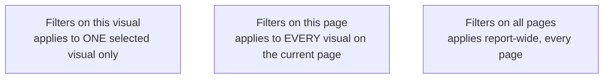
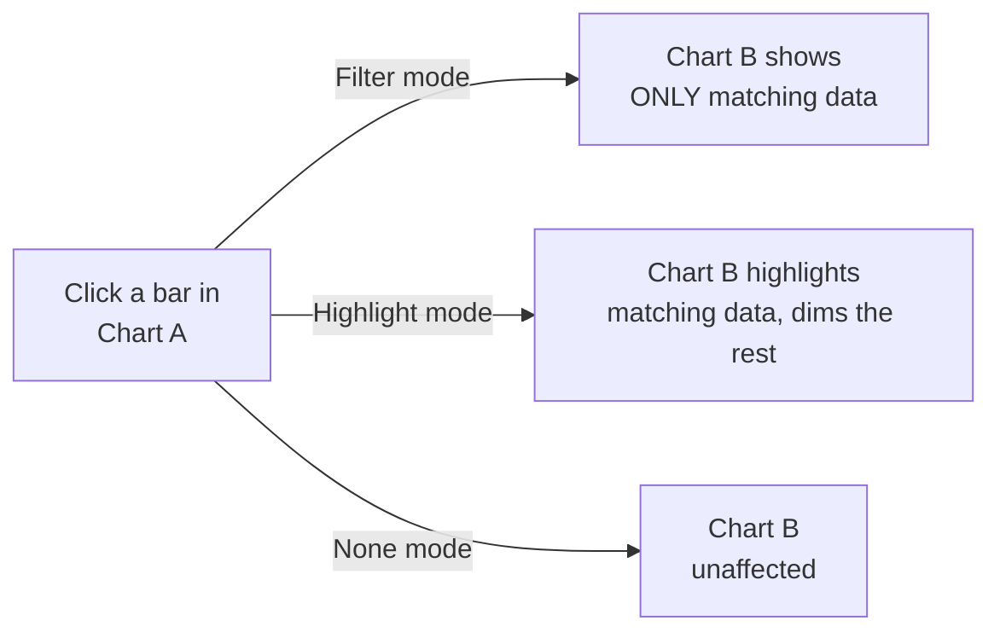

# Filters, Slicers & Visual Interactions

> [!abstract] Definition
> Power BI gives report builders several complementary layers of filtering: the **Filters pane** (structured, scoped filters), **slicers** (visual, on-canvas filter controls), and **visual interactions** (how clicking one visual affects others on the page).

---

## The Filters Pane - Three Scopes



```
Filters pane > drag a field into the appropriate scope box
```

| Scope | Applies to |
|---|---|
| **Filters on this visual** | only the currently selected visual |
| **Filters on this page** | every visual on the current report page |
| **Filters on all pages** | the entire report, all pages |

> [!tip] Filter scope order of precedence
> All three scopes combine (they're ANDed together) - a visual respects its own filter AND the page filter AND the report filter simultaneously. Use the broadest scope that makes sense to avoid repeating the same filter on every visual individually.

---

## Filter Types

```
Basic filtering       - checkbox list of values
Advanced filtering      - conditions like "is greater than," "contains," "starts with"
Top N filtering           - e.g. top 10 products by Total Sales
Relative date filtering     - e.g. "in the last 30 days," "this fiscal quarter"
```

---

## Slicers (On-Canvas Filter Visuals)

```
Visualizations pane > Slicer icon > drag a field into it
```

| Slicer style | Best for |
|---|---|
| List (default) | a handful of categorical options |
| Dropdown | many options, saves canvas space |
| Between (numeric range) | filtering a continuous number, e.g. price range |
| Relative date | "last N days/weeks/months" style date filtering |
| Date range slider | selecting a start/end date visually |

> [!tip] Sync slicers across pages
> `View > Sync Slicers` pane lets one slicer control filtering on multiple (or all) report pages simultaneously, without needing to duplicate the slicer visual on every page.

---

## Slicer Settings (Format Pane)

```
Selection: Single Select / Multi-select (Ctrl+click) / Select All
Show "Select All" option
Search box (for long lists)
```

> [!tip] Enable "Show search" on slicers with long lists
> `Format pane > Slicer settings > Options > Search` adds a text search box directly to the slicer, essential once a category field has more than roughly 15-20 distinct values.

---

## Visual Interactions - How Clicking One Visual Affects Others

```
Select a visual > Format tab (ribbon) > Edit Interactions
```

Clicking `Edit Interactions` shows small icons on every OTHER visual on the page:

| Icon | Effect on the target visual when the source visual is clicked/filtered |
|---|---|
| **Filter** (funnel icon) | target visual re-renders showing only data matching the selection |
| **Highlight** (highlighter icon, charts only) | matching data is highlighted, non-matching is dimmed - both remain visible for comparison |
| **None** | target visual is completely unaffected by the selection |



> [!tip] Highlight mode is often more insightful than Filter mode
> Filter mode hides context (you lose sight of the "whole" while looking at a subset). Highlight mode keeps the full picture visible while emphasizing the selected slice - better for "how does this segment compare to everything else" questions.

---

## Cross-Highlighting via Relationships

> [!info] Interactions follow the model's relationships automatically
> Clicking a data point in one visual filters/highlights every OTHER visual whose underlying fields are related (directly or indirectly) through the data model - this is the payoff of building a clean star schema (see [[04-Data-Modeling-Relationships]]), since it "just works" without manual configuration.

---

## Drill Down / Drill Up (Within a Hierarchy)

```
Visual toolbar icons (appear on hover, top-right of a visual with a hierarchy):
  ˅ (down arrow)   - drill down one level (e.g. Year -> Quarter)
  ˄ (up arrow)       - drill up one level
  ⇊ (double down)      - expand all the way down
```

> [!info] See [[13-Hierarchies-Groups-Drillthrough]] for building hierarchies and full drillthrough page setup.

---

## Clear/Reset Filters

```
A small eraser icon appears on filter cards and slicers once a selection is made - click to clear that specific filter
```

Adding a **Button** with action type "Clear all slicers" (via `Insert > Buttons`, formatted with the `Action > Type: Clear` setting once available, or a bookmark reset - see [[12-Bookmarks-Buttons-Navigation]]) gives users a one-click "reset the page" option.

---

## Related
- [[09-Visualizations-Chart-Types]]
- [[12-Bookmarks-Buttons-Navigation]]
- [[04-Data-Modeling-Relationships]]
