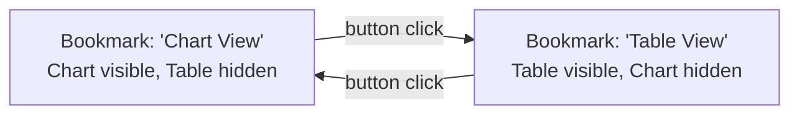

# Bookmarks, Buttons & Navigation

> [!abstract] Definition
> **Bookmarks** capture a snapshot of the report's current state (filters, slicer selections, visual visibility, even sort order), which can then be restored on demand - the foundation for building custom navigation, toggleable views, and guided storytelling in a report.

---

## Creating a Bookmark

```
View > Bookmarks pane > Add
```

Power BI captures, by default:
- Current filter/slicer selections
- Which visuals are visible/hidden (via the Selection Pane)
- Current sort order, drill state, and spotlight/focus mode

```
Right-click a bookmark > Rename, Update (recapture current state), Delete
```

> [!tip] Bookmark options control exactly what's captured
> Click the "..." next to a bookmark, or the settings gear when creating one, to choose whether it captures Data (filters/slicers), Display (visible/hidden visuals), and Current Page - unchecking irrelevant options avoids a bookmark accidentally overriding something unintended.

---

## Bookmarks + Selection Pane = Toggle Views



```
1. Place both a Chart AND a Table on the SAME spot on the canvas (overlapping)
2. Selection Pane: hide the Table, show the Chart -> create Bookmark "Chart View"
3. Selection Pane: hide the Chart, show the Table -> create Bookmark "Table View"
4. Add two buttons, each set to navigate to one of the bookmarks
```

> [!tip] The classic "toggle between two visual types" trick
> This pattern (overlapping visuals + Selection Pane visibility + bookmarks) is how most "switch between chart and table" or "show/hide a filter panel" interactions are built in Power BI - there's no dedicated "toggle visibility" visual, so bookmarks fill that role.

---

## Buttons

```
Insert > Buttons > choose a style (Blank, Back, Bookmark, Page Navigation, Q&A, Back)
```

```
Format pane > Action > toggle On > Type:
  Page navigation    - jump to a specific report page
  Bookmark              - apply a specific bookmark
  Web URL                  - open an external link
  Drillthrough                - jump to a drillthrough page (see 13-Hierarchies-Groups-Drillthrough), passing context
  Back                          - return to the previously viewed page/state
```

> [!info] Buttons need "Action" turned ON to actually do anything
> A button placed on the canvas is purely visual until its `Format > Action` toggle is switched on and configured - an easy step to forget when first building navigation.

---

## Building a Navigation Menu

```
1. Create one button per report page, each with Action: Page Navigation -> that specific page
2. Style consistently (same size/font), align/distribute using the Format tab's alignment tools
3. Optionally group them (Ctrl+click all > right-click > Group) and place on every page,
   OR use a single navigation page as the report's "home"
```

> [!tip] Sync the navigation buttons across pages
> Build the navigation menu once, then copy-paste it onto every page (or use a consistent header area) so users always have the same navigation options available, regardless of which page they're currently viewing.

---

## Bookmark Groups

```
Bookmarks pane > select multiple bookmarks > Group
```

> [!info] Why group bookmarks
> A bookmark GROUP can be applied together (e.g. a "Reset Filters" group that resets several unrelated things at once), and grouping also visually organizes a long bookmark list into logical sections (e.g. "Navigation" bookmarks vs "Toggle View" bookmarks).

---

## Drillthrough Buttons (Passing Context)

```
Format pane > Action > Type: Drillthrough > select the target drillthrough page
```

> [!info] See [[13-Hierarchies-Groups-Drillthrough]] for setting up the drillthrough target page itself - drillthrough buttons/right-click actions carry the currently selected data point's context (e.g. a specific customer) to that detail page automatically.

---

## Q&A Button (Natural Language Query)

```
Insert > Buttons > Q&A
```

> [!info] What it does
> Opens Power BI's natural-language query box directly on the report, letting users type questions like "total sales by region last quarter" and get an auto-generated visual - useful as a supplementary exploration tool alongside pre-built visuals, though it depends on well-named fields/synonyms in the model to work well.

---

## Common Uses for Bookmarks + Buttons

> [!tip] Popular patterns
> - **Guided walkthrough**: a sequence of bookmarks stepping through a narrative, with Next/Back buttons
> - **Show/hide a filter panel**: bookmark A shows an expanded filter sidebar, bookmark B hides it for a clean view
> - **Reset button**: a bookmark capturing the report's default/blank filter state, applied via a "Reset Filters" button
> - **Tab-style navigation**: buttons styled as tabs across the top, each navigating to a different page

---

## Related
- [[10-Filters-Slicers-Interactions]]
- [[13-Hierarchies-Groups-Drillthrough]]
- [[01-Interface-Overview]] (Selection Pane)
