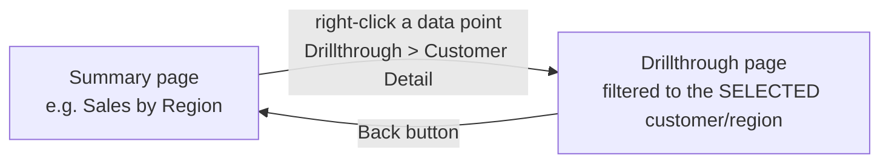

# Hierarchies, Groups & Drillthrough

> [!abstract] Definition
> **Hierarchies** let a visual drill from a broad level down to detail (e.g. Year -> Quarter -> Month -> Day). **Groups/bins** cluster raw values into custom categories. **Drillthrough** sends a user from a summary visual to a dedicated detail page, automatically filtered to their selection.

---

## Creating a Hierarchy

```
Fields pane > drag one field onto another (e.g. drag "Month" onto "Year") -> creates a hierarchy
       OR: right-click a field > "Create Hierarchy," then drag additional fields into it
```

```
Common hierarchy: Date Hierarchy
  Year -> Quarter -> Month -> Day
```

> [!tip] Power BI auto-creates a Date Hierarchy on any date column
> By default, dragging a date field onto a visual auto-expands it into a built-in Year/Quarter/Month/Day hierarchy - convenient for quick exploration, though for serious time intelligence work, a proper custom Date table (see [[04-Data-Modeling-Relationships]]) with explicit Year/Month columns is more reliable and better for DAX.

---

## Using a Hierarchy in a Visual

```
Drag the hierarchy (top level) into a visual's Axis/Category well
```

Drill controls appear on hover (top-right of the visual):

```
˅  Drill Down       - go one level deeper (e.g. Year -> Quarter)
˄  Drill Up           - go back up one level
⇊  Expand All Down       - show every level simultaneously
🔍 Show Next Level Only     - toggle whether higher levels stay visible while drilled down
```

> [!tip] Double-click a specific bar/segment to drill into just that item
> Rather than drilling the whole visual down a level for every category, double-clicking one specific bar (e.g. just "2025") drills down into only that item's sub-levels, keeping the rest collapsed.

---

## Groups (Grouping Categorical Values)

```
Select a field in a visual (or in the Fields pane) > right-click > New Group (or Ctrl+click multiple values first)
```

```
Example: group individual countries into custom regions
  "USA", "Canada", "Mexico" -> grouped as "North America"
  "UK", "France", "Germany"   -> grouped as "Europe"
```

Creates a new field (e.g. `Country (groups)`) usable in any visual just like a regular column.

> [!tip] Groups for ad-hoc categorization without touching Power Query
> Useful for quick, report-specific groupings that don't warrant a permanent change to the source data or a Power Query step - though for anything needed consistently across many reports, a proper column/mapping table upstream is more maintainable.

---

## Bins (Grouping Numeric Values into Ranges)

```
Right-click a numeric field > New Group > Group type: Bin
```

```
Example: Age -> Age Bins
  Bin size: 10   ->  0-9, 10-19, 20-29, ...
```

> [!tip] Bins are the Power BI equivalent of `pd.cut()`
> Same concept as [[15-Categorical-Data|Pandas: Categorical Data]]'s `pd.cut()` - converting a continuous numeric field into discrete range buckets for cleaner histograms/comparisons.

---

## Drillthrough Pages



### Setting Up a Drillthrough Target Page

```
1. Create a new report page (e.g. "Customer Detail")
2. Visualizations pane > Format > Page Information > Page Type: Drillthrough
3. Drag the field to drill on (e.g. Customer[CustomerName]) into the "Drillthrough" well
4. Build detail visuals on this page as normal - they'll respect the drillthrough filter automatically
5. A "Back" button is added automatically (can be styled/repositioned)
```

### Using Drillthrough

```
Right-click any data point on another page's visual > Drill Through > [target page name]
```

> [!tip] Drillthrough carries the FULL current filter context, not just the clicked field
> If a user has also selected a specific date range via a slicer before right-clicking, that filter comes along too - the drillthrough page shows the clicked customer's data WITHIN that already-selected date range, not all-time data.

---

## Drillthrough via Button

```
Insert > Buttons > Format > Action > Type: Drillthrough > select target page
```

> [!info] See [[12-Bookmarks-Buttons-Navigation]] for full button configuration - a labeled "View Details ->" button is often more discoverable for end users than relying on right-click, which isn't always obvious.

---

## Cross-Report Drillthrough

> [!info] Available with certain licensing tiers
> Drillthrough can also jump from a visual in one PUBLISHED report to a page in a DIFFERENT published report (in the same workspace or across workspaces, depending on setup) - useful for splitting a very large report suite into linked, focused reports rather than one enormous file.

---

## Related
- [[09-Visualizations-Chart-Types]]
- [[12-Bookmarks-Buttons-Navigation]]
- [[04-Data-Modeling-Relationships]]
