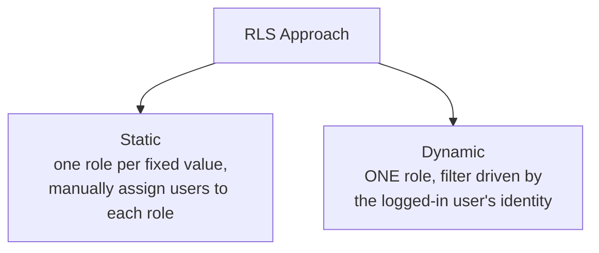
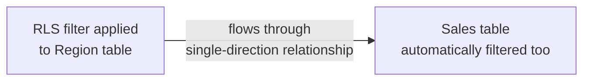

# Row-Level Security (RLS)

> [!abstract] Definition
> **Row-Level Security** restricts which ROWS of data a user can see, based on their identity - the same report and visuals are shared by everyone, but each viewer only sees data relevant to them (e.g. a regional manager sees only their region's sales).

---

## Creating a Role

```
Modeling > Manage Roles > Create
```

```dax
-- Role name: "RegionManager"
-- DAX Filter expression applied to the Sales table:
[Region] = "West"
```

> [!info] The DAX filter expression acts like an automatic, invisible `CALCULATE` filter
> Whatever expression you write is applied as a row filter on that table for any user assigned to the role - functionally equivalent to every query implicitly wrapped in `CALCULATE(..., [Region] = "West")`.

---

## Static vs Dynamic RLS



### Static RLS (Simple, More Maintenance)

```dax
-- Role: "WestRegion"
Sales[Region] = "West"

-- Role: "EastRegion"
Sales[Region] = "East"
```

Then manually assign specific users to each role in the Power BI Service.

### Dynamic RLS (Scales Better)

```dax
-- A single role, e.g. "UserSecurity," using a mapping table
-- UserRegionMapping table: columns [Email], [Region]

Sales[Region] IN
    CALCULATETABLE(
        VALUES(UserRegionMapping[Region]),
        UserRegionMapping[Email] = USERPRINCIPALNAME()
    )
```

```dax
USERPRINCIPALNAME()      -- returns the currently logged-in user's email/UPN (in the Power BI Service)
USERNAME()                  -- returns domain\username format (mainly relevant on-prem)
```

> [!tip] Dynamic RLS scales to hundreds of users without manual role assignment
> With a mapping table (`Email -> Region`) driving the filter, adding a new user's access is just adding a row to that table - no need to create new roles or manually reassign users in the Service every time the team changes.

---

## Testing Roles in Desktop

```
Modeling > View As > select a role (or "Other user" to test USERPRINCIPALNAME() with a specific email)
```

> [!tip] Always test every role before publishing
> `View As` simulates exactly what a user assigned to that role would see, directly in Desktop - critical for catching mistakes (like an overly broad or overly narrow filter expression) before real users are affected.

---

## Assigning Users to Roles (Power BI Service)

```
Workspace > dataset > "..." > Security > select a role > add user emails or security groups
```

> [!tip] Assign security GROUPS, not individual users, wherever possible
> Managing access via an Azure AD security group (rather than adding/removing individual emails inside Power BI) means IT/access changes happen in one central place and automatically flow through to report access - far less maintenance than manual per-user assignment.

---

## RLS and Relationships - Filter Propagation



> [!warning] RLS only propagates along relationships in the FILTERING direction
> If a role filters the `Region` dimension table but the relationship to `Sales` is single-direction (Region -> Sales), the filter correctly flows through. If relationships are misconfigured or filtering the wrong table, RLS can silently fail to restrict data as intended - always verify with `View As`, not just by inspecting the DAX expression.

---

## RLS Limitations

> [!warning] Things RLS does NOT protect against
> - Users with **Build permission** on the underlying dataset can create their OWN new reports against it, and RLS still applies correctly there - but users with direct access to the underlying data source (bypassing Power BI entirely) aren't restricted by RLS at all, since it's enforced at the Power BI query layer, not the source database.
> - RLS restricts ROWS, not columns - use **Object-Level Security (OLS)**, configured via external tools like Tabular Editor, if specific columns/measures also need hiding per role.
> - RLS doesn't apply to Power BI Desktop's Data View for someone with edit access to the .pbix file itself - it's enforced for VIEWERS of a published report, not for report authors/editors.

---

## Object-Level Security (OLS) - Brief Note

> [!info] Hiding entire tables/columns/measures per role
> Not configurable directly in Power BI Desktop's standard UI - requires an external tool like **Tabular Editor** (free, widely used) to set OLS permissions on top of an existing RLS role, for cases where certain roles shouldn't even see that a sensitive column/measure exists.

---

## Related
- [[04-Data-Modeling-Relationships]]
- [[15-Publishing-Power-BI-Service]]
- [[PowerBI/17-Common-Errors-Gotchas]]
