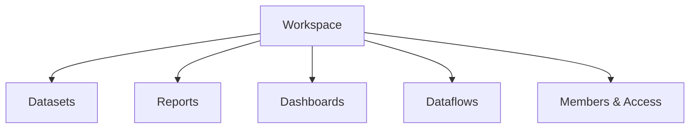
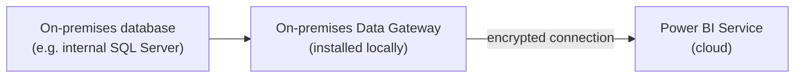

# Publishing & Power BI Service

> [!abstract] Definition
> The **Power BI Service** (app.powerbi.com) is the cloud platform where reports built in Desktop are published, shared, refreshed on a schedule, and consumed by other users - organized into **workspaces**, with content distributed to end users via **Apps**.

---

## Publishing a Report

```
Power BI Desktop: Home > Publish > choose a destination workspace
```

> [!info] Publishing uploads the report AND creates/updates its underlying dataset
> A `.pbix` file published to the Service becomes both a **Report** (the visual pages) and a **Dataset** (the data model + DAX) - these can later be managed somewhat independently (e.g. multiple reports can be built against one shared published dataset).

---

## Workspaces



```
Power BI Service > Workspaces > + New workspace
```

| Workspace role | Can do |
|---|---|
| **Admin** | full control - manage members, delete workspace, all content permissions |
| **Member** | edit/publish content, manage some settings |
| **Contributor** | edit/publish content, cannot manage workspace settings/members |
| **Viewer** | view content only, no editing |

> [!tip] Workspaces are the unit of collaboration
> Everyone with at least Contributor access to a workspace can see and edit its content - separate workspaces per team/department (rather than one giant shared workspace) keeps permissions manageable and reduces accidental overwrites.

---

## Apps (Distributing to Broad Audiences)

```
Workspace > Create app > select which reports/dashboards to include > Publish app
```

> [!info] Apps vs sharing a workspace directly
> An **App** is a curated, read-only, polished bundle of specific reports/dashboards from a workspace, distributed to end users (who never see the underlying workspace, its editing tools, or in-progress content) - the standard way to deliver finished reports to a broad, non-technical audience, as opposed to giving them direct workspace access.

---

## Scheduled Refresh

```
Workspace > dataset > "..." > Settings > Scheduled refresh
```

```
Refresh frequency: Daily / Weekly
Time(s) of day: e.g. 6:00 AM, 6:00 PM
Time zone
Failure notification email
```

> [!warning] Scheduled refresh requires stored credentials for every data source
> Set these under `Dataset Settings > Data source credentials` - a refresh silently fails (or emails a failure notice) if credentials expire (e.g. a password change) or were never configured for a newly added source.

| Tier | Max scheduled refreshes/day |
|---|---|
| Free / Pro | 8 per day |
| Premium / Fabric capacity | 48 per day |

---

## Gateways (On-Premises Data Sources)



> [!info] Why a gateway is needed
> The Power BI Service runs in Microsoft's cloud and has no direct network access to a database sitting inside a company's private network - the **On-premises Data Gateway** (a small installed application) acts as a secure bridge, so scheduled refresh can reach internal data sources without exposing them directly to the internet.

```
Download: Power BI > Download > On-premises data gateway
Register the gateway with your organization's Power BI tenant
Workspace > Dataset Settings > Gateway connection > select the registered gateway
```

> [!tip] Personal Gateway vs Standard/Enterprise Gateway
> A **Personal Gateway** is simple but only works for that one user's own scheduled refreshes and can't be shared. A **Standard/Enterprise Gateway** (installed on a dedicated always-on machine/server) supports multiple data sources and multiple users' datasets - the correct choice for any real team/organizational use.

---

## Dataflows (Reusable, Centralized Power Query)

```
Workspace > + New > Dataflow > define entities using Power Query Online
```

> [!tip] Dataflows centralize ETL logic across multiple reports
> Instead of repeating the same Power Query transformations inside every individual `.pbix` file, a Dataflow defines the transformation ONCE in the Service, and multiple datasets/reports can then connect to that shared, pre-cleaned output - reduces duplicated logic and inconsistency across a report portfolio.

---

## Dashboards vs Reports

| | Report | Dashboard |
|---|---|---|
| Source | one dataset, multiple pages | can pin tiles from MULTIPLE reports/datasets onto one canvas |
| Interactivity | full (filters, slicers, drillthrough) | limited - mostly click-through to the source report |
| Best for | in-depth exploration | at-a-glance summary combining several sources |

```
Open a visual in a report > pin icon (thumbtack) > Pin to a dashboard
```

---

## Sharing Options

```
Share button on a report:
  Share (direct link, specific people/groups)
  Publish to web (PUBLIC, embeds anywhere - use with extreme caution for sensitive data)
  Embed in SharePoint / Teams / a custom app (via Power BI Embedded)
```

> [!danger] "Publish to web" makes a report PUBLICLY accessible to anyone with the link
> No login or organizational access control applies - never use this option for reports containing sensitive, internal, or personally identifiable data. Reserve it strictly for genuinely public data intended for open sharing.

---

## Version History & .pbix Management

```
Workspace > report > "..." > Version History      - restore a previous published version if needed
```

> [!tip] Keep source .pbix files in a proper version control location too
> Power BI Service version history is convenient but limited - many teams also store the actual `.pbix` files in SharePoint/OneDrive/git-based storage (via tools like `pbi-tools` for git-friendly diffing) for more robust backup and collaboration history.

---

## Related
- [[02-Getting-Data-Connectors]]
- [[14-Row-Level-Security]]
- [[16-Performance-Optimization]]
