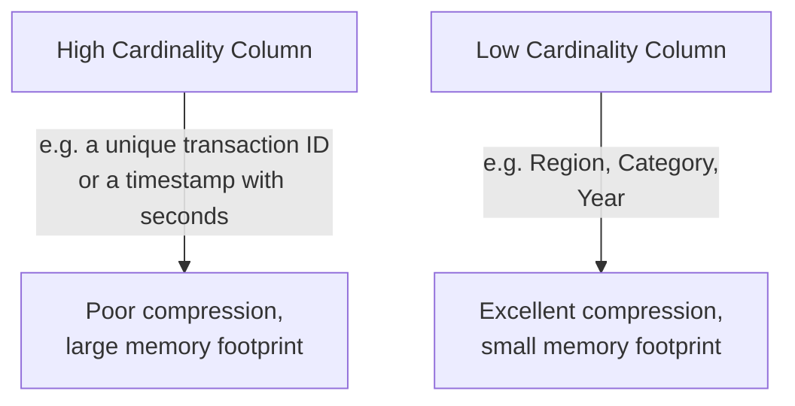

# Performance Optimization

> [!abstract] Definition
> Power BI performance depends on model design (star schema, cardinality), DAX efficiency, and data volume management. This note covers the main levers for keeping reports fast, plus the built-in **Performance Analyzer** tool for diagnosing slow visuals.

---

## Performance Analyzer

```
View tab (ribbon) > Performance Analyzer > Start Recording > interact with the report (click slicers, change pages) > Stop
```

```
Results per visual:
  DAX query time     - how long the measure/query itself took
  Visual display time  - rendering time
  Other                  - background/setup overhead
```

> [!tip] Sort by DAX query time to find the real bottleneck
> A visual that's slow to RENDER (many data points, complex custom visual) is a different problem than one that's slow because its DAX QUERY takes long - Performance Analyzer separates these, so fix the right thing first. Right-click a result row to "Copy query" and analyze it further in DAX Studio.

---

## Star Schema (The #1 Performance Lever)

> [!info] See [[04-Data-Modeling-Relationships]] for full detail
> A clean star schema (small dimension tables, one large fact table, single-direction relationships) is consistently the single biggest performance factor - far more impactful than any individual DAX optimization trick. A flat, wide, denormalized table is both slower AND uses more memory than the equivalent star schema.

---

## Reduce Cardinality & Column Count



> [!tip] Power BI's engine (VertiPaq) compresses based on repeated values
> Columns with few distinct values (Region, Status, Category) compress extremely well. Columns with mostly-unique values (transaction IDs, precise timestamps, GUIDs) compress poorly and bloat the model - remove unused high-cardinality columns entirely, or split a `DateTime` column into separate `Date` and `Time` columns (each far lower cardinality than the combined original) if time-of-day isn't actually needed.

```
Model View > select a table > "..." or File > Options > check actual column sizes via
  DAX Studio (external free tool) > "VertiPaq Analyzer" for a detailed breakdown
```

---

## Remove Unused Columns & Tables

```
Power Query Editor > Remove Columns for anything not used in a relationship, visual, or DAX formula
```

> [!tip] Every unused column still costs memory and refresh time
> Loading raw source columns "just in case" is a common habit that quietly bloats the model - only load what visuals or DAX actually reference; unused columns can always be added back later if genuinely needed.

---

## Aggregations (Pre-Summarized Tables for Huge Fact Tables)

```
Modeling > Manage Aggregations (on a smaller, pre-summarized table)
```

> [!info] What aggregations solve
> For a fact table with hundreds of millions of rows, queries at a summarized level (e.g. "sales by month by region") don't need to scan every individual transaction row. An aggregation table (e.g. pre-summed by month/region) is configured to automatically and transparently serve those summarized queries, only falling back to the full-detail table when a visual needs finer granularity - users never notice the switch, but performance improves dramatically.

---

## DAX Performance Tips

```dax
-- SLOWER - FILTER scans the whole table row by row before CALCULATE applies it
Sales High = CALCULATE([Total Sales], FILTER(Sales, Sales[Amount] > 1000))

-- FASTER - simple boolean filter arguments let the engine use its storage-level optimizations
Sales High = CALCULATE([Total Sales], Sales[Amount] > 1000)
```

> [!tip] Prefer simple boolean filter arguments over `FILTER()` when possible
> `CALCULATE(expr, Table[Column] > value)` can often be evaluated more efficiently by the storage engine than the equivalent `CALCULATE(expr, FILTER(Table, Table[Column] > value))` - reserve `FILTER` for genuinely complex, multi-column, or row-context-dependent conditions that a simple boolean can't express.

```dax
-- Use VAR to avoid recomputing the same sub-expression multiple times
Sales Growth % =
VAR CurrentSales = [Total Sales]
VAR PriorSales = [Total Sales Last Year]
RETURN DIVIDE(CurrentSales - PriorSales, PriorSales)
```

> [!info] See [[05-DAX-Fundamentals]] for the full `VAR` explanation.

---

## Import Mode vs DirectQuery Performance

> [!warning] DirectQuery is inherently slower for interactive reports
> Every filter/slicer click sends a fresh query to the live source - acceptable for smaller, well-indexed sources but can feel sluggish on large or poorly-indexed databases. See [[02-Getting-Data-Connectors]] for the full comparison; default to Import mode unless there's a specific real-time or data-volume requirement.

---

## Reduce Visual Count Per Page

> [!tip] Fewer, more focused visuals per page load and interact faster
> Each visual on a page issues its own DAX query - a page crammed with 20+ visuals means 20+ queries fire on every filter change. Splitting a dense page into several focused pages (using bookmarks/navigation buttons for a tab-like feel - see [[12-Bookmarks-Buttons-Navigation]]) often "feels" faster even with the same total content.

---

## Query Folding (Power Query)

> [!info] See [[03-Power-Query-Editor-M-Language]] for the full explanation
> Keeping transformations "foldable" (pushed back to the source as a native query) instead of pulling all raw data into Power BI first and transforming locally is critical for large database sources - always check "View Native Query" is still available after each significant step when working with a database connector.

---

## Reduce Refresh Time

```
Incremental Refresh (Premium/Fabric capacity): only refresh recent partitions of a large table, not full history
Disable "Auto Date/Time" (File > Options > Data Load) if not using the built-in date hierarchies - it silently creates a hidden date table PER date column, which adds up on large models
```

> [!tip] Turn off Auto Date/Time if you're building proper Date tables yourself
> `File > Options and Settings > Options > Data Load > uncheck "Auto date/time"` - leaving this on generates a hidden calculated date table for every single date/datetime column in the model, which can meaningfully bloat model size and refresh time on models with many date columns.

---

## Related
- [[04-Data-Modeling-Relationships]]
- [[03-Power-Query-Editor-M-Language]]
- [[05-DAX-Fundamentals]]
- [[PowerBI/17-Common-Errors-Gotchas]]
