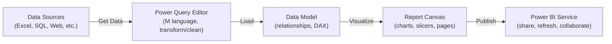
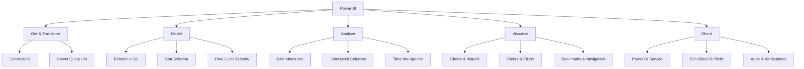

# 📊 Power BI - Map of Content

> [!abstract] What is Power BI?
> **Power BI** is Microsoft's business intelligence platform for connecting to data sources, transforming data (Power Query/M), modeling relationships between tables, writing calculations (DAX), and building interactive reports/dashboards. It has three main layers: **Power Query** (get and shape data), the **Data Model** (relationships, DAX calculations), and **Reports** (visuals, formatting, interactivity).



---

## 📂 Folder Contents

| # | Note | Covers |
|---|------|--------|
| 01 | [[01-Interface-Overview]] | Desktop UI: views, panes, ribbon |
| 02 | [[02-Getting-Data-Connectors]] | Get Data, connectors, source settings, refresh |
| 03 | [[03-Power-Query-Editor-M-Language]] | Query Editor, M language, transformations |
| 04 | [[04-Data-Modeling-Relationships]] | Relationships, cardinality, cross-filter direction, star schema |
| 05 | [[05-DAX-Fundamentals]] | DAX syntax, calculated columns vs measures, context |
| 06 | [[06-DAX-Functions-Reference]] | Aggregation, logical, text, date/time functions |
| 07 | [[07-DAX-Time-Intelligence-Context]] | `CALCULATE`, filter/row context, time intelligence |
| 08 | [[08-Calculated-Columns-Tables-Measures]] | Calculated tables, measure organization, what-if parameters |
| 09 | [[09-Visualizations-Chart-Types]] | Chart types, when to use each, custom visuals |
| 10 | [[10-Filters-Slicers-Interactions]] | Filter pane, slicers, visual interactions |
| 11 | [[11-Formatting-Themes-Conditional-Formatting]] | Formatting pane, themes, conditional formatting, tooltips |
| 12 | [[12-Bookmarks-Buttons-Navigation]] | Bookmarks, buttons, drill actions, navigation |
| 13 | [[13-Hierarchies-Groups-Drillthrough]] | Hierarchies, groups/bins, drillthrough pages |
| 14 | [[14-Row-Level-Security]] | RLS roles, `USERPRINCIPALNAME`, dynamic security |
| 15 | [[15-Publishing-Power-BI-Service]] | Workspaces, apps, gateways, scheduled refresh |
| 16 | [[16-Performance-Optimization]] | Star schema, aggregations, DAX performance, Performance Analyzer |
| 17 | [[17-Common-Errors-Gotchas]] | Common errors, circular dependencies, filter context traps |

---

## 🗺️ Conceptual Map



---

## ⚡ Quick Reference - Core Workflow

```
1. Home > Get Data > choose a connector > load or Transform Data
2. In Power Query Editor: clean/shape data (remove columns, change types, merge queries)
3. Close & Apply > lands in the Data Model
4. Model view: draw relationships between tables
5. Report view: drag fields onto the canvas, pick a visual type
6. Write DAX measures for calculations (New Measure)
7. Add slicers/filters, format visuals, arrange the page
8. Publish to the Power BI Service, set up scheduled refresh
```

```dax
-- A typical first measure
Total Sales = SUM(Sales[Amount])

Sales YTD = TOTALYTD([Total Sales], 'Date'[Date])

Sales Growth % =
DIVIDE([Total Sales] - [Total Sales Last Year], [Total Sales Last Year])
```

---

## 🔗 Related in LORE
- [[Excel|Excel Reference]] - Power Query and many DAX functions mirror Excel formulas/Power Pivot
- [[Pandas|Pandas Reference]] - `groupby`/`pivot_table` map conceptually to DAX measures + matrix visuals
- [[PostgreSQL|PostgreSQL Reference]] - a common data source connector for Power BI

> [!tip] How to use this vault section
> Same skeleton throughout: **Definition -> Syntax -> Key Options -> Examples -> Notes/Gotchas**. Use `Ctrl/Cmd+O` and type "PowerBI" or the note number to jump around.
